# DwarfStar (`ds4`) — Full Technical Analysis

**Subject:** the C / Objective-C / CUDA / HIP inference engine at `~/dev/ds4` (~249,000 lines of source).
**Goal of this document:** give you a structural, end-to-end mental model of the codebase, the internal logic flow of inference, and — in depth — **how the model is split across multiple machines**; then a concrete reading path into the implementation.

All claims below are anchored to real symbols and line numbers in the tree as of 2026-09-18. Line numbers are indicative anchors, not exact contracts; symbol names are stable enough to grep for.

---

## 0. How to use this document

| If you want to… | Read |
| --- | --- |
| A 5-minute overview | §1 (executive summary) + the diagram in §2.1 |
| To understand the code layout | §2, §3, §4 |
| To understand one inference step | §5.5–§5.9 |
| **To understand multi-machine splitting** | **§7 (the centerpiece)** |
| To understand serving / agents | §8 |
| A guided tour with exercises | §12 |
| Quick lookup of knobs | §13 (env vars), §14 (glossary) |
| **Fused-kernel study list** | **§16 (mega-fused kernels)** |
| **Splitting V4.1 Q2 across Spark + Mac** | **§17 (hardware split) and §18 (porting the engine)** |

Convention: `file.c:1234` = line anchor. `[INFERENCE]` marks something I concluded rather than read verbatim; everything else is grounded in the source.

---

## 1. Executive summary

DwarfStar is **not a general GGUF runner**. It is a narrow, hand-tuned inference engine for a handful of large MoE models (DeepSeek V4 Flash / V4.1 Flash / V4 PRO, GLM 5.2 / 5.3 Flash, Qwen3.8 Flash Next), optimized for hardware people actually own: Apple Silicon, DGX Spark, Strix Halo, and multi-GPU CUDA boxes. `ds4.c` does not link against GGML, though it inherits GGUF layouts, quant tables and some kernel lineage from `llama.cpp` (acknowledged in `README.md` and `LICENSE`).

Ten facts that organize everything else:

1. **One giant translation unit.** `ds4.c` is 85,257 lines and is the whole engine: GGUF loading, shape validation, weight binding, CPU reference kernels, the GPU graph driver, sessions, and the public API. There is no source-tree split — every engine C file sits in the repository root — and no CMake or autotools. `ds4.h` (641 lines) is the public contract; `ds4_gpu.h` (3,547 lines) is the flat backend ABI.
2. **Backends are swapped by the Makefile, not by a compile-time enum.** `CORE_OBJS` replaces `ds4_metal.o` / `ds4_cuda.o` / `ds4_rocm.o` / `ds4_cpu.o` and the link driver changes with it (`Makefile:32-67`, `:97-110`, `:299-320`).
3. **Model shape is a *runtime* global.** `g_ds4_shape` (`ds4.c:880`) is selected at engine open from GGUF metadata; `DS4_N_LAYER`, `DS4_N_EMBD`, `DS4_MODEL_FAMILY`, … are macros over that global (`ds4.c:922-955`). One process serves one model.
4. **Metal is the production path**; kernels are compiled **at runtime** by concatenating `metal/*.metal` into one source string and calling `newLibraryWithSource` (`ds4_metal.m:4754`, `:6946`). CUDA and ROCm reimplement the same `ds4_gpu.h` ABI.
5. **The GPU "graph" is a fixed tape, not a graph.** Comment at `ds4.c:30060` calls it a "fixed DS4 tape": one command buffer per decode token, layers encoded in order into a reused compute encoder, split at layer boundaries (~4 layers per submission).
6. **The CPU backend is reference/debug only** (`AGENT.md`), and `make cpu` compiles the same `ds4.c` with `-DDS4_NO_GPU`.
7. **Models > RAM run by streaming routed experts from SSD**, with a bounded LFU+LRU expert cache seeded from compiled hotlists; non-routed weights stay mmap-resident.
8. **There are three distinct ways to spread a model over more hardware**, and they are unrelated code paths (§7):
   - **network pipeline parallelism** (`ds4_distributed.c`) — whole layer ranges on separate machines, activations over TCP;
   - **network tensor parallelism** (`ds4_tp.c`) — two identical machines running the *same* layers in lockstep, exchanging per-layer partial sums over RDMA/TCP;
   - **in-box multi-GPU layer placement** (`ds4_layer_pack.c` + `ds4_gpu_mgpu.h`) — layer ranges across CUDA cards in one host.
9. **A `ds4_session` is the unit of KV state**, and it is the *only* abstraction the frontends see. Distributed and TP modes are implemented *behind* the session API, so the CLI, server and agent are unchanged (`ds4_distributed.h:9-13`).
10. **Correctness is enforced by differential testing against the model vendor**: official continuation vectors, local golden logit vectors, and A/B benchmark harnesses that abort unless logits are bit-identical.

---

## 2. Repository map

### 2.1 Module graph

```mermaid
flowchart TD
  subgraph FE["Frontends (separate binaries)"
    CLI["ds4_cli.c<br/>REPL + linenoise"]
    AG["ds4_agent.c<br/>native coding agent"]
    SRV["ds4_server.c<br/>OpenAI/Anthropic HTTP"]
    EV["ds4_eval.c / ds4_bench.c"]
  end

  subgraph API["Public contract"
    H["ds4.h<br/>engine + session API"]
  end

  subgraph CORE["Engine (one TU)"
    C["ds4.c<br/>85,257 lines"]
  end

  subgraph SUP["Engine side modules"
    IMG["ds4_image.c<br/>PNG/JPEG + preprocess"]
    ENG["ds4_engram.c<br/>n-gram tables on disk"]
    SSD["ds4_ssd.c<br/>cache budget math"]
    LP["ds4_layer_pack.c<br/>multi-GPU placement"]
    DIST["ds4_distributed.c<br/>pipeline parallelism"]
    TP["ds4_tp.c<br/>tensor parallelism"]
    KV["ds4_kvstore.c<br/>disk KV cache"]
    PP["ds4_prompt_prefix.c"]
  end

  subgraph BE["Backends (one per build)"]
    M["ds4_metal.m + metal/*.metal"]
    CU["ds4_cuda.cu + cuda/mmq/*"]
    RO["ds4_rocm.cu + rocm/*.cuh"]
    CPU["ds4_cpu.o (-DDS4_NO_GPU)"]
  end

  CLI --> H
  AG --> H
  SRV --> H
  EV --> H
  H --> C
  C --> IMG
  C --> ENG
  C --> SSD
  C --> LP
  C --> DIST
  C --> TP
  SRV --> KV
  AG --> KV
  CLI --> PP
  C -->|"ds4_gpu_* ABI (ds4_gpu.h)"| M
  C -->|"ds4_gpu_* ABI"| CU
  C -->|"ds4_gpu_* ABI"| RO
  C -->|"DS4_NO_GPU stubs"| CPU
  DIST -.->|"layer slice API"| C
  TP -.->|"gate callbacks"| C
```

### 2.2 File inventory (by weight)

| File | Lines | Role |
| --- | ---: | --- |
| `ds4.c` | 85,257 | The engine: everything from GGUF to logits |
| `ds4_metal.m` | 50,528 | Metal runtime glue: device, pipelines, buffers, gate service thread |
| `ds4_cuda.cu` | 34,039 | CUDA backend, ~250 kernels, in-box multi-GPU |
| `ds4_server.c` | 22,194 | Hand-rolled HTTP/1.1 + slot scheduler + SSE + tool translation |
| `ds4_agent.c` | 13,635 | Native coding agent (tools, permissions, session persistence) |
| `ds4_distributed.c` | 8,437 | **Pipeline parallelism across machines** |
| `ds4_eval.c` | 4,998 | Capability regression harness |
| `ds4_gpu.h` | 3,547 | Flat backend ABI (~440 declarations) |
| `ds4_tp.c` | 3,220 | **Tensor parallelism between two machines** |
| `ds4_cli.c` | 2,438 | CLI + REPL |
| `ds4_qwen4_cuda.cuh` | 2,344 | Qwen3.8 CUDA kernels |
| `ds4_web.c` | 1,454 | Web fetch/page reading for the agent |
| `ds4_kvstore.c` | 1,352 | Disk checkpoint format + eviction |
| `ds4_image.c` | 1,159 | PNG/JPEG decode, per-vision-model preprocessing |
| `ds4_eval_cases.c` | 1,118 | 50-case "hard" suite data |
| `ds4_bench.c` | 1,043 | Throughput benchmark driver |
| `ds4.h` | 641 | Public engine/session API |
| `metal/*.metal` (26 files) | — | Compute kernels (moe, dense, flash_attn, dsv4_hc, dsv4_kv, …) |
| `rocm/*.cuh` (24 files) | — | HIP kernel shards included by `ds4_rocm.cu` |
| `cuda/mmq/*` | — | Vendored llama.cpp quantized-matmul tier (pinned commit) |
| `tests/` (~104 files) | — | Kernel oracles, session/TP tests, Python HTTP/vision tests |

### 2.3 Supporting trees

- `docs/` — 13 platform/feature guides (`DISTRIBUTED.md`, `SERVER.md`, `SSD_STREAMING.md`, `SPECULATIVE_DECODING.md`, …).
- `gguf-tools/` — offline tooling: `deepseek4-quantize` (safetensors→GGUF), `quality-testing/score_official` (token NLL scorer), Python packers, imatrix collection.
- `speed-bench/` — `ds4-bench` driver, A/B harnesses, tracked CSVs/SVGs per machine.
- `third_party/iris/` — vendored single-header PNG/JPEG (MIT).
- `misc/` — gitignored internal notes, not shipped.
- `QA_BEFORE_RELEASES.md` — 2,074-line release gate, the real quality contract.

---

## 3. Design philosophy (the constraints that explain the code)

From `AGENT.md` and `README.md`, the project's own rules:

| Rule | Consequence in code |
| --- | --- |
| Keep the production path whole-model graph inference | `ds4.c` encodes an entire token as one tape; there is no op-graph interpreter |
| Model loading stays mmap-backed by default | Weights are never copied: `newBufferWithBytesNoCopy` over mmap pages (`ds4_metal.m:2285`) |
| SSD streaming must *hide* expert loads behind compute | Explicit overlap code: shared expert computes while routed experts load (`ds4.c:26700`) |
| CPU backend is reference/debug only | `-DDS4_NO_GPU` build is feature-frozen, used by tests as an oracle |
| Correctness before speed; no unexplained drift | Whole QA sections on logit-vector equality; A/B harnesses abort on non-identity |
| Keep it small, sharp; no slop; **no C++** | Flat C ABI everywhere; CUDA/HIP isolated in their own TUs |
| Narrow public APIs | `cli`/`server` never see tensor internals; they only call `ds4_session_*` |
| Do not add permanent semantic variants behind flags | Diagnostics behind env vars; exactly one release path |
| Instance lock is intentional | One model process at a time (`ds4_acquire_instance_lock`) |

Two consequences worth internalizing:

- **Model families are added by writing a new tape, not by generalizing.** `ds4.c` contains parallel graph drivers: `ds41_graph_*` (DeepSeek V4.1), `qwen4_graph_*`, `glm_graph_*`, and the DeepSeek V4 `metal_graph_*`. The same shape-metadata validator rejects unknown architecture strings early (`config_validate_model`, `ds4.c:~7150`).
- **Cross-cutting features (TP, speculation, vision, streaming) are wired into each tape separately.** That is why `ds4_gpu_tp_set_attn_head_split`, `g->tp_world`, `g->streaming`, etc. appear in so many places: each model tape honors them independently.

---

## 4. Build system and backend matrix

### 4.1 Targets

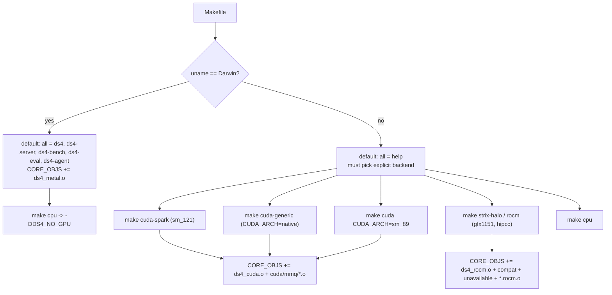

| Target | Backend | Notes |
| --- | --- | --- |
| `make` | Metal | Primary target (`Makefile:78`) |
| `make cpu` | none (`-DDS4_NO_GPU`) | Reference/oracle build |
| `make cuda-spark` | CUDA sm_121 | DGX Spark / GB10 |
| `make cuda-generic` | CUDA `native` | Requires a recent toolkit |
| `make cuda CUDA_ARCH=sm_89` | CUDA | Ada / L40S path |
| `make strix-halo` / `rocm` | HIP gfx1151 | Framework Desktop |
| `make test` | — | Builds and runs the full regression suite |
| `make test-rocm`, `make cuda-regression`, `make test-session-state`, … | — | Focused suites |

### 4.2 Defines that matter

| Define | Meaning |
| --- | --- |
| `DS4_NO_GPU` | CPU-only build: the whole GPU block is compiled out. `DS4_HAS_DEEPSEEK41_GPU`/`DS4_HAS_QWEN4_GPU` are derived from it (`ds4.c:50-57`) |
| `DS4_ROCM_BUILD` | HIP/TTM memory path, `ds4_linux_memory.h` |
| `DS4_TEST_HOOKS` | Exposes engine internals for tests; `ds4.c` is recompiled a second time as `ds4_{cpu,cuda}_test_hooks.o` (`Makefile:843`, `:924`) |
| `DS4_CUDA_HAVE_MXF4` | Only for sm_120a/sm_121a — native FP4 tensor-core kernels |
| `DS4_HIP_MMQ_Y` | Vendored mmq tile height under HIP |

Note the practical traps: on Linux a bare `make` only prints help; `-DDS4_CUDA_HAVE_MXF4` is arch-gated, so MXFP4 codegen differs between Blackwell and Ada builds; and the Metal `.metal` sources are read from disk at process start, so a binary run from another checkout can fail at runtime (`ds4_metal.m:~48423` prints a remediation message).

---

## 5. The engine core (`ds4.c`)

### 5.1 Layout of the file

`ds4.c` is organized as vertical strata, not as a module graph. The 27 top-level `/* ===` banners run from line 1 to ~69,085; after that it is function-level implementation of the public API. In order:

| Stratum (approx. lines) | Contents |
| --- | --- |
| 1–500 | File header, includes, compile-time gates, constants (`DS4_MAX_*`), think-mode constants |
| 500–1,040 | **Shape profiles** (`DS4_SHAPE_FLASH`, `_PRO`, `_FLASH41`, `_GLM52`, `_GLM53`, `_QWEN4_EXP`, `_QWEN4_MINI`) and their dimension fields |
| 1,040–1,520 | GGUF quant layouts + IQ2 tables |
| 1,520–2,300 | Expert-locality profiler (produces hotlists) |
| 2,294–3,600 | **GGUF model loader**: mmap, tensor directory, metadata accessors |
| 3,616–4,774 | **CPU reference kernels** (F16/F32/Q8_0/Q2_K/IQ2_XXS, indexer QAT, FP8 KV round trip) |
| 4,774–5,700 | **Weight binder**: GGUF tensor names → semantic fields; per-family layout validators |
| 5,700–7,400 | **Shape/metadata validation** per family (`config_validate_*`) |
| 7,900–8,400 | Sliced loading (`load_slice`) and validation |
| 15,900–17,100 | CPU prefill/decode reference paths |
| 17,113–30,000 | `ds4_gpu_graph` struct + **Metal decode tape** (`metal_graph_encode_token_raw_swa`) and per-layer phase encoder |
| 33,800–42,000 | Streaming expert cache seeding, layer page-in, prefill overlap |
| 37,428–38,400 | **Layer-major prefill** (Metal) and chunked prefill |
| 44,145–44,600 | CPU sampling (`sample_top_p_min_p`, argmax helpers) |
| 51,720–59,300 | **GLM tape** (`glm_graph_*`), including indexed/sparse attention prefill |
| 58,861+ | **Qwen3.8 tape** (`qwen4_graph_*`) |
| 59,569–59,800 | Memory planner: per-layer KV sizing, per-tier scratch |
| 59,971–70,059 | `ds4_engine_open_internal`, multi-tier placement, device caches |
| 70,425–85,257 | Public API implementation: sessions, sync/eval, batching, payloads, TP bind, vision |

### 5.2 Model shape selection

```c
static ds4_shape g_ds4_shape = { .name = "DeepSeek V4 Flash", ... };   /* ds4.c:880 */
#define DS4_MODEL_FAMILY (g_ds4_shape.family)                          /* ds4.c:923 */
#define DS4_N_LAYER      (g_ds4_shape.n_layer)                         /* ds4.c:925 */
```

`config_validate_model` reads `general.architecture` / `*_block_count` / `*_hidden_size` and dispatches to a family validator, which assigns `g_ds4_shape` and then `config_expect_*`-checks every other metadata field against the chosen profile. Unknown shapes `exit(1)`. This is why the binary both (a) supports several models and (b) is *narrow*: the profiles are hard-coded, and everything downstream reads the global.

| Profile | Family | Layers | Embd | Experts | Notable |
| --- | --- | ---: | ---: | ---: | --- |
| `DS4_SHAPE_FLASH` | DeepSeek4 | 43 | 4096 | — | MLA + indexer top-k 512, `n_swa` 128 |
| `DS4_SHAPE_PRO` | DeepSeek4 | 61 | 7168 | — | indexer top-k 1024 |
| `DS4_SHAPE_FLASH41` | DeepSeek4.1 | 40 | 5120 | — | Engram layers, 2 ratio-2 KV layers |
| `DS4_SHAPE_GLM52` | GLM DSA | 79 | 6144 | — | KDA linear attention + pool indexer |
| `DS4_SHAPE_GLM53` | GLM DSA | 46 | 4096 | — | `glm5-next.*` metadata |
| `DS4_SHAPE_QWEN4_EXP` | Qwen4 | 49 | 2560 | — | 3 GDN + 1 gated GQA, n-gram PLE |

### 5.3 Model loading and weight binding

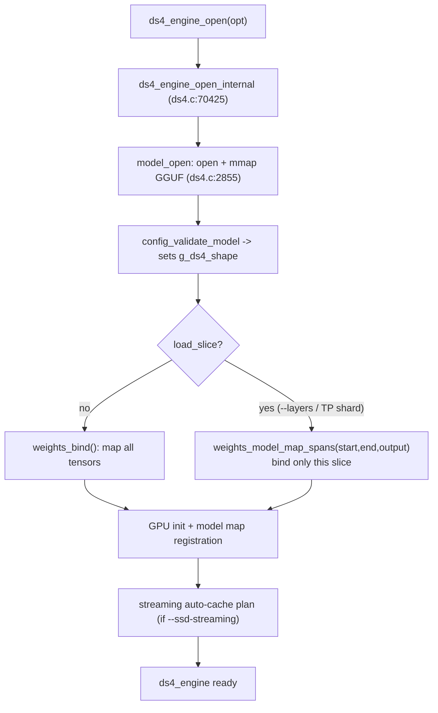

Key properties:

- **mmap, no copy.** `model_open` maps the file; the weight binder records `abs_offset`/`bytes` and the rest of the program addresses tensors through semantic fields (`layer->attn_q_a`, `layer->ffn_gate_exps`) instead of string lookup (`ds4.c:4774`).
- **Strict validation.** Every tensor's type and shape is checked against the active profile (`weights_validate_*`), including quant layout (`tensor_expect_glm_dense_quant_layout`).
- **Sliced loading is a first-class mode.** `load_slice` + `load_layer_start/end` + `load_output` are set by `--layers` (via `ds4_dist_prepare_engine_options`) or by TP sharding; `weights_validate_glm_dsa_layout` then only requires the advertised layers, and token embedding / output head are validated only when present (`ds4.c:5725-5727`, `:7917-7923`). This is what makes pipeline parallelism possible: a worker physically never maps the tensors it does not own.
- **Streaming changes what is mapped.** With `--ssd-streaming`, routed-expert tensors are excluded from the static span and served from an explicit cache; `weights_model_map_decode_runtime_slice_spans` / `_static_decode_spans` (used around `ds4.c:71414-71440`) choose the resident set.

### 5.4 The graph

There is no runtime graph IR. The "graph" is a C struct of pre-allocated tensor views plus a hand-written encode sequence:

- `ds4_gpu_graph` (`ds4.c:~17113`) holds one slot per kernel-scratch buffer. Buffers that must exist **per GPU tier** are accessed through `_by_tier[]` arrays with accessor macros (`DS4_GPU_GRAPH_CLASS_P_ACCESSOR`, `ds4.c:17544`), so the same encode code runs on whichever device owns the current layer.
- **Decode**: `metal_graph_encode_token_raw_swa` (`ds4.c:30034`) builds one token tape; the per-layer work is `metal_graph_encode_decode_layer_phase` (`ds4.c:24085`) driven by a `metal_decode_layer_phase` enum (`ds4.c:24003`). Layers are encoded in order; `ds4_gpu_flush_commands` splits the command buffer every ~4 layers.
- **Prefill**: `metal_graph_prefill_layer_major` (`ds4.c:37428`) processes the prompt **layer by layer over all tokens** (layer-major) rather than token by token. That is what makes streaming prefetch possible: while layer *i* computes, layer *i+1*'s weights stream in.
- **Batching across sessions** reuses the same encoders with a shared prefill workspace (`share_session_prefill_workspace`, engine field `ds4.c:42293`).

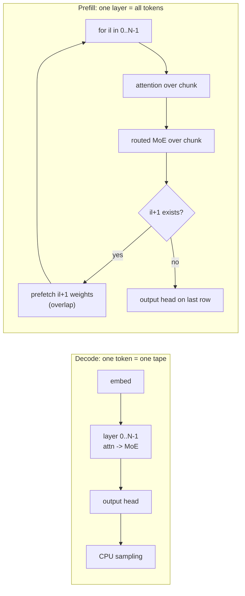

### 5.5 Attention and KV cache

For DeepSeek V4 / V4.1 the cache is described by `ds4_gpu_attention_decode_row` (`ds4_gpu_mgpu.h`):

```c
typedef struct {
    uint64_t raw_kv, comp_kv, topk;
    uint32_t pos, n_raw, raw_cap, raw_start, n_comp, top_k, window, ratio, indexed;
} ds4_gpu_attention_decode_row;
```

- **Raw KV** holds the sliding-window rows (`n_swa` 128 for Flash/Pro) — a ring buffer. On Metal, raw rows are written by `kernel_dsv4_kv_fp8_store_f32`: the non-RoPE prefix goes through an E4M3 round trip with a per-64-element power-of-two scale, then is stored back as float so the cache remains float-addressable (`ds4_metal.m`, `dsv4_kv.metal`).
- **Compressed KV** holds MLA rows pooled by a per-layer compression ratio (`ds4_layer_compress_ratio` / `g_ds4_compress_ratios`, `ds4.c:1359`, `:6445`). Ratios come from `deepseek4.attention.compress_ratios` and are validated against the expected per-layer pattern.
- **Indexer / sparse attention**: the model's own top-k row selection. The indexer path applies a 128-wide Hadamard rotation plus an FP4 activation-simulation round trip before scoring (`dsv4_indexer_qat_row_inplace_cpu`, `ds4.c:3821`) — required to match the reference graph; without it the top-k selection diverges.
- **Hyper-connections (HC)**: DeepSeek V4 carries *n_hc* parallel residual streams mixed by a learned Sinkhorn-normalized matrix (`DS4_N_HC`, `n_hc_sinkhorn_iter`). Most of the odd-looking buffer names in the tape (`cur_hc`, `hc_mix`, `hc_split`, `hc_pre`, `hc_post`, `hc_comb`, `after_attn_hc`) come from this.
- **Per-layer KV sizing** is estimated by `engine_per_layer_kv_bytes_planner` (around `ds4.c:59569`) mirroring the runtime graph allocation; a unit test asserts `sum(planner) == runtime bytes`. This is the number the multi-GPU packer and the context-memory estimator use.

### 5.6 Mixture of experts

Per layer: one **shared expert** (always computed) plus a **routed MoE** with top-k selection.

- Router: `layer_topk_selected_experts` (top-k with groups) or `layer_hash_selected_experts` (hash routing, used by some layers).
- Shared expert: `layer_shared_ffn_one` (`ds4.c:12718`).
- Routed: `layer_routed_moe_one` (`ds4.c:12971`) and the batched variant `layer_routed_moe_batch` (`ds4.c:13241`).
- Quantization: routed experts dominate model size and are the aggressively quantized part. `ds4_engine_routed_quant_bits` (`ds4.c:62154`) reports 4 for Q4_K/MXFP4 else 2 (IQ2_XXS/Q2_K). Gate/up and down can differ (mixed per-layer layouts are validated explicitly).

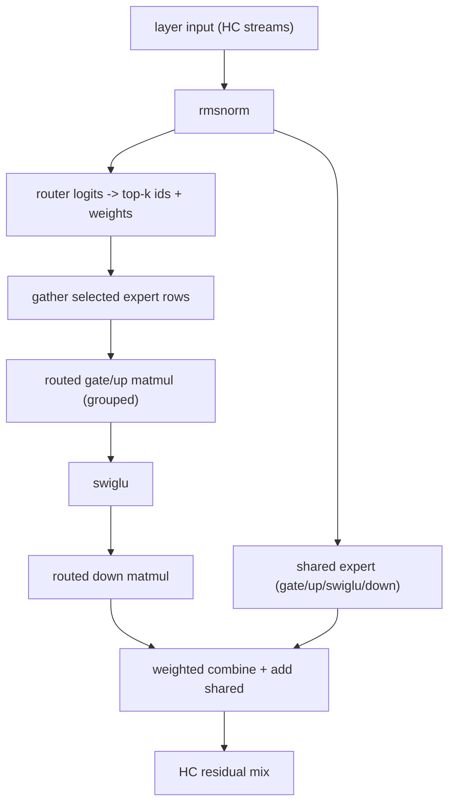

### 5.7 Sampling

Sampling is **CPU-side** by design: the GPU returns logits (or argmax), the host does top-k / top-p / min-p and temperature, with a 64-bit RNG threaded through the call (`ds4_sample_logits`, `ds4.h`). The default is temperature 1, top-p 1, min-p 0.05; `--temp 0` selects greedy. GPU-side helpers exist only for argmax and indexer top-k (`ds4_gpu_argmax_tensor`, `ds4_gpu_indexer_topk_tensor`).

### 5.8 Sessions, checkpoints and prefix reuse

`ds4_session` (`ds4.c:60205`) is the KV owner. It holds:

- the backend graph(s): `ds41_graph`, `graph` (DeepSeek), `glm_graph`, `qwen4_graph` plus `*_ready` flags;
- `checkpoint` (the exact token prefix the live state corresponds to) and `ctx_size` / `prefill_cap`;
- optional `distributed` (pipeline) and `tp_session_id` (tensor parallel) handles;
- speculative state (MTP / DSpark), vision spans, progress/cancel callbacks.

Three operations define its lifecycle:

| Operation | Contract |
| --- | --- |
| `ds4_session_sync(s, prompt)` | Make the live KV equal to `prompt`. If the current checkpoint is a prefix, only the suffix is evaluated; otherwise the state is rebuilt from scratch. Returns `DS4_SESSION_SYNC_INTERRUPTED` if cancelled mid-way. |
| `ds4_session_eval(s, token)` | Append one token, produce logits. |
| `ds4_session_invalidate(s)` / `ds4_session_rewind(s, pos)` | Drop or truncate state. Rewind keeps the token prefix and restores recurrent state where possible; DeepSeek's compressors cannot truncate, so the checkpoint is invalidated and the caller must re-sync. |

Prefix math lives in `ds4_session_common_prefix` + `ds4_session_rewrite_from_common` + `ds4_session_rewrite_requires_rebuild`, with the rule that a GPU session needs an exact token-prefix match (the CPU path is more forgiving). Frontends then implement their own *cache ladders* on top (see §8) — the engine only offers "is this a prefix?" and "sync".

`ds4_session_sync` is also the tensor-parallel rendezvous point: when TP is active, the leader sends the prompt to the worker *before* running its own prefill, then waits for the worker's ack and half-logits (`ds4.c:75060-75120`).

### 5.9 Batching across sessions

For servers, decode is batched:

- `ds4_sessions_eval_batch(items, count)` (`ds4.c:80050`) — one token per session, CUDA has a native multi-session path (`ds4_sessions_eval_batch_cuda`), others fall back to a correctness-first sequential loop.
- `ds4_sessions_eval_batch_speculative_argmax` (`ds4.c:79862`) — batched speculative cycle (Qwen3.8 MTP), greedy acceptance.
- `ds4_sessions_eval_batch_with_prefill` (`ds4.c:80124`) — advances a resumed prefill suffix and a decode batch in one scheduling step.

Batch size 1 is documented as exactly `ds4_session_eval`, which keeps the fast path honest.

---

## 6. Memory strategy: fitting big models on real machines

There are four independent memory regimes, in increasing order of pressure.

### 6.1 Resident (default)

mmap the GGUF, hand the pages to the GPU as no-copy buffers, key the graph. Requires RAM ≥ weights + KV + scratch.

### 6.2 SSD streaming of routed experts

The premise (from `docs/SSD_STREAMING.md` and the code): attention, dense projections, norms, embeddings and the shared expert are small relative to the routed experts; the routed experts are enormous but only top-k of them are used per token. So:

- **Non-routed weights stay resident** (mmap).
- **Routed expert slabs are the only streamed tensors**, served through a bounded per-device cache.

The cache is a real policy engine, not a pager:

| Aspect | Implementation |
| --- | --- |
| Budget | `ds4_ssd_auto_cache_plan` / `ds4_ssd_cache_experts_for_byte_budget` in `ds4_ssd.c` (note: this file is *only* budget math and an mlock helper, not IO) |
| Seeding | Compiled hotlists `ds4_streaming_hotlist.inc` (Flash/Pro) and `ds4_streaming_hotlist_glm52.inc` — `{layer, expert}` uint16 pairs sorted by profiled hits/weight; generated by `--expert-profile` runs |
| Hotlist file format | `# ds4 expert hotlist v1`, then `layer expert hits weight` lines (`ds4_expert_profile_write_hotlist_file`, `ds4.c:1841`) |
| Eviction | LFU on `g_stream_expert_cache_route_hotness` (halved every 16 decode tokens) with LRU tie-break on `last_used`; in-flight entries protected by a command-buffer epoch |
| Metal IO | plain `pread` + an 18-thread persistent pool + `F_RDADVISE` (`ds4_metal.m:13416-13650`) |
| CUDA/ROCm IO | second `O_DIRECT` fd, dedicated prefetch thread, double-buffered pinned staging ring, `cudaMemcpyAsync` |
| Engram tables | separate, always-on-disk (see §6.4) |

**Overlap is explicit and worth reading in the source:**

- Decode: `overlap_selected_shared` (`ds4.c:26700`) starts an async load of the *selected* experts, then computes the always-resident shared expert (gate/up/swiglu/down), then joins the load before running the routed MoE. The load is therefore hidden behind the shared expert.
- Prefill: `metal_graph_stream_prepare_slot` + `_start_if_needed(il + ahead)` + `_join_layer(il)` page in layer *i+ahead*'s tensors while layer *i* computes; ROCm uses a whole-layer expert load thread (`rocm_graph_stream_layer_expert_load_start_next`).
- V4.1 pipes Engram row reads across encoder layers (`ds41_engram_prefetch_start/wait`).
- CUDA additionally overlaps selected-expert loads with the shared expert (`metal_graph_use_cuda_selected_shared_overlap`, `ds4.c:22479`).

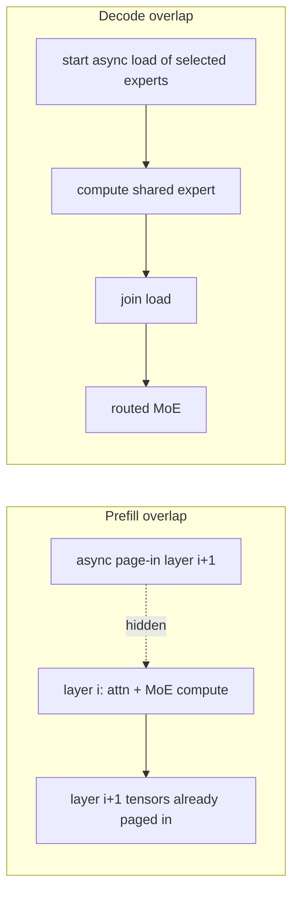

### 6.3 Layer placement across GPUs in one host

`ds4_layer_pack.c` implements a **monotonic-contiguous** packer: entry 0 = embedding, entries 1..n = transformer layers, entry n+1 = output head. Each entry has a byte cost (`engine_compute_entry_bytes`, `ds4.c:69181`, which includes *per-layer KV and per-tier scratch*, not just weights); entries are assigned to devices in order, and anything that does not fit spills to CPU — and every later entry spills too (stickiness). The comment in `ds4_layer_pack.h` is explicit that the CPU tier is always available, so there is no "too big" error path.

`ds4_gpu_mgpu.h` supplies the plumbing: `ds4_gpu_config` (device list + per-device VRAM budget + safety margin), `ds4_gpu_ctx g_gpu[16]`, peer-access matrix `g_gpu_peer_ok[][]`, and per-tier tensor alloc/copy/wait (`ds4_gpu_tensor_alloc_ptr_on`, `ds4_gpu_tensor_copy_xdev*`, `ds4_gpu_tensor_wait_xdev`). Placement is computed in `engine_classify_multi_tier` (`ds4.c:69489`) and consumed per layer via `g->placement[il+1]` + `ds4_gpu_set_current_device(tier)`.

Two details that show the engineering maturity: the CUDA backend *validates* peer copies at init (4 sizes × 4 iterations) because `cudaMemcpyPeer` can silently corrupt on some Ada parts, falling back to a pinned-host bounce; and the packer pre-subtracts per-tier Class-P scratch from *every* device budget, so a layout that fits the weight math cannot late-OOM at session creation (`ds4.c:59706-59718`).

### 6.4 Engram tables (DeepSeek V4 / V4.1)

`ds4_engram.c/.h`: 2 layers hold an n-gram embedding table (`NGRAM` 4, `HEADS` 8, `COLS` 24, `DIM` 256, 264 bytes/row). Rows are found by rolling n-gram hashing over the last tokens (`ds4_engram_hash`), the tables are **never mapped** — a dedicated `O_RDONLY` fd is opened at load and rows are `pread` directly, 24 rows per token per layer, with bounded concurrent readers on macOS (`ds4_engram_read_batch`). The tables are ~189 GiB in the shipped V4.1 Q2 artifact and always stay on disk, so a fast local SSD is a hard requirement in every mode.
---

## 7. Splitting a model across machines

This is the part most readers come for, and the part where the codebase has the most machinery. Start by disambiguating, because the repository uses the word "parallel" for three unrelated things.

### 7.0 Taxonomy: three different splits

```mermaid
flowchart TB
  subgraph A["1. Pipeline parallelism (network)"]
    direction LR
    A1["machine 0<br/>layers 0..19"] -->|"activations (TCP)"| A2["machine 1<br/>layers 20..39"] -->|"activations"| A3["machine 2<br/>layers 40..output"]
  end
  subgraph B["2. Tensor parallelism (network, 2 ranks)"]
    direction LR
    B1["rank 0: same layers,<br/>experts 0..E/2"] <-->|"per-layer partial sums<br/>RDMA / TCP gates"| B2["rank 1: same layers,<br/>experts E/2..E-1"]
  end
  subgraph C["3. Multi-GPU placement (one host)"]
    direction LR
    C1["GPU0: embedding + layers 0..21"] --> C2["GPU1: layers 22..31"] --> C3["GPU2: layers 32..43 + head"]
  end
```

| | Pipeline (`ds4_distributed.c`) | Tensor parallel (`ds4_tp.c`) | In-box multi-GPU (`ds4_layer_pack.c`) |
| --- | --- | --- | --- |
| Code entry | `--role coordinator/worker --layers A:B` | `--tensor-parallel --role leader/worker` | `ds4_gpu_config` / `--gpu-vram` |
| Unit of split | **layers** | **tensors inside every layer** | layers |
| Machines | N (2..many) | exactly 2 | 1 host, up to 16 devices |
| KV cache | partitioned per stage | partitioned (both ranks hold their half) | partitioned per device |
| Wire volume per token | one hidden-state vector per hop (64 KiB at 32-bit for Flash) | one partial-sum vector per gate per layer (~n_embd·4 B × 2 gates × layers, ×2 directions) | PCIe/NVLink copies |
| Weights | **not replicated** — each machine holds its slice | **replicated dense/shared**, routed experts sharded 50/50 | not replicated |
| Best for | capacity, long-prefill throughput, heterogeneous boxes | latency reduction on two equal, well-connected machines | one big CUDA box |
| Explicitly rejected combos | — | SSD streaming, distributed mode, MTP drafting on the worker, CPU backend | — |

The pipeline path is the one that answers "sum the RAM of several machines"; the tensor-parallel path answers "make two identical machines behave as one, faster".

---

### 7.1 Shared concept: the layer-slice API

Both network modes and both in-box paths ultimately drive the same three engine entry points, declared in `ds4.h`:

```c
int ds4_session_layer_slice_reset(ds4_session *s, char *err, size_t errlen);
int ds4_session_eval_layer_slice(ds4_session *s,
                                 const int *tokens, uint32_t n_tokens, uint32_t pos0,
                                 uint32_t layer_start, uint32_t layer_end,
                                 const float *input_hc, float *output_hc,
                                 bool output_logits, float *logits,
                                 char *err, size_t errlen);
int ds4_session_eval_output_head_from_hc(ds4_session *s, const float *hidden_hc,
                                         uint32_t n_tokens, float *logits,
                                         char *err, size_t errlen);
```

`ds4_session_eval_layer_slice` (`ds4.c:74344`) is the heart of every distributed mode. Its preconditions are checked in order and are worth memorizing:

1. `layer_start <= layer_end < ds4_model_normal_layer_count()`.
2. `input_hc == NULL` **iff** `layer_start == 0` (the first stage starts from token embeddings).
3. `output_logits` requires `layer_end + 1 == executable_layers` **and** the output head to be loaded.
4. `weights_layers_bound(engine->weights, layer_start, layer_end)` — the slice must actually be mapped.
5. `ds4_session_slice_check_timeline` — `pos0`/`n_tokens` must fit the context.
6. Both `output_hc` and `logits` may be NULL: a mid-pipeline prefill chunk that only needs the KV side effect.

The hidden-state payload format is the model's **HC-expanded** width, not `n_embd`:

```c
uint64_t ds4_engine_hidden_f32_values(ds4_engine *e) {
    if (DS4_MODEL_FAMILY == DS4_MODEL_FAMILY_GLM_DSA) return DS4_N_EMBD;
    return (uint64_t)DS4_N_HC * DS4_N_EMBD;     /* e.g. 4 * 4096 = 16384 f32 = 64 KiB */
}
```

---

### 7.2 Pipeline parallelism across machines (`ds4_distributed.c`)

File header (`ds4_distributed.c:4-15`) states the design intent precisely:

> "This module owns the DS4 distributed transport and orchestration layer. The rest of the engine still sees a normal `ds4_session`: when distributed mode is active, `ds4.c` delegates sync/eval/save/load to the coordinator session API in this file. Workers execute contiguous model slices with the same graph-slice entry points used by the local engine. KV snapshots remain topology-independent: save gathers worker-owned layer tensors into the normal DSV4 payload, and load splits a normal DSV4 payload across the currently registered route."

#### 7.2.1 Roles, ownership, and the topology rule

- **Coordinator** (`--role coordinator --listen HOST PORT --layers 0:K`): owns layers `[0..K]`, is the only process that owns the tokenizer, prompt, sampling and the user-facing session. Its layer range **must start at layer 0** (`dist_validate_layers_for_model`, `ds4_distributed.c:8391`).
- **Worker** (`--role worker --coordinator HOST PORT --layers A:B|A:output`): owns a contiguous slice; runs no sampling; keeps one KV state per coordinator session id.
- Layer ranges are **inclusive**; `A:output` sets `has_output = true` and `end = UINT32_MAX` internally (`dist_parse_layers`).
- The output head normally lives on the last stage. If the last worker is output-less, the coordinator may still run the head itself, provided `ds4_engine_has_output_head(engine)` (`state.local_can_output_head`, used in `dist_coordinator_can_pipeline_prefill`).

Discovery is **not** automatic: the coordinator only listens; every worker is configured with the coordinator's address and dials in. Workers advertise their own data-listener port inside the HELLO.

#### 7.2.2 Startup and handshake

```mermaid
sequenceDiagram
  autonumber
  participant C as Coordinator
  participant W as Worker
  C->>C: open listener on --listen HOST:PORT
  C->>C: spawn accept thread (dist_coordinator_accept_main)
  W->>W: open data listener (port 0 allowed, learn real port)
  W->>W: spawn dist_worker_data_listener_main
  loop until connected (200 retries, 25 ms)
    W->>C: TCP connect (dist_connect_endpoint)
  end
  W->>C: HELLO {model_id, quant_bits, layer_start, layer_end, has_output, has_hidden, ctx_size, n_layers, listen_port, model_name}
  C->>C: validate (dist_coordinator_client_main)
  alt mismatch
    C-->>W: ERROR "..." then close
  else accepted
    C->>C: dist_coordinator_add_worker(); state->generation++
    C->>C: monitor fd for POLLHUP
    C->>W: WORK (reusing dup'd control fd for the first hop)
    W-->>C: RESULT / ACK
  end
```

Compatibility is enforced entirely at HELLO — there is **no protocol version field** in the frame header. Rejected: model id mismatch, model-name string mismatch, layer-count mismatch, `quant_bits ∉ {2,4}`, out-of-range layer span, `has_output` not ending at the final layer, a worker with a *smaller* context than the coordinator, or an invalid listen port. `[INFERENCE]` Therefore any change to a wire record is a breaking change for mixed-version peers; `README`/`docs/DISTRIBUTED.md` tell users to run the same commit everywhere.

The first hop is special: to avoid a third connection, the coordinator `dup()`s the *control* socket for the first worker (`dist_coordinator_build_route_plan`, `ds4_distributed.c:2262-2274`) when running a one-shot generation. Later hops are dialed lazily worker→worker, one dedicated socket + relay thread per `(host, port)` (`dist_worker_get_forwarder`).

#### 7.2.3 Wire protocol

Framing is a 12-byte header, big-endian, followed by `bytes` of payload:

```c
typedef struct { uint32_t magic; uint32_t type; uint32_t bytes; } ds4_dist_frame_header;  /* magic "DS4D" */
```

| # | Message | Direction | Purpose |
| ---: | --- | --- | --- |
| 1 | `HELLO` | worker→coordinator | advertise slice + identity |
| 2 | `ERROR` | both | human-readable failure text |
| 3 | `WORK` | coordinator→worker, worker→worker | one slice evaluation (see below) |
| 4 | `RESULT` | back upstream | status + telemetry + payload (ACK / hidden / logits) |
| 5 | `SNAPSHOT_SAVE_REQ` | coordinator→worker (data conn) | request this stage's KV shard |
| 6 | `SNAPSHOT_BEGIN` | worker→coordinator | shard metadata (bytes, token hash) |
| 7 | `SNAPSHOT_CHUNK` | both | 8 MiB chunks of the DSVL payload |
| 8 | `SNAPSHOT_DONE` | both | end of shard transfer |
| 9 | `SNAPSHOT_LOAD_BEGIN` | coordinator→worker | push a shard back |

The core record, `ds4_dist_work_fixed`, carries everything a stage needs to be self-checking:

```
model_id | session_id(hi,lo) | request_id(hi,lo)
prefix_hash(hi,lo)   <- FNV-1a over tokens[0..pos0)
result_hash(hi,lo)   <- FNV-1a over tokens[0..pos0+n_tokens)
pos0, n_tokens | layer_start, layer_end | flags
token_bytes, input_hc_bytes, input_hc_bits
route_count, route_index, route_bytes
```

body: `fixed | tokens[n_tokens] (u32 BE) | input_hc (quantized) | route_blob`

Flags: `INPUT_HC 0x1` (activations are attached), `OUTPUT_LOGITS 0x2` (this stage must produce logits), `RESET_SESSION 0x4` (drop the worker's KV for this session), `ACK_ONLY 0x8` (no payload wanted back).

The **route blob** is the topology, shipped with every request so intermediate workers can forward without talking to the coordinator:

```
[ route_fixed | host ] [ route_fixed | host ] ... [ route_return_fixed { RETURN_UPSTREAM, 0, 0 } ]
```

`dist_route_validate_blob` re-validates contiguity (`entry[i].layer_start == entry[i-1].layer_end + 1`), host NUL-safety, port range, that only the final entry may request logits, and that there are no trailing bytes — i.e. **a malicious or buggy coordinator cannot make a worker run a non-contiguous route.**

#### 7.2.4 Route planning

`dist_coordinator_build_route_plan` (`ds4_distributed.c:2201`):

1. Snapshot the worker registry, sort by `(layer_start asc, has_output first, layer_end desc)` (`dist_worker_route_cmp`).
2. Special case: if the coordinator itself ends at `n_layers-1` and can produce logits, the plan is empty (pure local run).
3. DFS from `next = local_end + 1` to `n_layers - 1`, requiring exact contiguity and preferring output-capable workers last (`dist_route_search_workers`, `dist_worker_route_candidate_ok`). Failure reports the smallest missing layer.
4. Materialize route entries (+ `dup()` of the first-hop fd when needed) and append the return-upstream marker.

The plan is cached in `ds4_dist_session.plan` and invalidated by `state->generation`, which is bumped on every worker add/remove/forget.

If no complete path exists, `ds4_dist_session_route_ready` returns 0 (workers missing) vs 1 (ready) vs −1 (configuration error); the CLI polls it every 250 ms while printing status.

#### 7.2.5 One decode token, end to end

This is the sequence to internalize; everything else in the module is an elaboration of it.

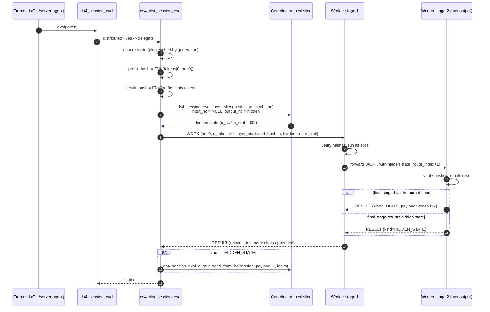

Implementation notes that matter:

- The **coordinator always computes its own slice first**; the remote call is issued only after the local slice succeeds (`dist_coordinator_eval_span`, `ds4_distributed.c:2670`). Latency on the critical path is `local + network + remote`.
- If the plan is empty, the coordinator simply runs `output_logits = true` locally — the same code path, no special-casing at the frontends.
- Result kinds are `ACK 0`, `HIDDEN_STATE 1`, `LOGITS 2`; each `RESULT` carries the `result_hash`, and a mismatch is a hard error ("distributed result prefix hash mismatch").
- Every `RESULT` carries a **telemetry chain** (`ds4_dist_telemetry_fixed`: eval µs, downstream-wait µs, forward-send µs, bytes in/out); each relay appends its own record, so the coordinator can print a per-hop breakdown under `--debug` / `DS4_DIST_DECODE_PROFILE`.
- A worker that is not the last stage sets `forwarded.flags &= ~OUTPUT_LOGITS`, so logits are only ever produced by the stage whose route entry carries `DS4_DIST_ROUTE_F_OUTPUT_LOGITS`.

#### 7.2.6 Prefill: chunking, pipelining, backpressure

Prefill is where pipeline parallelism earns its keep: with layer-major prefill, different stages can work on different chunks simultaneously.

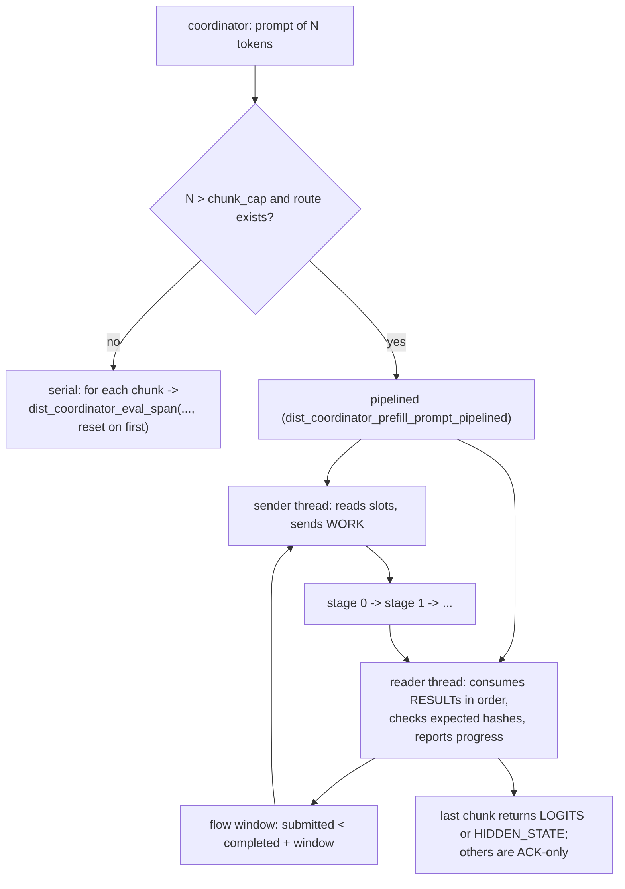

- Chunk size: `--dist-prefill-chunk` (default = the session's prefill capacity, typically 4096); exceeding the session cap is an error.
- Flow window: `--dist-prefill-window`, default `min(stages + 2, 8)`, hard cap 64. Non-default values are flagged experimental in `ds4_dist_usage` because they can change logits.
- Intermediate chunks set `ACK_ONLY` (disable with `DS4_DIST_DISABLE_PREFILL_ACK_ONLY`), so the wire carries only one activation vector per gap.
- The reader precomputes the expected cumulative hash per chunk and validates every result; results must arrive in order, so a misbehaving stage fails fast.
- Progress is surfaced to the UI as `"prefill_chunk"` events.

**Four levels of backpressure** exist, and knowing them is the fastest way to understand a stalled run:

| Level | Mechanism | Default | Knob |
| --- | --- | --- | --- |
| 1 | socket buffers + send timeout | 128 MiB buffers, 60 s | `DS4_DIST_SOCKET_BUFFER_MB`, `DS4_DIST_SOCKET_TIMEOUT_SEC` |
| 2 | worker prefetch job queue | depth 2 | `DS4_DIST_WORKER_PREFETCH_DEPTH` |
| 3 | worker→worker forwarding window | depth 4 | `DS4_DIST_WORKER_FORWARD_WINDOW` |
| 4 | coordinator prefill flow window + send slots | window = stages+2 (≤8), depth 2 | `--dist-prefill-window`, `DS4_DIST_PREFILL_SEND_DEPTH` |

Deliberate non-default: the control socket installs **no receive timeout** by default, because an idle control socket during a concurrent snapshot transfer must not be mistaken for a dead route (`ds4_distributed.c:1053-1056`).

#### 7.2.7 Activations on the wire: `--dist-activation-bits`

Only the hidden state is compressed for transport (tokens are always u32, logits always f32):

| bits | Codec | Notes |
| --- | --- | --- |
| 32 (default) | raw f32, **zero-copy alias** of the receive buffer | `out_uses_wire = true`; callers must not free the pointer |
| 16 | IEEE binary16 (`dist_f32_to_f16` / `dist_f16_to_f32`) | round-to-nearest-even, subnormals, Inf/NaN handled |
| 8 | E4M3 (`dist_f32_to_f8_e4m3` / `dist_f8_e4m3_to_f32`) | clamped to ±240, **no Inf/NaN** — a real accuracy risk for large activations |

The width is chosen by the coordinator and **preserved hop to hop** (`dist_forward_work_to_next` re-uses `input_hc_bits`). Each frame declares `input_hc_bytes`/`input_hc_bits`, and the receiver recomputes `n_tokens * ds4_engine_hidden_f32_values(engine)` and rejects a width mismatch before touching KV.

#### 7.2.8 KV partitioning and consistency

- Each stage's `ds4_session` holds **only its own layer range** of KV — guaranteed by `load_slice` at engine open.
- Workers key sessions by the coordinator's 64-bit `session_id` (`ds4_dist_worker_session`), lazily created, so two frontends cannot accidentally share a timeline ("so independent callers do not share token timelines by accident", `ds4_distributed.c:200-205`).
- Consistency invariant: an FNV-1a hash over token ids (`DS4_DIST_TOKEN_HASH_INIT = 1469598103934665603`, prime `1099511628211`). Each `WORK` carries `prefix_hash`; the worker compares against its own `session->token_hash` and rejects a mismatch **before doing layer work**. After a successful eval it stores `result_hash`. `RESET_SESSION` resets both the slice KV and the hash.
- The comment is explicit that this is not a security primitive — it is a session integrity check.

#### 7.2.9 Failures, route invalidation, replay

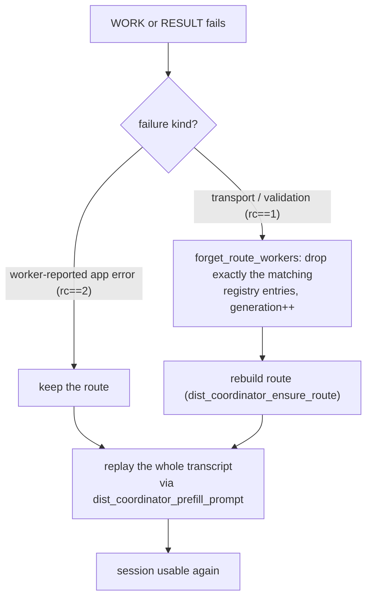

- Detection: coordinator polls each registered worker fd for `POLLHUP|POLLERR|POLLNVAL` (1 s timeout); workers detect EOF on the read loop, then **drop all per-session KV** (`dist_worker_clear_sessions`) and reconnect in a loop, re-sending HELLO.
- Recovery reuses the transcript the coordinator already has: replay the full token prefix across the (possibly rebuilt) route.
- Application-level errors (e.g. "worker KV prefix hash mismatch") deliberately do **not** eject the worker — only transport/validation failures do.

#### 7.2.10 Save/load: topology-neutral checkpoints

A distributed save produces a **normal single-node `DSV4` file**; a load splits it across whatever route exists *now*. That is what lets you checkpoint a 3-machine run and resume on 2.

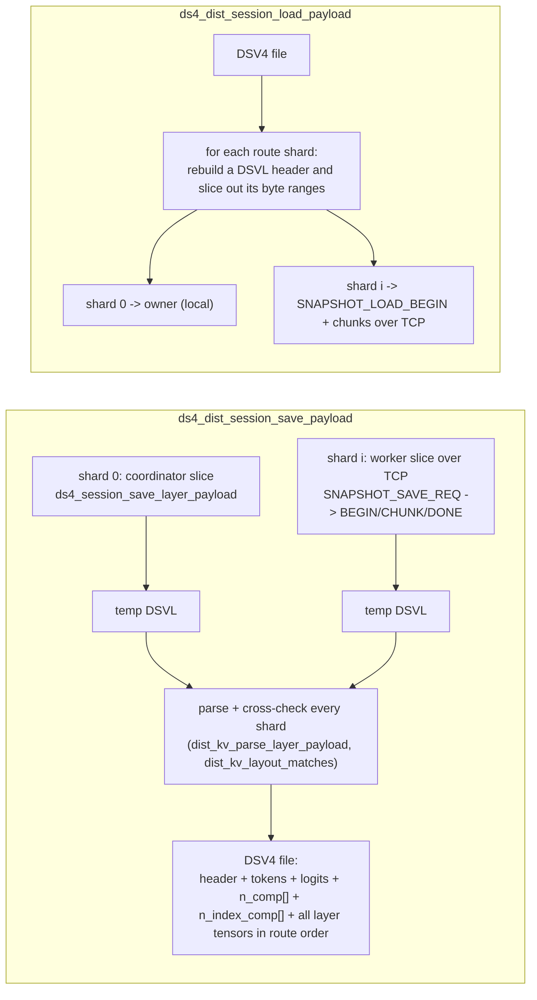

Formats (`ds4.h:610-615`):

```
DSV4 session header : magic "DSV4", version 2, 13 u32 fields
DSVL layer header   : magic "DSVL", version 1, 14 u32 fields (per-stage shard)
```

The coordinator validates before writing that the route covers every layer (`dist_kv_route_validate`: `local_start == 0`, contiguous entries, ends at `n_layers-1`), and on load verifies `n_layers`, `ctx`, `token_count`, `vocab`, per-layer `n_comp`/`n_index_comp` caps and exact tensor byte counts.

#### 7.2.11 Operating the pipeline mode

| Knob | Effect |
| --- | --- |
| `--role coordinator|worker|none` | role |
| `--layers A:B` / `A:output` | this process's slice; coordinator must start at 0 |
| `--listen HOST PORT` | coordinator accept socket (or worker data listener) |
| `--coordinator HOST PORT` | where a worker dials |
| `--dist-prefill-chunk N` | chunk cap (default: session prefill cap) |
| `--dist-prefill-window N` | chunks in flight (default stages+2, ≤8, ≤64) |
| `--dist-activation-bits 32|16|8` | hidden-state wire precision |
| `--dist-replay-check` | coordinator verifies replayed logits after recovery |
| `--debug` | route + per-hop timings |
| `DS4_DIST_DECODE_PROFILE=1` | per-token timing lines (send / wait / copy / output head) |
| `DS4_DIST_DISABLE_PREFILL_PIPELINE=1` | force serial prefill (debugging) |

Practical caveats, from the code and `docs/DISTRIBUTED.md`:

- A single generation stream cannot exploit pipeline overlap (each token must finish the whole route before sampling); pipeline mode is for **capacity and long-prefill throughput**.
- Worker mode is not available in `ds4-server` (`ds4_server.c:15611` refuses it) — start workers with `./ds4`.
- Disk KV restore rebuilds the saved token prefix on **both** ranks, so a TP restore pays prefill.
- No authentication or encryption on the link; use a trusted network.

---

### 7.3 Tensor parallelism between two machines (`ds4_tp.c`)

Header contract (`ds4.h:98-103`):

> "Tensor parallelism: two identical machines run the model in lockstep and split the heavy per-layer matvecs, exchanging partial sums at gates inside the graph. Each rank keeps one contiguous half of the routed experts resident; dense and shared weights remain replicated. The leader owns prompt/sampling and listens; the worker dials in and mirrors every session sync/eval."

#### 7.3.1 What is split, and what is not

| Component | Split? | Mechanism |
| --- | --- | --- |
| **Routed experts** | **Yes, 50/50** | by expert id: rank 0 owns lower ids, rank 1 upper (+ remainder). Enforced in kernels via `ds4_tp_owns_expert` (`metal/moe.metal:449`) and in the weight map via `weights_model_map_sharded_spans` (`ds4.c:8523`) |
| Attention output projection | Per model | DeepSeek: replicated; GLM: head/k-slice split (`ds4_gpu_tp_set_attn_head_split`, `ds4.c:56323`, `:53579`) |
| Shared expert FFN | Split dynamically | decided on the GPU per token (`ds4_gpu_parallel_ffn_start_split`) |
| Dense projections, norms, embeddings | **No** — replicated | |
| Output head / vocab | Halved when `e->tp.vocab_split` | DeepSeek V4 always; V4.1 only on CUDA. Worker ships its half of the logits per step (`ds4_tp_send_logits_half`) |
| KV cache | Each rank holds its own shard of experts' contributions; attention KV is replicated for DeepSeek | |

Consequence: the **memory win is on routed experts** (the bulk of the weights), while the compute win comes from halving each per-layer matvec.

#### 7.3.2 The gate model

A *gate* is a synchronization point inside the graph where the two ranks exchange partial sums. There are exactly **two gates per layer** (`DS4_TP_GATES_PER_LAYER = 2`, `ds4_tp.h:32`):

```c
enum { DS4_TP_GATE_ATTN = 0, DS4_TP_GATE_FFN = 1 };
```

The schedule — which (layer, gate) pairs actually fire — is model-specific and exchanged at handshake so both ranks agree:

- DeepSeek V4/V4.1: identity over `2 * n_layer` slots.
- GLM 5.2 resident: only sparse layers.
- GLM 5.3: an explicit 3×64-bit mask (`uint64_t gate_slot_mask[DS4_TP_GATE_MASK_WORDS]`, `DS4_TP_GATE_MASK_WORDS = 3`), e.g. KDA layers fire the FFN gate only.
- GLM streaming: FFN only.

`ds4_engine_tp_gate_schedule` (`ds4.c:71844`) produces `(gate_slot_start, gate_slot_step, gates_per_token, mask)` for `ds4_tp_identity`.

**The slab** is one shared, GPU-visible, NIC-registered block. Layout from `ds4_tp_slab_bytes` (`ds4_tp.c:645`) with `vec = n_embd * 4` bytes (f32 partials, **never quantized on the wire**):

```
[ out[S]            ]  S = n_layer * 2      local partials, one vec per slot
[ in[S]             ]                      peer partials land here
[ in_flags[S] * 8   ]
[ token          16 ]
[ out_flags[S] * 8  ]
[ gpu_flags[S] * 4  ]  GPU-written gate-ready flags
[ batch_out[L][8]   ]  verify-block rows (L = n_layer, 8 = DS4_TP_BATCH_MAX_ROWS)
[ batch_in [L][8]   ]
```

`ds4_engine_tp_bind` (`ds4.c:72465`) allocates it, creates `ds4_gpu_tensor_view`s for every slot, calls `ds4_gpu_tp_init(rank, slab, gpu_flags_off, out_off, vec_bytes, exchange_fn, engine)` and arms the three exchange callbacks (`gate`, `batch`, `big`). On CUDA the network-visible slab is a **host** buffer (`e->tp.host_slab`) because there is no GPUDirect here — the exchange callbacks stage through host memory.

#### 7.3.3 Transport

Two sockets are used: a **control** TCP stream (framed commands + acks + logits halves) and a **data** channel (gates). Transport selection:

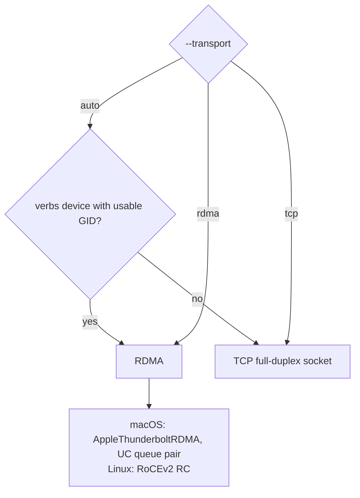

RDMA specifics (`ds4_tp.c:120-160`) — these comments are the most valuable part of the file for a systems reader:

- `librdma`/`libibverbs` is loaded with `dlopen` so a build/machine without the stack falls back to TCP at runtime with no link-time cost. Only setup entry points need `dlsym` (post/poll are header inlines).
- **Apple Thunderbolt RDMA quirks, validated with scratchpad probes:** only UC queue pairs exist (RC/UD → `ENOTSUP`); **RDMA WRITE is accepted but never executes**, so the data plane is two-sided SEND/RECV; messages above 16 KiB are not delivered (`DS4_TP_RDMA_MAX_MSG 16384`); RTR requires GRH addressing with the IPv4-mapped GID that only appears once the Thunderbolt member interface has its own IPv4 address; UC delivery is in-order.
- Because UC does not retry a send that arrives before the peer posted its receive, there is a **warm-up round** (`tp_rdma_warm_up`) and a one-per-window barrier (`tp_rdma_window_barrier`, tag bytes on the data socket).

Completion detection has no shortcuts:

- Decode posts a **lookahead receive window** of 16 gates (`DS4_TP_RDMA_RECV_WINDOW`); gate `seq` lands in slab slot `(seq-1) % slots`, and the CQE for that receive *is* the arrival signal (`recv_done` watermark).
- Sends above 16 KiB are split into chained work requests; the provider reports CQEs even for unsignaled sends, so the code accounts for every send (`send_outstanding`) rather than trusting one CQE per chain.
- A gate timeout of 750 ms (`DS4_TP_DEFAULT_GATE_TIMEOUT_MS`) exists to fail well before Metal's command-buffer watchdog when the peer stalls while keeping sockets open.
- Before switching a queue pair from decode (latency) to bulk (prefill), the decode window must be drained with dummy sends on both ranks (`tp_rdma_drain_decode_window`), with a byte exchange as the mutual barrier.

#### 7.3.4 GPU-side gate service

The two backends implement the same C ABI (`ds4_gpu_tp.h`) differently:

| | Metal | CUDA |
| --- | --- | --- |
| Arrival signalling | GPU writes a slab flag word (`kernel_dsv4_tp_flag_set[_checked]`) or an `MTLSharedEvent`; alternative 8192-line poll region (`kernel_dsv4_tp_poll_release`) | stream is synchronized, then the exchange is called synchronously |
| Service | dedicated `ds4_gpu_tp_service_thread` with a 1024-deep queue (`ds4_metal.m:10552`) | inline in the encode path |
| Payload integrity | checked variant verifies a checksum (`*_tp_flag_checked`) | — |
| Prefill bulk | CPU-visible bounce buffers | pinned host buffer, `ds4_gpu_tensor_read/write` |

Because a Metal gate spins on a flag in a command buffer, ordering with the service thread uses events or flags, and `ds4_gpu_tp_set_session_batch_mode` exists because multi-session tapes reuse slab slots and therefore *require* event arrival rather than flag polling.

#### 7.3.5 Lockstep protocol

Rank 1 mirrors rank 0 through framed commands on the control socket (protocol version 14). The worker loop is `ds4_tp_worker_run` (`ds4_tp.c:3011`); the leader-side senders are `ds4_tp_send_*`.

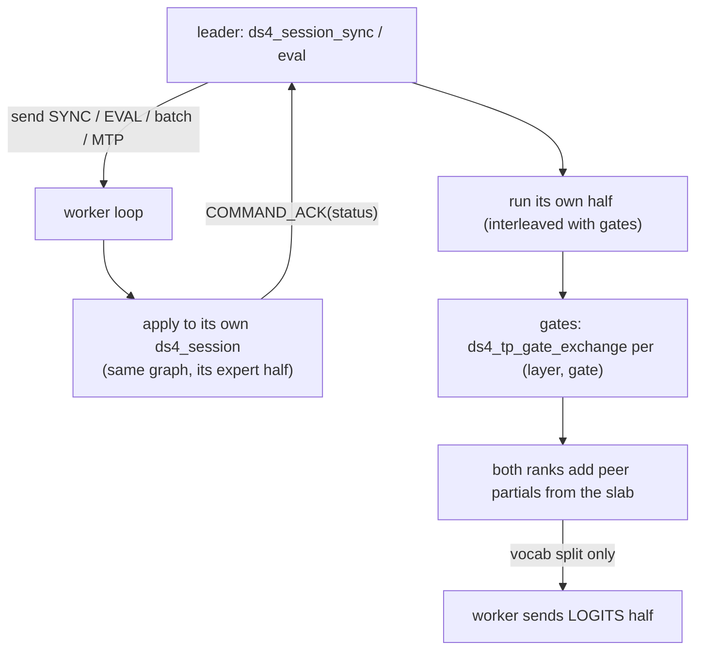

Mirrored operations: `SESSION_CREATE` (with the leader's ctx size; the worker pre-warms the GPU before acking so the cost never lands in the first timed prefill), `SESSION_DESTROY`, `SYNC`, `SYNC_MULTIMODAL`, `EVAL`, `GLM_MTP`, `VERIFY`, `REWIND`, `INVALIDATE`, `EVAL_BATCH`, `MIXED_BATCH`, `COMMAND_ACK`, `LOGITS`, `STOP`, `ERROR`, `HASH`.

Notable invariants:

- **Identity handshake** (`ds4_tp_identity`): GGUF byte size, model id, n_layer, n_embd, n_vocab, routed quant bits, gate schedule + mask. Mismatch aborts before any inference.
- **Cancellation is agreed, never sampled independently**: `ds4_tp_sync_checkpoint` performs a two-sided exchange at matching prefill boundaries, because one rank may not enter a GPU gate while the other leaves it.
- **Batch decode** is mirrored too (`ds4_tp_send_eval_batch`, `ds4_tp_send_mixed_batch`), including a mixed prefill+decode step.
- **Failure**: a single atomic `failed` flag (`ds4_tp_mark_failed`) is set by any exchange failure; the leader invalidates sessions and reports "tp: gate transport failed" (`ds4.c:77462-77465`).
- **Debug**: `--debug-hash N` cross-checks the hidden-state hash every N tokens (`ds4_tp_hash_check`), the fastest way to localize a divergence to one rank.

#### 7.3.6 Speculative decoding under TP

Speculation and TP compose through a dedicated path: the leader sends the draft block (`VERIFY`), both ranks run the *sharded* batch verify (`ds4_tp_batch_gate_exchange`, with a dedicated RDMA window opened by `ds4_tp_batch_block_begin` / closed by `ds4_tp_batch_block_end`), and then the leader commits with a mode:

| Commit mode | Meaning |
| --- | --- |
| FULL | keep the whole verified block on both ranks |
| PREFIX | keep a matching prefix; restore the rest on both ranks |
| ROLLBACK_REPLAY | restore the original frontier, then replay `token_count` tokens |

Drafting itself is replicated (the leader drafts, both verify), and `ds4_gpu_tp_suspend_expert_sharding` exists for the coordinator-only drafting phase.

#### 7.3.7 Limits and validation

`ds4_tp_validate_engine_options` rejects combinations TP cannot support: SSD streaming, distributed (pipeline) mode, MTP drafting on the worker, and the CPU backend. `ds4_engine_tp_bind` refuses anything that is not Metal or V4.1-on-CUDA (`ds4.c:72467-72472`), and for CUDA network TP the engine further requires V4.1 Q2, **one GPU per rank**, and no quality mode (`ds4.c:70740-70743`). Ranks are exactly two — this is a deliberate 50/50 pair design, not a general N-way TP.

---

### 7.4 In-box multi-GPU (contrast case)

Not cross-machine, but it is the third axis and shares vocabulary, so it is worth one paragraph of contrast:

- **Pipeline across cards**: `ds4_layer_pack` computes a monotonic-contiguous layer→device map (`engine_compute_entry_bytes` prices weights + per-layer KV + per-tier scratch), and the graph dispatches each layer on its owner device via `g->placement[il+1]` + `ds4_gpu_set_current_device(tier)`. Handoffs are `ds4_gpu_tensor_copy_xdev*` with per-pair peer validation and a pinned-host fallback.
- **CUDA tensor parallel in one box**: `--cuda-tensor-parallel` splits routed experts across a *pair* of tiers (`cuda_tp_partner_tier = tier + half`) and reduces partials with `ds4_gpu_add_xdev_tensor`, i.e. the same idea as network TP but over PCIe/NVLink instead of RDMA. The documented 8×L40S serving configuration uses double the device ordering (`0,2,4,6,1,3,5,7`) so each TP pair shares a host bridge.
- The network TP path is *not* GPUDirect on CUDA: it stages through host memory, so an in-box NVLink pair is bandwidth-superior; network TP wins on capacity across hosts.

### 7.5 Choosing a mode

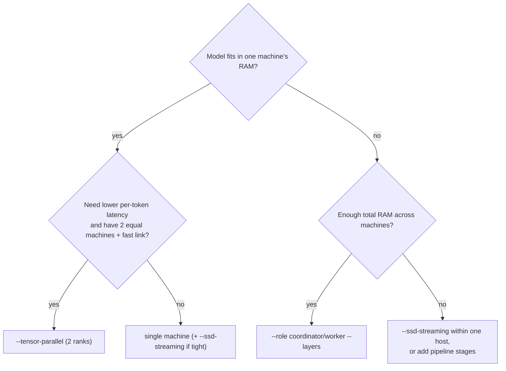

| Goal | Use | Why |
| --- | --- | --- |
| Run a model larger than any single machine's RAM | Pipeline | sums RAM; weights not replicated |
| Speed up a large model on two machines with a fast link | TP | halves per-layer work per GPU |
| Multi-user serving on many GPUs in one box | In-box placement (+ CUDA TP per pair) | no network in the loop |
| Long-prompt ingestion across machines | Pipeline | chunk-level overlap across stages |
| Tighter VRAM on one Mac | SSD streaming | expert cache + hotlists |

### 7.6 Verifying and debugging a distributed run

- `--debug` / `DS4_DIST_DECODE_PROFILE=1` prints the route and per-hop timings; `DS4_DIST_CONNECT_TRACE` traces connection setup.
- `ds4-cli` prints route readiness while polling; `ds4_dist_session_route_ready` is also exposed as `ds4_session_distributed_route_ready`.
- For TP, `--debug-hash N` plus `DS4_TP_GATE_TRACE` / `DS4_TP_GATE_PROFILE` localize which gate diverged, and `tests/test_tp_commands.c`, `test_tp_rdma.c`, `test_tp_tcp.c`, `test_metal_tp_bulk.c`, `test_metal_tp_spec.c`, `test_metal_tp_cancel.c` exercise the protocol without needing two physical machines for all cases.
- `--dist-replay-check` verifies that a transcript replay after a route failure reproduces the same logits.
- `CONTRIBUTING.md` is explicit that a local command-parser test is **not** physical TP QA; distributed changes are expected to be tested on real ranks.
---

## 8. Frontends

All three frontends are thin: they tokenize/render prompts, call `ds4_session_sync` / `ds4_session_eval`, and translate output. `ds4.h` is deliberately narrow so "CLI/server code should not know tensor internals" (`AGENT.md`).

### 8.1 `ds4-server` — HTTP serving (`ds4_server.c`)

A hand-rolled HTTP/1.1 server: **one request per connection**, `Content-Length` only (no chunked encoding), 64 KiB header cap, 64 MiB body cap, hand-written JSON parser with a nesting limit of 256. `Connection: close` everywhere, and EOF is treated as **cancellation**.

Endpoints: `OPTIONS` (204+CORS), `GET /v1/models`, `GET /v1/models/<alias>`, `POST /v1/chat/completions`, `POST /v1/responses`, `POST /v1/messages` (Anthropic), `POST /v1/completions`. No embeddings, no health, no auth — `docs/SERVER.md` tells you to front it with a proxy.

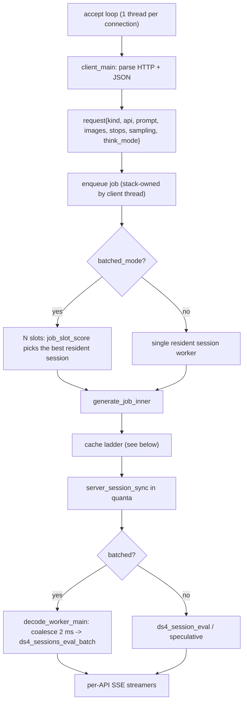

Design points worth studying:

- **Slot scoring** (`job_slot_score`, `ds4_server.c:14642`) is a priority ladder: live tool-id binding → `INT_MAX`; exact visible-prefix live match → `live_pos`; else `ds4_session_common_prefix()`. This is what keeps multi-turn tool conversations on the session that already has their KV.
- **Decode coalescing**: `decode_worker_main` waits up to `DS4_SERVER_DECODE_COALESCE_US` (default 2000 µs) for more rows, but never stalls a lone request; plain and speculative rows are issued as two separate batch calls.
- **Prefill yields to decode**: `server_prefill_quantum_for` gives 2048 tokens when idle, but only `--mixed-prefill-quantum` (default 128; 1024 floor for GLM 5.3) while generations are in flight, so prefill cannot starve interactivity. Prefill ownership round-robins between slots.
- **Cache ladder** (`generate_job_inner`, `ds4_server.c:13298`): responses-visible → responses-tool-output → anthropic-tool-output → GLM memory-rewind → thinking-visible → memory-text → disk-text → cold prefill. Responses/Anthropic continuations get *first refusal* because a live tool-call binding is stronger evidence than byte equality; if the binding is gone, the server returns **409** telling the client to replay the full history rather than cold-prefilling a naked tool result. Before loading a disk snapshot it **stores the current checkpoint first**, so an older-prefix hit cannot silently discard newer conversation state.
- **Tool translation** is bidirectional and syntax-specific. Four model syntaxes (DeepSeek DSML, GLM `<arg_key>/<arg_value>`, Qwen `<function=/<parameter=`, V4.1 variant) each get a renderer and a parser. Unusually, the server keeps a `tool_memory` rax-based LRU of the **exact sampled bytes** of tool calls so a continuation request can be replayed byte-for-byte instead of being re-canonicalized from JSON — persisted into the KV file trailer.
- **Streaming safety**: stop-sequence tails, partial UTF-8, and partial DSML closing tags are held back until they can no longer be part of a control token (`stop_list_stream_safe_len`, `text_stream_safe_limit`).
- **Cancellation**: the client thread polls the socket every 100 ms for disconnect and marks the job cancelled; an in-flight backend batch is always allowed to finish (it owns the session until the call returns).

### 8.2 `ds4_kvstore` — disk KV cache format

48-byte header (`KVC`, version 1) + rendered text + payload + optional trailer. **The lookup key is the SHA-1 of the rendered prompt text**, not tokens (rationale in the header comment: tokenization may differ across replays while the bytes match; the payload still stores exact tokens). Gates: `model_id`, `quant_bits`, `ctx_size`, payload ABI. Eviction score = time-decayed hits × tokens/file_size with a 6-hour half-life, ×2 for anchor reasons (`cold`/`evict`/`shutdown`), ×0.05–0.5 for superseded continued prefixes; GC is a lazy directory rescan. Alignment defaults to 2048 tokens so a restored checkpoint lands on the same compressor-row boundary a cold prefill would.

### 8.3 `ds4-agent` — native coding agent

Runs inference **in-process** (no HTTP), keeping token history and live model state together, and implements a tool loop:

- Tools: `read`, `more`, `write`, `list`, `edit`, `search`, `google_search`, `visit_page`, `bash` (+ `bash_status`/`bash_stop`), `view_image`.
- **Streaming preflight**: `agent_preflight_edit_old()` verifies an `edit` selector as soon as `old` finishes arriving, so a doomed edit is stopped before the model emits `new`.
- **No artificial tool-call ceiling** — the comment at `ds4_agent.c:10333` says the real stopping conditions are context pressure, compaction, Ctrl+C and the model's final answer.
- Session persistence in `~/.ds4/kvcache`: `sysprompt.kv` is a fixed bootstrap checkpoint verified by *exact rendered text*; conversation sessions are explicit saves named `SHA1(title || created_at_le64).kv` with the title in a trailer. `/strip` removes the heavy payload but keeps text so the session can be rebuilt by re-prefill. Reads are defensively bounded so a corrupt length field cannot drive a multi-GB allocation.
- Interrupt plumbing: because linenoise puts the tty in raw mode, Ctrl+C usually arrives as byte 3 rather than SIGINT; both paths funnel into one latch, which is also installed as the engine's cancel callback, so an in-flight prefill returns `DS4_SESSION_SYNC_INTERRUPTED`.
- Status line shows `ds4_session_pos()`/`ds4_session_ctx()` — i.e. **live model state**, which diverges from transcript length exactly when a cache hit or rewind skipped a prefill.

### 8.4 `ds4` CLI

`linenoise`-based REPL with `/help`, `/read`, `/think`, `/power`, `/steer`, `/quit`; `--prefix-file` preloads `USER:`/`ASSISTANT:` turn pairs (`ds4_prompt_prefix.c`, strictly validated: alternating roles, must end with `ASSISTANT:`).

---

## 9. Speculative decoding

Two mechanisms, one dispatch surface (`ds4_session_eval_speculative`, `ds4.c:84972`):

| | **DSpark** (DeepSeek) | **MTP** (GLM 5.x, Qwen3.8) |
| --- | --- | --- |
| Weights | separate *support* GGUF, checkpoint-matched (`ds4_dspark_weights`) | built into the main GGUF (`ds4_mtp_weights` / `nextn` block) |
| Draft length | up to block size, default 5, hard cap 16 | GLM commits ≤ 2; Qwen adaptive depth 2–3 |
| Enable | DSpark support file + options | `--mtp` |
| Verify | `metal_graph_verify_suffix_tops` on a sharded batch | same target trunk |
| Rollback | `spec_frontier_*` prefix slots (5 deep) | rewind of the MTP block state |
| KV after a partial accept | compressor frontiers committed to a prefix; ungarbage rows are simply ignored | rewind with snapshot restore |

Sampling semantics matter and are easy to get wrong:

- `temperature == 0` → greedy: drafts are accepted only if they match the target's greedy token.
- default (non-zero) → **opportunistic**: greedy drafts are accepted when they match the target's greedy choice, but the target's own distribution is used for the final sample.
- `--mtp-exact-sampling` → **exact p/q acceptance with residual replacement** for DSpark / internal MTP blocks, i.e. provably distributed-identical output.

Rewind differs by model because the architectures differ: Qwen restores from verify snapshots; GLM rewinds its MTP state; **DeepSeek's compressors cannot truncate**, so a speculative rewind invalidates the checkpoint and the caller must rebuild (this is stated in `ds4.h` next to `ds4_session_rewind`).

Budget/limits: prefill is never accelerated; the scheduler backs off when acceptance is low; the server disables MTP/DSpark while session batching is active except for Qwen-on-Metal.

---

## 10. Vision

Three separate encoders, selected by a `ds4_vision_kind` and loaded from a `--vision FILE` GGUF:

| Model | Encoder | Notes |
| --- | --- | --- |
| DeepSeek V4 / V4.1 | 32-layer encoder + aligner (shared code, `ds4_deepseek4_vision_gpu.cuh`) | V4.1 uses a different checkpoint |
| GLM 5.3 | 24-layer encoder (`ds4_glm53_vision_gpu.cuh`) | |
| Qwen3.8 | 27-layer Qwen3-VL encoder (`ds4_qwen4_cuda.cuh`, `ds4_qwen4_vision.h`) | separate `mmproj` GGUF |

Pipeline: `ds4_image_decode_file` (PNG/JPEG via vendored iris, EXIF orientation) → per-model preprocessing to patches → `ds4_gpu_*_vision_encode` (returns a `ds4_vision_embedding` with grid geometry and a **32-byte SHA-256 fingerprint**) → `ds4_prompt_append_vision` splices the embedding over the image placeholder tokens and records a `ds4_vision_span{token_start, embedding}`.

The fingerprint is what makes image-prefix reuse safe: `ds4_session_vision_prefix_matches` / `ds4_session_rebase_vision_state` verify every historical image's fingerprint and row count before allowing a cached prefix to be reused. Sessions holding vision state are excluded from the text-keyed disk KV cache (`ds4_session_has_vision_state`).

---

## 11. Correctness engineering: tests, eval, benchmarks

This project's testing culture is a load-bearing part of its design, not an afterthought.

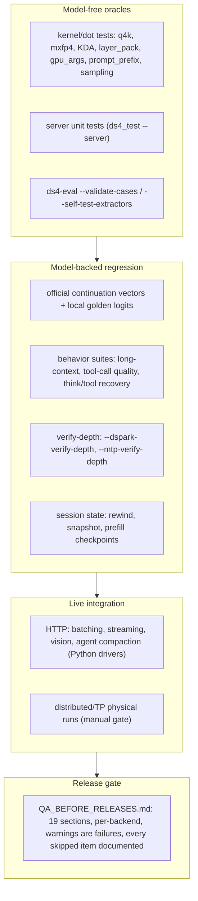

- **Official vectors**: `tests/test-vectors/<checkpoint>/` pins vendor continuation logprobs and local golden logits. A checkpoint/fixture mismatch is declared an *invalid test*, not a quality result (`docs/TESTING.md`).
- **`ds4_test`** (7,357 lines) is the main C runner with 19 groups; `--logprob-vectors` catches tokenizer/template/attention/quant regressions, `--metal-tensor-equivalence` proves the fast and quality prompt paths agree, `--metal-ssd-streaming-cache-pressure` is a regression pin for a real streaming bug (issue #384).
- **`ds4-eval`** is an in-repo capability harness (92 core + 50 hard + 12 hard-smoke cases, strictly graded on the final answer, with trace/regrade support), explicitly not a leaderboard.
- **`ds4-bench`** does context-frontier sweeps with *incremental* prefill (each row measures only the new suffix) and greedy non-EOS decode, emitting `prefill_tps`, `gen_tps`, `gen_first_ms`, `kvcache_bytes`.
- **A/B harnesses abort unless logits are bit-identical** — the mechanism that lets the team change dispatch/scheduling without silently changing math.
- **Ownership invariants have their own tests**: `tests/test_engine_mgpu_placement.c` checks the layer packer (weights vs runtime split), `test_session_state.c` checks rewind/snapshot round trips, `test_tp_*.c` check the TP protocol without two physical machines.

---

## 12. A guided reading path

The codebase is 249k lines; do not read it front to back. This order gives you a working model in a few hours and then lets you go deep on demand.

### Stage 0 — Orientation (30 min)

1. `README.md` — supported models/hardware, the "not a general GGUF runner" statement, and the platform guides table.
2. `AGENT.md` — the project's own rules; it explains *why* the structure is unusual (whole-model tape, mmap loading, hidden SSD overlap, no C++).
3. `ds4.h` — read it end to end (641 lines). This is the entire public contract: engine options, session lifecycle, slice APIs, payload formats, batching entry points.
4. `docs/DISTRIBUTED.md` — the operational view of §7 of this document.

### Stage 1 — The engine's shape (2 h)

5. `ds4.h` enums + `ds4.c:489-955` — shape profiles and the `g_ds4_shape` macro layer. Understand that model family is chosen at runtime from metadata.
6. `ds4.c:70425+` (`ds4_engine_open_internal`) — follow the order: options → `model_open` → `config_validate_model` → `weights_bind` → GPU init → streaming plan. Note where `load_slice` short-circuits.
7. `ds4.c:4774-5700` — the weight binder. Skim the tensor-name table for one family (`weights_bind_glm_dsa` or the DeepSeek path); the point is that GGUF names become semantic fields.
8. `ds4.c:7902-7945` — sliced loading and `weights_model_map_spans`: the mechanism every distributed mode depends on.

### Stage 2 — One token, one layer (3 h)

9. `ds4.c:30034` (`metal_graph_encode_token_raw_swa`) — read the decode tape top to bottom, but treat each kernel call as a black box on the first pass. You are looking for the ordering: embedding → per layer {attn + MoE} → output head.
10. `ds4.c:24085` (`metal_graph_encode_decode_layer_phase`) — the per-layer core. Read the attention part and then the MoE part.
11. `ds4.c:12718` / `:12971` — shared expert and routed MoE (CPU reference versions are the clearest specification of the GPU kernels).
12. `ds4.c:37428` — layer-major prefill; compare with the decode tape to see why prefill made streaming overlap possible.
13. `ds4.c:26700` (`overlap_selected_shared`) — the exact mechanism that hides expert loads.

### Stage 3 — The distributed modes (4 h, the core of your study)

14. `ds4.h:588-604` — the three slice entry points; read their contracts before anything else.
15. `ds4.c:74344` (`ds4_session_eval_layer_slice`) — the invariants list at the top is the contract of every distributed mode.
16. `ds4_distributed.c:1-200` — protocol constants and wire records; then `:1516-1749` (hash helpers) — small, self-contained.
17. `ds4_distributed.c:1944-2320` — route search + plan construction. Read `dist_route_validate_blob` (`:6131`) next; it is the security/consistency boundary.
18. `ds4_distributed.c:2554-2790` — `dist_coordinator_eval_remote_on_fd` and `dist_coordinator_eval_span`: the complete decode path, including the hidden-state vs logits decision.
19. `ds4_distributed.c:3513-3830` — pipelined prefill: sender thread, reader thread, flow window, ACK-only intermediates.
20. `ds4_distributed.c:6718-6800` + `:7171` — forwarding to the next stage and processing a WORK frame on a worker.
21. `ds4_distributed.c:2948-2990` — failure recovery: forget route, rebuild, replay transcript.
22. `ds4_distributed.c:4692-5230` — the DSV4/DSVL topology-neutral save/load path.
23. `ds4_tp.c:120-165` — the RDMA quirk comment block. Read it twice; it explains almost every odd choice in the file.
24. `ds4_tp.c:645-700` — slab layout; then `ds4_engine_tp_bind` (`ds4.c:72465`) — how the slab becomes per-slot tensor views.
25. `ds4_tp.c:1518-1610` — a single RDMA gate exchange, including the receive-window trick.
26. `ds4_tp.c:3011-3220` — the worker's lockstep loop. This is the clearest statement of the TP contract.
27. `ds4_gpu_tp.h` (57 lines) + `ds4_metal.m:10189-11270` — the GPU-side gate machine.

### Stage 4 — Periphery as needed

28. Streaming: `ds4.c:22780-23070` (hotlist load/seed), `:33814-33950` (seed from hotlist), `ds4_metal.m:13416-13650` (pread pool + eviction).
29. Serving: `ds4_server.c:10127` (server struct) → `:14642` (slot scoring) → `:13182` (decode coordinator) → `:13298` (cache ladder).
30. Speculation: `ds4.c:84972` (`ds4_session_eval_speculative`) and `:80195` (DSpark argmax path).
31. Vision: `ds4_image.c` preprocessing → `ds4_prompt_append_vision` → fingerprint-based prefix checks.
32. Tooling: `QA_BEFORE_RELEASES.md` §1–2 to learn which checks the maintainer considers non-negotiable.

### Exercises (each is a bounded experiment)

| # | Exercise | What it teaches |
| --- | --- | --- |
| 1 | Run `./ds4 --help` and map every flag to the `ds4_engine_options` field it sets (start in `ds4_cli.c`, then `ds4_dist_parse_cli_arg` / `ds4_tp_parse_cli_arg`) | how frontends configure the engine |
| 2 | `grep -n "tp_world" ds4.c` and list every place the tape branches on TP | how a cross-cutting feature touches each model tape |
| 3 | Instrument `dist_coordinator_eval_span` with a counter and run `DS4_DIST_DECODE_PROFILE=1` on a 2-stage split | real per-hop latency breakdown |
| 4 | Compute `ds4_tp_slab_bytes(43, 4096)` by hand and compare with the allocation in `ds4_engine_tp_bind` | why the slab is sized the way it is |
| 5 | Trace one prefix-hash mismatch by sending a deliberately wrong `--layers` range | the session-integrity invariant |
| 6 | Read `tests/test_engine_mgpu_placement.c` and reproduce its expectations for a 3-device config | how placement budgets include KV and scratch |
| 7 | Diff the DeepSeek decode tape against the GLM tape for the attention section | why model families are separate tapes |

---

## 13. Appendix: environment variables worth knowing

The codebase uses env vars for diagnostics and tuning. Those most relevant to the topics above:

| Variable | Default | Effect |
| --- | --- | --- |
| `DS4_DIST_PREFILL_CHUNK` | session cap | prefill chunk size (pipeline) |
| `DS4_DIST_PREFILL_WINDOW` | stages+2, ≤8 | chunks in flight |
| `DS4_DIST_PREFILL_SEND_DEPTH` | 2 | sender slots |
| `DS4_DIST_WORKER_PREFETCH_DEPTH` | 2 | worker job queue depth |
| `DS4_DIST_WORKER_FORWARD_WINDOW` | 4 | worker→worker pending window |
| `DS4_DIST_SOCKET_BUFFER_MB` / `_TIMEOUT_SEC` | 128 / 60 | socket tuning |
| `DS4_DIST_DISABLE_PREFILL_PIPELINE` | unset | force serial prefill |
| `DS4_DIST_DECODE_PROFILE` | unset | per-token distributed timing lines |
| `DS4_TP_GATE_TRACE` / `DS4_TP_GATE_PROFILE` | unset | TP gate tracing / per-gate µs profile |
| `DS4_TP_DISABLE_VERIFY_WINDOW` | unset | disable the RDMA verify-block window |
| `DS4_METAL_*_SOURCE` | unset | override a `metal/*.metal` file at runtime |
| `DS4_METAL_STREAMING_EXPERT_HOTLIST` | built-in | custom hotlist file |
| `DS4_METAL_DISABLE_STREAMING_EXPERT_HOTLIST` | unset | disable hotlist seeding |
| `DS4_EXPERT_HOTLIST` / `--expert-profile` | unset | profile expert usage and write a hotlist |
| `DS4_SERVER_DECODE_COALESCE_US` | 2000 | batch coalescing window |
| `DS4_KVSTORE_*` | see `ds4_kvstore.h` | cache budget, GC, alignment |
| `DS4_QWEN4_MTP_DEPTH` | adaptive | force Qwen draft depth |

## 14. Appendix: glossary

| Term | Meaning in this codebase |
| --- | --- |
| **tape** | the fixed per-token encode sequence; the "graph" |
| **layer slice** | a contiguous inclusive layer range a process/device owns and has actually mapped |
| **`hc` (hidden state)** | the HC-expanded activation vector (`n_hc * n_embd` f32 for DeepSeek) — the currency of pipeline parallelism |
| **gate** | a per-layer synchronization point where TP ranks exchange partial sums |
| **slab** | one GPU-visible, NIC-registered buffer holding all gate in/out slots |
| **route / plan** | the ordered list of remote stages after the coordinator's own layers, shipped with each WORK frame |
| **tier** | a logical device index in the in-box multi-GPU placement |
| **segmented / sliced GGUF** | a GGUF containing only some layers, loaded with `load_slice` |
| **DSV4 / DSVL** | session payload magic / per-layer-payload magic (topology-neutral checkpoints) |
| **hotlist** | compiled `{layer, expert}` table used to seed the streaming expert cache |
| **Engram** | DeepSeek V4/V4.1 disk-resident n-gram embedding table |
| **DSpark / MTP** | speculative decoding: external support model / built-in next-n block |
| **DSML** | DeepSeek's tool-call markup language (also the name of the parser subsystem) |
| **Class P scratch** | per-GPU-tier kernel scratch buffers replicated on every used tier |

## 15. Appendix: gotchas that will cost you time

1. **A bare `make` on Linux does nothing but print help.** Pick a backend target.
2. **Metal shaders are read from `metal/` at process start.** Running a binary from another checkout can fail at runtime, not at build time.
3. **One instance per model** — there is a deliberate `flock` instance lock; two big model processes will not coexist.
4. **`ds4_ssd.c` is not the IO engine.** It is budget math plus an `mlock` helper. Real IO lives in `ds4_metal.m` and `ds4_cuda.cu`.
5. **`ds4_layer_pack.c` has nothing to do with SSD streaming.** It is the multi-GPU layer placement packer.
6. **Coordinator must own layer 0**; only the final route entry may produce logits; a non-final entry requesting logits is rejected by the worker.
7. **`--dist-activation-bits 8` is E4M3 with no Inf/NaN and a ±240 clamp** — an accuracy hazard for large activations, not just a bandwidth knob.
8. **A worker disconnect drops all of its per-session KV**, so reconnecting always implies a transcript replay.
9. **TP is exactly two ranks** and refuses SSD streaming, pipeline mode, CPU backend and (on CUDA) anything but V4.1 Q2 with one GPU per rank.
10. **DeepSeek's compressors cannot truncate**, so a speculative rewind invalidates the checkpoint and forces a rebuild — unlike GLM/Qwen which restore snapshots.
11. **`-ffast-math` is selectively removed** (engram, several numeric tests); re-adding it changes results.
12. **The CPU backend can crash macOS** with very large mappings (`AGENT.md` safety note) — it is for tests and oracles, not for production runs.
13. **Warnings are release blockers** per `QA_BEFORE_RELEASES.md`, and `tests/test-vectors/` fixtures are checkpoint-scoped: 0731 vs pre-0731 vs Vision-Experimental are not interchangeable.
14. **Vision sessions cannot be saved to the text-keyed disk cache**, and image prefix reuse depends on SHA-256 fingerprints of the embeddings.

---

## 16. Appendix: the mega-fused kernels worth studying and reusing

The most reusable engineering asset in this repository is its **kernel-fusion discipline**. Decode is dispatch-bound: at ~43 layers, one extra kernel per layer costs ~43 extra submits per token. So the codebase fuses aggressively *within* a stage — and, unusually, the comments document exactly why each fusion is arithmetically identical to the sequence it replaces. That documentation is the real study material.

For each kernel below: what it fuses, where it lives, how it works, the exactness argument, the fallback, and what is worth stealing.

### 16.0 How to recognize a fused kernel

Naming is systematic across `metal/*.metal` and mirrored in `ds4_cuda.cu` / `ds4_qwen4_cuda.cuh`:

| Token in the name | Meaning |
| --- | --- |
| `mul_mv_id` | MoE expert gather + matvec, rows selected by an **id** list |
| `_pair_` | **gate and up projections in one kernel** (one shared activation read) |
| `_swiglu` | activation fused into the matvec dispatch |
| `_sum6` / `_sum8` | down projection accumulated over the 6/8 selected experts **plus** the weighted combine |
| `_reduce` | split-KV partial reduction (flash-attention tail) |
| `_rope` | a RoPE rotation appended to another stage |
| `_norm` / `_rms` | RMSNorm folded into a neighbor |
| `_store` | writes the KV cache (raw or compressed) |
| `_expand` / `_collapse` | hyper-connection stream expansion / collapse |
| `_fused` | explicitly multi-stage |
| `_pre_norm`, `cluster2`, `pack2`, `slots6` | threadgroup cooperation / phase or row-count specialization |
| `<NPT_>` (template) | simd-width or shape specialization (qwen4) |

Kernel inventory by file, for orientation:

| File | `kernel void` count | Focus |
| --- | ---: | --- |
| `metal/qwen4.metal` | 86 | Qwen3.8 trunk: attention prep/decode/merge, HC, MoE, MTP |
| `metal/moe.metal` | 84 | routed MoE per quant type, SwiGLU pairs, TP expert ownership |
| `metal/dsv4_misc.metal` | 69 | router, indexer, GLM glue, TP flag kernels, GLM QKV+KV fusion |
| `metal/dense.metal` | 21 | dense projections incl. compressor store |
| `metal/dsv4_hc.metal` | 14 | **hyper-connection** mega-fusions |
| `metal/dsv41.metal` | 10 | V4.1 specifics |
| `metal/dsv4_rope.metal` / `dsv4_kv.metal` | 9 / 9 | RoPE helpers, KV FP8 store, compressor packing, attention reduce |
| `metal/flash_attn.metal` | 5 | flash attention (pad/blk/vec/reduce) |
| `metal/norm.metal` | 5 | RMSNorm variants incl. the QKV triple fusion |

**Measure fusion before you trust a name.** Count dispatches in the host wrapper: `ds4_gpu_routed_moe_one_tensor` (`ds4_metal.m:40367`) is ~2,641 host lines with **0 direct `dispatchThreadgroups` calls** — it encodes via sub-helpers. By contrast `ds4_gpu_router_project_select_fused_tensor` (`:20539`), `ds4_gpu_hc_expand_add_rms_norm_mix_split_norm_f16_tensor` (`:45234`), `ds4_gpu_shared_down_hc_expand_q8_0_tensor` (`:46124`), `ds4_gpu_qkv_pair_quad_compressor_store_tensor` (`:21670`), `ds4_gpu_glm_qkv_norm_store_compact_kv_tensor` (`:34613`) and `ds4_gpu_glm53_kda_decode` (`:47470`) each issue **exactly one** dispatch. That is the real dividing line between "fused" and "chained".

### 16.1 QKV RMS-norm + KV RoPE + FP8 store (the decode triple fusion)

**Where:** `metal/norm.metal:255` — `kernel_dsv4_qkv_rms_norm_kv_rope_fp8_store_f32`.
**Host wrapper:** `ds4_gpu_dsv4_qkv_rms_norm_kv_rope_fp8_store_tensor` (`ds4_gpu.h:1160`, implementation `ds4_metal.m:22613`), emitted from the DeepSeek decode tape at `ds4.c:24660-24775`.
**Fuses:** (1) Q RMS-norm of the q-lora row, (2) KV RMS-norm, (3) KV RoPE tail rotation, (4) E4M3 FP8 round trip + f16-consistent raw-cache commit — four back-to-back dispatches on the same rows.

**How it works.** The grid is 2-D: `dispatchThreadgroups(MTLSizeMake(rows, defer ? 1 : 2, 1))` — `y == 0` is the Q task, `y != 0` is the KV task, so one dispatch serves two differently-shaped norms. A task bitmask (`args.tasks`: `1u` = q, `2u` = kv) lets the host run only one half. The Q threadgroup body is byte-identical to `kernel_dsv4_qkv_rms_norm_f32_4` (`metal/norm.metal:186`): float4 dot accumulation → `simd_sum` → 32-slot cross-simdgroup reduction through `shmem_f32` → `rsqrt` → scaled weight multiply.

The KV threadgroup then continues into RoPE and the store inside the *same* threadgroup. The header comment states the discipline:

> "the kv threadgroup continues with the shared affine-row RoPE helper (lane mapping preserved: `r == lane` on the first 64 lanes) and a verbatim copy of `kernel_dsv4_kv_fp8_store_f32` with its work predicated to the first 64 lanes (**barriers stay uniform across the whole threadgroup**). Arithmetic, order and rounding are unchanged; gated and verified against full-vocabulary logits before promotion."

Two details to internalize:

- **Predicated lanes, uniform barriers.** The FP8 phase needs only 64 lanes (`tid < 64u` gates the work) but *every* thread executes the barriers. This is the standard way to fuse sub-width stages without diverging around a `threadgroup_barrier`.
- **Precision-matched round trip.** The raw cache is written as `(float)((half)q)`, deliberately demoting to f16 to match what flash-attention's half-typed KV buffer sees; the diagnostic `DS4_METAL_KV_RAW_F32` is explicitly labelled "not a production-ready setting".

**The deferred-task trick** (`ds4_gpu.h:158-165`, implementation `ds4_metal.m:22518-22611`) is the most interesting part. When armed, the fused kernel runs only the Q task and stashes the KV norm/RoPE/FP8 work in a file-static `g_kv_task`; that work is then folded into the layer's KV staging kernel, with `ds4_gpu_kv_norm_task_flush()` running it standalone if nothing consumed it (call sites `ds4_metal.m:27598`, `:31032`, `:31084`). There is even a `begin_concurrent`/`end_concurrent` pair (`ds4_metal.m:22574`) to run the KV task concurrently under the q_b projection's command-buffer section. The tape arms it only under tensor parallelism (`ds4.c:24699`: `if (defer_kv && g->tp_world == 2)`).

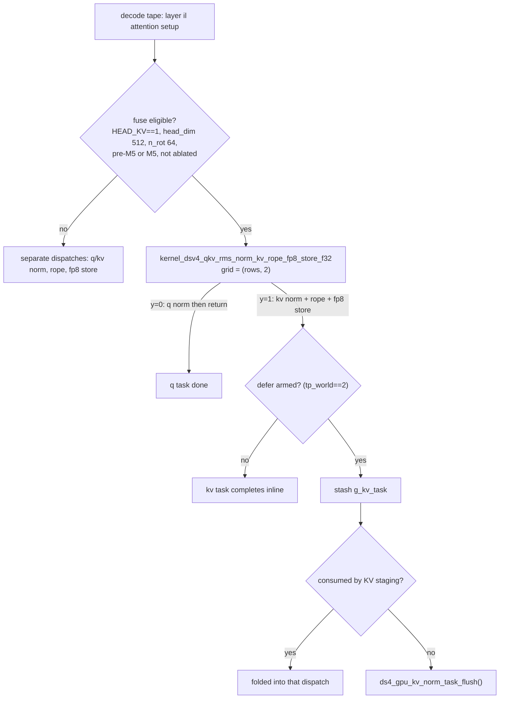

**Gate conditions** (`ds4.c:24680-24692`): `DS4_N_HEAD_KV == 1`, head_dim 512, n_rot 64, live raw cache, full decode phase, and pre-M5 or M5 Apple Silicon with `ds4_gpu_kv_rope_fp8_fuse_available()`. Kill switches: `DS4_METAL_DISABLE_PRE_M5_QKV_NORM_KV_STORE_FUSE`, `DS4_METAL_DISABLE_KV_NORM_DEFER`.
**Not on CUDA:** this triple fusion has no CUDA equivalent — CUDA's `ds4_gpu_dsv4_qkv_rms_norm_kv_rope_fp8_store_tensor` is a multi-launch path. That asymmetry is typical (§16.12).

**Reuse value:** a complete worked example of (a) a 2-D grid encoding two different jobs, (b) predicated sub-width phases with uniform barriers, (c) a *deferred* fusion whose tail executes later inside an unrelated kernel, with a flush path for safety.

### 16.2 Compressor row finalize: seven dispatches into one

**Where:** `metal/dsv4_rope.metal:647` — `kernel_dsv4_comp_row_finalize_f32`; sibling `kernel_flash_attn_ext_vec_reduce_rope` at `:594`.

This is the most instructive kernel in the tree **because the comment is a complete bit-exactness proof**. It runs every `ratio`-th token per compressor (DeepSeek V4 pools sparse-attention rows by compression ratio) and replaces seven single-row dispatches:

| Phase in the fused kernel | Standalone kernel whose math it reproduces |
| --- | --- |
| RMS norm of the pooled row | `kernel_rms_norm_mul_f32_4`'s tree (float4 lanes, `simd_sum`, zero-padded 32-slot cross-simdgroup reduce); 512-wide uses 128 virtual threads on simdgroups 0-3, 128-wide uses 32 virtual threads on simdgroup 0 |
| RoPE tail | `ds4_rope_tail_pair_affine_row` verbatim (lanes 0-63, `nthreads = 64`) |
| FP8 round trip | `kernel_dsv4_fp8_kv_quantize_f32`'s 64-lane shared-memory max tree; `src == dst`, so the verbatim tail copy is dropped |
| Commit copy | per-element `f32 -> f16` (value-wise exact) |
| Indexer QAT | `kernel_dsv4_indexer_hadamard_fp4_f32`'s butterfly + per-32 amax tree, lanes 0-127 |

One dispatch, **two threadgroups** (one per compressor row width: 512 and 128 floats). The unifying rule, again from the comment: *"Threads outside a phase's virtual width still execute every barrier, so threadgroup barriers stay uniform across the 256-thread threadgroup."*

The `:594` sibling applies the same idea to the attention output: one threadgroup owns a head's entire 512-float row, so the inverse RoPE is an *intra-threadgroup* dependency — "reduce, barrier, rotate" — and it calls the same shared `noinline` helpers as the standalone kernels:

> "Both halves call the same shared `noinline` helpers the standalone kernels use, so the arithmetic and its codegen are identical to running the two dispatches back to back."

**Reuse value:** the pattern *"extract the standalone kernel body into a `noinline` helper, then call that same helper from both the standalone kernel and the fused one"* is the most portable trick in the file. It is how you fuse without forking the math.

### 16.3 Router: projection + probability + device-wide top-k in one dispatch

**Where:** `metal/dsv4_misc.metal:5274` — `kernel_dsv4_router_project_select_fused`; host wrapper `ds4_gpu_router_project_select_fused_tensor` (`ds4_gpu.h:847`, `ds4_metal.m:20539`, Metal-only, one dispatch).

**Fuses:** the router GEMM (`n_expert` rows × `n_embd`), the logits reduce-and-write, the probability transform, the optional expert bias, and the **full top-k selection**.

Four phases inside one kernel:

1. **GEMM** — `NR0 = 2` output rows per threadgroup, `NF = 16` floats per lane group, half4 weight rows with `FOR_UNROLL` float4 dot products, then `helper_mv_reduce_and_write<NR0>()` for the cross-simdgroup reduce.
2. **Grid-wide completion via a device-scope atomic** — the killer detail. Each threadgroup bumps a device-scope counter; only the last one (of 128) proceeds:

```c
atomic_thread_fence(mem_flags::mem_device, memory_order_seq_cst, thread_scope_device);
if (tid == 0) {
    const uint old = atomic_fetch_add_explicit(completion, 1u, memory_order_relaxed);
    scratch[0] = old == 127u ? 1.0f : 0.0f;
}
threadgroup_barrier(mem_flags::mem_threadgroup);
if (scratch[0] == 0.0f) return;              // only the last block selects
atomic_thread_fence(mem_flags::mem_device, memory_order_seq_cst, thread_scope_device);
```

   That hand-rolled device barrier plays the role a second kernel launch normally would: it guarantees all logits are visible before selection starts.
3. **Probability transform** — `volatile` reloads force a re-read after the fence; `p = sqrt(log1p(exp(x)))` is written as `select(log(1+exp(x)), x, x > 20)` for overflow safety, plus the optional bias.
4. **Bitonic top-k over 256 experts, hybrid execution** — stages with `j < 32` use `simd_shuffle_xor` (register-to-register); stages with `j >= 32` bounce through threadgroup memory with ping-pong score/idx buffers indexed by `cross_stage` parity. Sort direction is derived from the bit pattern (`(tid & k) == 0`).

**Reuse value:** the canonical "small-N selection fused into its producer" kernel — exactly the shape any MoE router needs — and a demonstration of a grid-wide barrier without a second launch.

### 16.4 Hyper-connection: gate + Sinkhorn + collapse + RMSNorm

**Where:** `metal/dsv4_hc.metal:462` — `kernel_dsv4_hc_split_weighted_sum_norm4` (the `n_hc == 4` specialization; generic sibling `:288`; the Sinkhorn helper `ds4_hc_comb_weights4_exact` is at `:400`).

DeepSeek V4 carries four parallel residual streams ("hyper-connections"). Producing the sublayer input from them is logically: `pre = sigmoid(mix·scale + base + eps)`, a Sinkhorn-normalized 4×4 combination matrix (`sinkhorn_iters` from metadata, default 20), the weighted collapse of four HC streams into one `n_embd` row, and an RMSNorm — plus writing the split/pre/post intermediates the next stage consumes.

All of it in one dispatch:

- `tid == 0` runs the scalar chain: sigmoid pre-gate, post-gate `2·sigmoid(z)`, then the Sinkhorn iterations as four `float4`s with alternating row/column normalization (`col_inv = 1/(r0+r1+r2+r3+eps)`) and max-subtraction before `exp` for stability.
- The whole threadgroup then performs the collapse, **preserving the standalone kernel's explicit accumulation order** (`v += x0[i]*pre0; v += x1[i]*pre1; …`), accumulates `dot(v,v)` for the norm, reduces via `simd_sum` + a 32-slot shared array, and writes both the collapsed row and the normalized output.

The exactness note is a small masterclass in *not* "fixing" numerics while fusing:

```c
const float norm_arg = sumf / float(n_embd) + args.norm_eps;
const float norm_scale = args.n_rows > 1 ? 1.0f / sqrt(norm_arg) : rsqrt(norm_arg);
```

because single-row decode historically used `rsqrt` while batched prefill used `1/sqrt`.

**The deepest fusion in the codebase** is the sibling pair at `metal/dsv4_hc.metal:1546` / `:1573` — `kernel_dsv4_hc_rms_norm_mix_f16_cluster2_pre_norm` and `kernel_dsv4_hc_expand4_rms_norm_mix_f16_cluster2_pre_norm`, wrapped by `ds4_gpu_hc_rms_norm_mix_split_norm_f16_tensor` / `ds4_gpu_hc_expand_add_rms_norm_mix_split_norm_f16_tensor` (`ds4_gpu.h:2931` / `:2951`, one dispatch each). They compose HC post/expand + the compound HC producer + a 1024-virtual-thread RMS reduction + an f16 mix matvec + Sinkhorn split + weight RMSNorm **across six co-resident threadgroups coordinated by a device-scope atomic barrier**, whose target the host passes as `6 * dispatch count`:

> "Phase 0 spreads `kernel_dsv4_hc_expand4` … over the six threadgroups and writes the expanded residual x; a device-scope barrier across the co-resident threadgroups then orders every read of post/comb and every write of x before the producer overwrites split and reads x. The barrier counter is monotonic; the host passes `6 * dispatch count`."

Both are inside `#ifdef __APPLE__` (`ds4_gpu.h:2930-2977`) — Metal-only.

### 16.5 Shared-expert down projection + HC expand tail

**Where:** `metal/dsv4_hc.metal:704` — `kernel_dsv4_shared_down_hc_expand4_q8_0`; wrapper `ds4_gpu_shared_down_hc_expand_q8_0_tensor` (`ds4_gpu.h:3051`, one dispatch).

**Fuses:** `shared_out = shared_mid @ W_shared_down` (Q8_0 matvec) **and** `after_ffn_hc = HCPost(routed_out + shared_out, residual_hc, split)`.

The comment states the constraint precisely:

> "The Q8_0 dot reduction is intentionally copied from the normal matvec shape so the shared expert result is bit-identical. The only specialization is that DS4 decode has one token and HC=4, so the thread that finishes each shared-down output row can immediately expand it into the four HC streams."

The lane math is a compact reference for every block-quantized matvec in the project:

```c
constexpr short NQ = 8;                 // quants per lane chunk
const short ix = tiisg / (NW / NQ);     // lane's k-slice
const short il = tiisg % (NW / NQ);     // lane's offset inside the block
...
for (int ib = ib0; ib < nb; ib += NSG * NQ) {
    FOR_UNROLL(short i = 0; i < NQ; ++i) yl[i] = yb[i];
    FOR_UNROLL(short row = 0; row < NR0; ++row) {
        device const int8_t *qs = ax[row][ib].qs + il * NQ;
        float sumq = 0.0f;
        FOR_UNROLL(short i = 0; i < NQ; ++i) sumq += qs[i] * yl[i];
        sumf[row] += sumq * ax[row][ib].d;   // block scale applied after the int dot
    }
    yb += NSG * NQ * QK8_0;
}
```

then `simd_sum` per row, a `shmem_f32[row][tiisg]` transpose (one float per row per simdgroup), a final `simd_sum` of the shared row — and lane 0 of simdgroup 0 writes `shared_out` **and immediately performs the 4-stream HC expansion in registers**.

**Reuse value:** the reduction skeleton (quantized int dot → per-lane partial → `simd_sum` → shared transpose → final `simd_sum` → epilogue) generalizes to any elementwise epilogue: bias, gate, norm, expand.

### 16.6 Routed MoE: two dispatches, with expert ownership

The routed MoE looks like a five-stage pipeline (gather → gate/up → SwiGLU → down → weighted combine) and is implemented as **two** compute dispatches per token:

| Dispatch | Kernel family | Fuses |
| --- | --- | --- |
| 1 | `kernel_mul_mv_id_{iq2_xxs,q4_K,mxfp4}_pair_swiglu_f32` (`metal/moe.metal:3582`, `:4322`, `:4589`; plus `pack2_overlap` `:3725`, `slots6` `:3878`, `addr_` `:3974`, `masked_` `:4114`, `tp_static` `:4819`) | expert gather by id, gate matvec, up matvec, optional clamp, SwiGLU, route weight |
| 2 | `kernel_mul_mv_id_{iq2_xxs,q2_K,q4_K,mxfp4}_sum6_f32` (`metal/moe.metal:5801`, `:5901`, `:6747`, `:6403`) | down matvec across the 6 selected experts, weighted summation, optional `add_in` |

Two structural ideas to steal:

1. **Ownership predicate instead of divergent geometry.** Under tensor parallelism each rank owns half the experts; the kernel simply returns early for the rest:

```c
const int32_t i02 = ((device const int32_t *)(ids + iid1 * args.nbi1))[idx];
if (!ds4_tp_owns_expert(i02, args.ne02, args.tp_rank, args.tp_world)) return;
const int i02b = i02 - args.tp_expert_base;   // index inside the owned shard
```

   No separate launch geometry, no host-side filtering; ownership is a per-threadgroup predicate (`ds4_tp_owns_expert`, `metal/moe.metal:449`), and both ranks run identical launch shapes.
2. **Codebook dequantization staged in threadgroup memory.** The IQ2_XXS grid and sign tables are copied once per threadgroup (`svalues`, `ssigns`) and indexed by the packed code bits inside the hot loop, keeping quantized read traffic minimal.

The host entry `ds4_gpu_routed_moe_one_tensor` (`ds4_metal.m:40367`) picks the kernel pair by quant type (a host-side pipeline switch, not a C++ template), with the Q2_K `_sum6` and `_addr_` variants serving SSD-streaming/expert-table layouts.

### 16.7 Attention decode: 32 split-KV partials + softmax + sink + reduce + inverse RoPE

**Where:** `metal/dsv4_rope.metal:832` — `kernel_dsv4_flash_attn_vec_packed32_reduce_rope_f16_dk512_dv512`, which calls the `static inline` helper `ds4_flash_attn_vec_packed8_reduce_f16_512` (`metal/flash_attn.metal:1457`). The generic path is two dispatches (`kernel_flash_attn_ext_vec` at `flash_attn.metal:970` + `kernel_flash_attn_ext_vec_reduce` at `:1442`, or the RoPE-fused `dsv4_rope.metal:594`).

This is the attention mega-kernel: one 256-thread dispatch per head collapses 32 split-KV partials with online softmax and attention sinks, reduces them, and applies the **inverse** RoPE to the result. The helper's own comment describes the trick:

> "M5 decode specialization: time-slice all 32 split-K workgroups through eight physical simdgroups, then reduce through the same 32-lane topology without a device partial buffer. The host gate fixes the exact F16 512-wide geometry."

It is guarded by a long **uniform specialization guard** at the top — compile-time feature flags and shape constants checked as a single `if` (mask and sinks required, bias/scap rejected, `nsg == 1`, `nwg == 32`, `ns10 == ns20 == 512`, head_dim 512, `n_dims == 64`, `row_bytes == 2048`, inverse RoPE required). If any condition fails the kernel does nothing and the host takes the generic path — the host applies the *same* gate ("Uniform specialization guard; host applies the same eligibility gate"). That is a clean pattern for shipping highly specialized kernels safely.

Also in `dsv4_rope.metal`: the indexer QAT path (Hadamard butterfly + per-32 amax + FP4/E2M1 round trip with `exp2(ceil(log2(amax/6)))` scaling) is fused into the same file's finalize kernels rather than left as separate dispatches.

### 16.8 KV staging: ring gather + dtype convert + compressed transport + pad

**Where:** `metal/cpy.metal:145` — `kernel_dsv4_flash_kv_stage_f16`; host `ds4_gpu_flash_kv_stage_f16_tensor` (`ds4_gpu.h:2152`, `ds4_metal.m:27640`).

Decode-time gathered attention consumes a *logical* raw-cache ring followed by an already-f16 compressed cache. This kernel packs both regions into the contiguous f16 flash-attention scratch in one dispatch, fusing what previously took 3-4:

- **raw ring gather with wrap-around** (`physical_row = raw_start + logical_row; if (physical_row >= raw_cap) physical_row -= raw_cap;`) plus `float4 -> half4` conversion;
- **compressed-cache transport** as `packed_ushort4` (pure bit movement, no conversion);
- **optional mask/pad append**, so the vector attention kernel's redirected final partial block lands in this same dispatch.

The selection is a single flat `gid` range partition (`gid < raw_vecs`; `< total_vecs`; else pad) — a nicely cache-friendly alternative to a multi-axis grid when all segments have identical vector width.

### 16.9 GLM: multi-part kernels and linear attention

- `metal/dsv4_misc.metal:722` — `kernel_glm_qkv_norm_store_compact_kv` (host `ds4_gpu_glm_qkv_norm_store_compact_kv_tensor`, `ds4_metal.m:34613`, one dispatch). A 2-D grid where `x` is the token and `y` is the **part** (`0` = Q norm, `1` = KV norm, `2` = compact-KV store), with `part > 2u` returning immediately. This is the cleanest, smallest "one kernel, N jobs" example in the tree — start here before the HC kernels.
- `metal/glm53_kda.metal:14` — `kernel_glm53_kda_decode` (host `ds4_gpu_glm53_kda_decode`, `ds4_metal.m:47470`): GLM 5.3's Kimi Delta Attention in one decode dispatch — conv-state update + recurrent-state update + gating, with recurrent and convolution state kept FP32. The prefill counterpart is split by necessity into prepare (`:162`), recurrence (`:249`) and output (`:289`) because the recurrence is sequential over tokens.

### 16.10 What is *not* fused (honest boundaries)

| Path | Reality |
| --- | --- |
| Routed MoE | Two compute dispatches (`_pair_swiglu` + `_sum6`) plus address/gather encoding helpers — not one kernel, but far fewer than the five logical stages. |
| `ds4_gpu_flash_kv_stage_f16_tensor` host wrapper | The wrapper (`ds4_metal.m:27640`) is a ~2,537-line staging loop issuing a dispatch per layer region; the *kernel* is fused (§16.8), the loop is not. |
| Argmax | `ds4_gpu_argmax_tensor` (`ds4_metal.m:19189`) is a 14-line wrapper that **reuses the top-k machinery**: `ds4_gpu_indexer_topk_tensor(out_idx, logits, n_vocab, 1, 1)`. Fusion by reuse rather than new code — worth copying as a habit. |
| TP partial combine | Separate entry points (`ds4_gpu_routed_moe_owned_slots_combine_tensor`, `..._packed_combine_tensor`, `ds4_gpu.h:2752`/`:2769`) because the peer's partials arrive over the network — a deliberate second stage. |
| CUDA-primary entries on Metal | Several fused entries exist only for CUDA: `ds4_gpu_matmul_q8_0_top1_tensor` appears **0 times** in `ds4_metal.m`; `ds4_gpu_attn_q_b_f16_head_rms_rope_tail_tensor` (`ds4_metal.m:22958`) is a pure stub that voids every argument and `return 0` to force the caller's fallback. |

### 16.11 What CUDA and ROCm fuse differently

The CUDA backend is a single 34,039-line TU in which the dominant pattern is a **host-side dispatch ladder**: try the fastest fused path, and on any validation failure or kernel error fall through to a simpler one (usually printing one stderr line). Consequences worth knowing before porting:

| Aspect | Metal | CUDA | ROCm |
| --- | --- | --- | --- |
| QKV norm+RoPE+FP8 triple fusion | **Yes**, one dispatch (`norm.metal:255`) | No — multi-launch | No |
| Deferred KV-norm task | **Yes** (`g_kv_task`, TP-gated) | No | No |
| HC cluster2 mega-fusions | **Yes**, Metal-only (`#ifdef __APPLE__`) | Not present | Not present |
| Routed MoE | 2 dispatches (`_pair_swiglu` + `_sum6`) | Fused gate/up/mid and down/direct-sum kernels; prefill splits into the vendored **MMQ** tier | Shares CUDA's source shape via `rocm/*.cuh` |
| Shared gate/up/SwiGLU | 1 dispatch (`_impl`, `ds4_metal.m:20324`) | 2 dispatches in places | **1 kernel**: `shared_gate_up_swiglu_q8_0_rows_w32_kernel` (`rocm/ds4_rocm_shared_expert.cuh:45`), with a scalar two-dispatch fallback at `:66` |
| Qwen3.8 decode fusions | Gated: env override or device name contains "M3 Ultra" (`ds4_metal.m:48485`) | **Unconditional**: `ds4_gpu_qwen4_decode_fusions_enabled()` is `{ return 1; }` (`ds4_qwen4_cuda.cuh:2191`) | Follows CUDA |
| Attention decode | 1 dispatch on M5 (packed32 + reduce + inverse RoPE) | Score-tile attention kernels; decode-graph capture for stable single-token resident work | HIP twins of the CUDA kernels |

The CUDA prefill tier is the vendored llama.cpp **MMQ** stack under `cuda/mmq/`, and it is itself a study-worthy fusion design:

- `mmid.cu` — converts MoE expert ids into compact expert-sorted column permutations and expert bounds, packing `(it, iex_used)` into 22/10 bits;
- `mmvq.cu` — the decode/vector half (`mul_mat_vec_q`, `mul_mat_vec_q_moe`) with per-quant-type `vec_dot` dispatch tables;
- `mmq.cuh` — the prefill tensor-core tile GEMM (`mul_mat_q`) with stream-K fixup and arch-dependent `__launch_bounds__`;
- `ds4_mmq.cu` / `ds4_mmq_d2r.cu` — the ds4-specific aligned-SoA and D2R variants, plus a repack step (`ds4_repack.cu`).

The `mmid`/`mmvq` split is the reason a Q4_K/IQ2_XXS MoE can run as a *sorted-column* batched GEMM in prefill yet as a gather-matvec in decode, from the same weights.

### 16.12 Technique checklist (what to extract for your own kernels)

| Technique | Where to see it | Why it works |
| --- | --- | --- |
| Extract the standalone body into a `noinline` helper; call it from both standalone and fused kernels | `dsv4_rope.metal:594`, `:647` | Fuse without duplicating math; identical codegen keeps results bit-identical |
| Predicate sub-width phases, keep barriers uniform | `norm.metal:255` (64-lane store in a 256-thread group) | Threadgroup barriers must be reached by every thread |
| Use a 2-D/3-D grid as a job selector (`y` = task/part) | `norm.metal:255`, `dsv4_misc.metal:722`, `cpy.metal:145` | One launch, multiple differently-shaped jobs |
| Defer a kernel tail into a later unrelated kernel; provide a flush | `ds4_metal.m:22518-22611`, tap at `ds4.c:24699` | Work moves into a dispatch already touching the same data |
| Grid-wide completion via a device-scope atomic counter; last block does the tail | `dsv4_misc.metal:5274` | Emulates a device barrier without a second launch |
| Hybrid bitonic selection (`simd_shuffle_xor` for `j < 32`, threadgroup ping-pong above) | `dsv4_misc.metal:5274` | Keeps cheap stages register-resident |
| Producer-tail fusion: the thread that finishes an output row runs the epilogue | `dsv4_hc.metal:704` | Zero extra traffic for bias/gate/norm/expand |
| Multi-threadgroup cooperation with a monotonic device barrier sized `co_resident_groups * dispatch_count` | `dsv4_hc.metal:1573` | Lets several threadgroups cooperate as one |
| Ownership predicate for tensor parallelism instead of host-side partitioning | `moe.metal:3582` + `ds4_tp_owns_expert` (`moe.metal:449`) | Identical launch geometry on both ranks |
| Precision-matched stores with a diagnostic override | `norm.metal:255` (`DS4_METAL_KV_RAW_F32`) | Fused and non-fused consumers see identical values |
| Uniform specialization guard inside the kernel, mirrored by the host gate | `dsv4_rope.metal:832` | Ship hyper-specialized kernels with a guaranteed safe fallback |
| Reuse an existing selection kernel for a simpler problem | `ds4_metal.m:19189` (argmax = top-k with k=1) | Less code, one place to optimize |

### 16.13 Verification discipline to copy

1. **Keep a switch.** Every fusion is disableable: `DS4_METAL_DISABLE_PRE_M5_QKV_NORM_KV_STORE_FUSE`, `DS4_METAL_DISABLE_KV_NORM_DEFER`, `DS4_QWEN4_DECODE_FUSIONS=0`, plus reference paths. A fusion you cannot turn off cannot be bisected.
2. **Prove bit-identity, not similarity.** The A/B harnesses (`speed-bench/metal_decode_schedule_bench.c`, `metal_prefill_variant_bench.c`) *abort* unless every full-vocabulary logit row is bit-identical and the selected token matches.
3. **Gate on full-vocabulary logits**, which is what the comments mean by "gated and verified against full-vocabulary logits before promotion".
4. **Write down the accumulation order** wherever fusion could re-associate a sum — including preserving historical quirks such as `rsqrt` for single-row decode.
5. **Assert shape preconditions at the top of the kernel and return early**, letting the host wrapper fall back (`if (hc.n_hc != 4 || hc.n_tokens != 1) return;`).

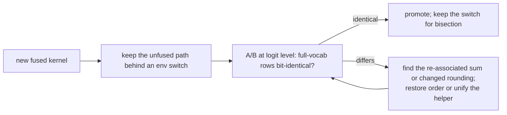

### 16.14 Where to start reading, in order

1. `metal/dsv4_misc.metal:722` — smallest complete "one kernel, N parts" example.
2. `metal/norm.metal:255` + `ds4_metal.m:22518` — predicated phases and the deferred-task pattern.
3. `metal/dsv4_rope.metal:647` — seven-into-one fusion whose comment is a per-phase exactness proof.
4. `metal/dsv4_hc.metal:462` — Sinkhorn + collapse + norm in one dispatch, with the `rsqrt` exactness note.
5. `metal/dsv4_hc.metal:704` — the quantized matvec reduction skeleton and the producer-tail epilogue.
6. `metal/dsv4_hc.metal:1573` — six co-resident threadgroups behind a device-scope barrier (the deepest fusion).
7. `metal/dsv4_misc.metal:5274` — device-scope atomics and an in-kernel top-k.
8. `metal/moe.metal:3582` + `:5801` — the two-dispatch routed MoE with the TP ownership predicate.
9. `metal/dsv4_rope.metal:832` and `metal/cpy.metal:145` — the M5 attention mega-reduce and the KV staging packer.
10. `ds4_metal.m:20324` / `:20440` / `:20539` — how a fused dispatch is composed on the host (pipeline lookup, `setBytes` constants, threadgroup memory length, grid shape).
11. `cuda/mmq/mmid.cu` + `mmvq.cu` + `mmq.cuh` — the vendored prefill/decode quantized-matmul split, for contrast with the hand-written Metal paths.
12. `speed-bench/metal_decode_schedule_bench.c` — the bit-identity harness that guards all of the above.

---


---

## 17. Appendix: splitting DeepSeek V4.1 Flash Q2 across a DGX Spark and a Mac Studio M4 Max

**Question asked:** what is the optimal way to split `DeepSeek-V4.1-Flash-Q2.gguf` (341 GiB) across a DGX Spark (CUDA) and a Mac Studio M4 Max (Metal), so that both prefill and decode are as fast as possible, with copy-paste commands.

**Answer up front:** *not possible in this engine as it stands.* Of the three splitting mechanisms, **pipeline parallelism is explicitly rejected for the V4.1 family**, and **network tensor parallelism requires two ranks that produce identical activations** — Spark/Metal and Spark/CUDA do not, and their RDMA transports are incompatible besides. So the honest optimal configuration for this hardware pair today is **two independent single-machine servers** (§17.6), each with its own SSD-streaming setup. §17.5 works out the split you would want *if* the capability existed, because the arithmetic is the same one you would need to re-evaluate after any patch — and it confirms your intuition that the Spark should carry the majority of the layers.

Everything below is code-verified in the tree at `~/dev/ds4`; measured throughput numbers are quoted with their source, and derived numbers are labelled.

### 17.1 The two machines

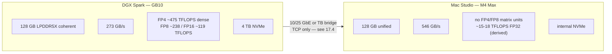

Sources: NVIDIA DGX Spark product page and developer blog (1 PFLOP FP4 sparse, 128 GB, **273 GB/s**), TechPowerUp GB10 entry (FP4 475.4 / FP8 237.7 / BF16 118.8 / TF32 59.4 TFLOPS), Apple/Flopper for M4 Max (**546 GB/s** with the 16-core CPU / 40-core GPU configuration; the 14-core/32-GPU variant is 410 GB/s).

**Measured on an identical workload** — Flash Q2 (a different, smaller checkpoint) in `speed-bench/m4_max.csv` and `speed-bench/gb10.csv`, 2048-token prefill chunks and 128 greedy tokens:

| Context | M4 Max prefill | GB10 prefill | ratio | M4 Max decode | GB10 decode | ratio |
| ---: | ---: | ---: | ---: | ---: | ---: | ---: |
| 2 048 | 343.76 t/s | 825.76 t/s | Spark **2.40×** | 26.76 t/s | 18.05 t/s | Mac **1.48×** |
| 4 096 | 303.46 t/s | 899.52 t/s | Spark **2.96×** | 26.52 t/s | 15.47 t/s | Mac **1.71×** |
| 65 536 | 204.96 t/s | 822.98 t/s | Spark **4.02×** | 22.92 t/s | 13.84 t/s | Mac **1.66×** |

Your premise is confirmed by the project's own data: **the Spark wins prefill by 2.4-4×, the Mac wins decode by ~1.5-1.7×**, and the prefill gap widens with context while the decode gap is roughly constant.

**Measured V4.1 Flash Q2** (the model you have):

| Configuration | Prefill | Decode | Source |
| --- | ---: | ---: | --- |
| One Spark, Q2 SSD streaming, 64 GiB cache, 64K ctx | 84.90 t/s @2K → 384.45 t/s @32K | 9.3 t/s (auto cache, 32K ctx, 256 tokens) | `QA_BEFORE_RELEASES.md` §17 CUDA SSD streaming |
| Two Sparks, network TP, resident (20 layers/rank) | ~205 t/s @1K, 406.93 t/s @32K | **21.9 t/s** mean single session, 20.86 t/s long run; 28 t/s aggregate over 8 sessions | `docs/DGX_SPARK.md` |
| M3 Ultra 512 GB, V4.1 **Q4** resident | 341.75 t/s @4K | 18.69 t/s | `QA_BEFORE_RELEASES.md` §17 |
| M4 Max, V4.1 Q2 | **not measured anywhere in the repo** | idem | repo gap |

Note for interpretation: **two Sparks in tensor parallel reach 2.35× the decode of one Spark streaming** (21.9 vs 9.3 t/s). That ratio — not parallelism for its own sake — is what a working split buys you: it replaces SSD streaming with residency.

### 17.2 What the model requires

- One file, `365,713,686,528` bytes = **340.60 GiB**; docs round to 341 GiB.
- **~151.8 GiB of main weights** and **~188.8 GiB of disk-only Engram tables** in the same file.
- **40 transformer layers**, `n_embd` 5120, `n_hc` 4 → the inter-stage activation vector is `4 × 5120 = 20 480` f32 = **80 KiB per token**.
- Engram tables live at **layers 1 and 14** and are read from the file by `pread` (`ds4_engram.c`; `ds41_engram_prefetch_*`). They are deliberately excluded from the model map (`ds4.c:3391-3393`) and must stay unmapped (`ds4.c:6941-6945`).
- Consequence: **any process that owns layer 1 or 14 needs the 341 GiB file on local disk**, and every process needs the file anyway to map its slice.

### 17.3 Why pipeline parallelism is blocked for V4.1

This is not a missing feature you can enable with a flag — the engine refuses the combination at open time:

```c
/* ds4.c:70585 */
if (DS4_MODEL_FAMILY == DS4_MODEL_FAMILY_DEEPSEEK41 && !opt->inspect_only) {
    const bool supported = (e->backend == DS4_BACKEND_METAL || ... CUDA ...) &&
        opt->distributed.role == DS4_DISTRIBUTED_NONE &&
        !load_slice && !opt->dspark && !opt->glm_mtp && ... ;
    if (!supported) {
        fprintf(stderr, "ds4: V4.1 requires Metal or single-GPU CUDA per rank "
                        "(optional network tensor parallelism); DSpark, steering "
                        "and legacy diagnostics are not supported ...");
```

Read the two load-bearing terms: **`opt->distributed.role == DS4_DISTRIBUTED_NONE`** and **`!load_slice`**. Pipeline parallelism sets *both* (`ds4_distributed.c:8369-8387` sets `load_slice/load_layer_start/load_layer_end/load_output` from `--layers`), so a V4.1 stage process exits at startup with that message.

Three independent reasons confirm it is deliberate rather than an oversight:

1. **The V4.1 session never allocates the graph the layer-slice path drives.** `ds4_session_new` (`ds4.c:72813-72852`) takes a V4.1-specific branch that allocates `s->ds41_graph` and returns; `s->graph` — the `ds4_gpu_graph` that `ds4_session_eval_layer_slice` encodes through (`metal_graph_encode_decode_layer`, `metal_graph_encode_layer_batch`) — is only allocated on the generic path at `ds4.c:73092`.
2. **A V4.1 slice cannot be allocated at all unless it holds layers 1 and 14.** `ds41_graph_alloc` (`ds4.c:40344-40348`) unconditionally requires `blk.1.engram_embd.weight` and `blk.14.engram_embd.weight` and opens their tables from the local file. Even the *last* stage (`--layers 24:output`) would fail here, because the engram tensors are not in its slice.
3. **The message itself names the permitted multi-rank mode:** *"…per rank (optional network tensor parallelism)"*.

So for V4.1 the only cross-machine mode the engine supports is network TP.

### 17.4 Why network tensor parallelism cannot span Spark + Mac either

TP *is* allowed for V4.1 — on **matching platforms**. `ds4_engine_tp_bind` (`ds4.c:72465-72475`) accepts Metal or V4.1-on-CUDA, and both same-platform pairings are validated: two Macs (`docs/DISTRIBUTED.md`) and two Sparks (`docs/DGX_SPARK.md`). A mixed pair fails on three levels, in increasing order of severity:

**1. The handshake does not stop you — it has no backend field.** `ds4_tp_hello_fixed` (`ds4_tp.c:55-74`) carries magic, version, role, rdma_ok, gguf_bytes, model_id, n_layer, n_embd, n_vocab, quant_bits, ctx_size and the gate schedule. It compares model identity and shape only (`ds4_tp.c:1963-1977`). A Spark and a Mac given the same GGUF therefore pass the handshake and start their first sync.

**2. The first sync desynchronizes the control stream.** `vocab_split` is derived per rank, not negotiated:

```c
/* ds4.c:72549 */
e->tp.vocab_split = DS4_MODEL_FAMILY == DS4_MODEL_FAMILY_DEEPSEEK4 ||
    (DS4_MODEL_FAMILY == DS4_MODEL_FAMILY_DEEPSEEK41 && e->backend == DS4_BACKEND_CUDA);
```

For V4.1 this is **false on Metal and true on CUDA**. The worker sends its half-logits frame only if its own flag is set (`ds4_tp.c:3127-3129`); the leader drains that frame only if *its* flag is set (`ds4.c:75111-75113`). With one side true and the other false you get either a frame that is never read (the next `ds4_tp_wait_command_status` expects `COMMAND_ACK` and fails) or a receiver blocking on a frame that will never be sent. Either way the pair dies at the first prefill.

**3. RDMA cannot interoperate, and the deeper invariant is not satisfiable.** The macOS path uses an AppleThunderboltRDMA **UC** queue pair; the Linux path uses RoCEv2 **RC** (`ds4_tp.c:816-822`), and the setup exchange rejects a mismatch outright: `if (r->peer.reliable != mine.reliable || r->peer.link_layer != mine.link_layer) → "tp rdma: incompatible queue-pair transport"` (`ds4_tp.c:1182-1185`). TCP (`--transport tcp` on both) avoids that, but not reason 2.

The fundamental blocker is that **tensor parallelism is a lockstep numerical contract**: both ranks must hold *identical* activations at every gate, because each rank's expert partial is computed from its own copy of the hidden state and the two partials are summed. This engine guarantees that by running the *same kernels on the same backend*. Metal and CUDA are deliberately not numerically identical — they even store the compressed attention cache in different formats (`ds4.c:17114-17117`: "Metal stores the persistent attention-compressed KV cache in F16"), and the per-family tapes differ. The project ships a cross-check for exactly this class of failure: `ds4_tp_hash_check` / `--debug-hash N` ("both sides send their hidden-state hash for a token and compare" — `ds4_tp.h`). On a mixed pair it would be reporting drift, not a clean lockstep.

```mermaid
flowchart TD
  Q{"Split V4.1 Q2 across Spark + Mac?"} --> P["Pipeline: --role coordinator/worker --layers"]
  Q --> T["Network TP: --tensor-parallel"]
  P --> P1["ds4.c:70585 gate requires<br/>distributed.role == NONE && !load_slice"]
  P1 --> P2["engine_open exits:<br/>'V4.1 requires Metal or single-GPU CUDA per rank'"]
  T --> T1{"Same backend on both ranks?"}
  T1 -->|"Metal+Metal or CUDA+CUDA"| OK["Supported and measured"]
  T1 -->|"Metal + CUDA"| T2["Handshake passes (no backend field)"]
  T2 --> T3["vocab_split 0 vs 1 -> control-stream desync"]
  T2 --> T4["UC vs RC queue pair -> RDMA rejected"]
  T2 --> T5["activations not bit-identical across backends"]
  T3 --> X["Pair fails at first sync"]
  T4 --> X
  T5 --> X
```

### 17.5 The optimization, worked out (for the case where a split exists)

You asked for the *most optimal* split. Here is the arithmetic, so it can be reused the moment the capability appears — and it is also the argument for how you should weight the two machines today.

Two formulas govern everything:

- **Decode is additive.** A single generation stream must finish the whole route before the next token, so per-token time is `T = L_spark·τ_s + L_mac·τ_m` with `L_spark + L_mac = 40`. Layer splitting therefore **can never beat the faster single machine** for decode; it averages them, weighted by layer count. (This is the repository's own advice: "Use pipeline mode primarily for capacity and long-prefill throughput, not as a guaranteed decode speedup" — `docs/DISTRIBUTED.md`.)
- **Prefill is pipelined.** Chunks overlap across stages, so throughput is `min(40·R_s/L_s, 40·R_m/L_m)`: a `max`, not a sum. A split *does* beat the fastest single machine here, up to the balance point `L_s/L_m = R_s/R_m`.

Per-layer constants from the matched Flash Q2 runs at 65K context (`τ` = per-layer decode time, `R` = whole-model prefill rate):

```
τ_spark = 1.680 ms/layer      τ_mac = 1.015 ms/layer      (Mac 1.66x faster)
R_spark = 822.98 t/s          R_mac = 204.96 t/s          (Spark 4.02x faster)
```

Frontier for a two-stage layer split (40 layers; prefill from the `min` formula, decode from the `T` formula):

| Spark layers | Mac layers | prefill t/s | decode t/s | Spark RAM | Mac RAM |
| ---: | ---: | ---: | ---: | ---: | ---: |
| 32 | 8 | **1 025** | 16.2 | ~120 GiB | ~30 GiB |
| 28 | 12 | 683 | 17.2 | ~106 GiB | ~45 GiB |
| 24 | 16 | 512 | 17.7 | ~91 GiB | ~61 GiB |
| 20 | 20 | 410 | 18.6 | ~76 GiB | ~76 GiB |
| 16 | 24 | 342 | 19.5 | ~61 GiB | ~91 GiB |
| 8 | 32 | 256 | 21.8 | ~30 GiB | ~120 GiB |

Absolute values are optimistic by a constant factor (the constants come from Flash Q2; the V4.1 anchor of 21.9 t/s for a 20/20-equivalent TP pair puts the real decode band at roughly **13-18 t/s** and the prefill band at roughly **340-420 t/s** at the balanced point — see the calibration note). **The shape of the tradeoff is the reliable result**, and it points one way:

- **Total wall time for a long-context agent turn (30 K prefill + 500 generated tokens):** 32/8 → 29 + 31 = 60 s; 20/20 → 73 + 27 = 100 s; 8/32 → 117 + 23 = 140 s.
- **Short chat (2 K prompt, 300 tokens):** 32/8 → 2 + 19 = 21 s; 20/20 → 5 + 16 = 21 s; 8/32 → 8 + 14 = 22 s.

Prefill dominates the long-context case and is where the Spark is 4× stronger, so **the optimal split is Spark-heavy: give the Spark 28-32 of the 40 layers and the Mac 8-12**. That is the opposite of the "Mac decodes, Spark prefills, split 50/50" intuition: the Mac's decode advantage (1.66×) is worth less than the Spark's prefill advantage (4×) for any workload with a substantial prompt. Memory also stays comfortable: at 28/12 the Spark holds ~106 GiB and the Mac ~45 GiB.

Calibration note (so the table is not over-trusted): the two-Spark TP measurement gives a per-rank time of ~45.7 ms for a half-model in 20-layer-equivalent work, which matches a 20/20 pipeline prediction of ~54 ms within the model's error. Treat the ratios and the ordering as solid, the absolute t/s as ±30%.

### 17.6 What to run today (copy-paste)

Since one logical split is unavailable, the next best thing is **two independent servers** — one per machine — with a routing rule. This keeps both machines busy and each doing what it is best at.

**Step 1 — copy the GGUF to both machines.** Both need the complete file (each maps its own slice; Engram reads come from the same file):

```sh
# on the Spark (4 TB NVMe) and on the Mac
mkdir -p /data/models          # Mac: /Volumes/Models/deepseek already holds it
# 340.60 GiB — copy over 10 GbE or re-run the downloader:
# ./download_model.sh ds41f-q2
```

**Step 2 — build.**

```sh
# Spark
cd ~/ds4 && make cuda-spark

# Mac
cd ~/ds4 && make
```

**Step 3 — start the Spark as the prefill/batch server.** This is the configuration with published V4.1 numbers (384 t/s @32K prefill, up to 8 batched decode rows):

```sh
# DGX Spark — long context and many concurrent clients
./ds4-server --cuda \
  -m /data/models/DeepSeek-V4.1-Flash-Q2.gguf \
  --ssd-streaming --ssd-streaming-cache-experts 64GB \
  --ctx 65536 \
  --batched-session 8 \
  --host 0.0.0.0 --port 8000
```

**Step 4 — start the Mac as the low-latency interactive server.** Metal is the default backend; omit `--cuda`:

```sh
# Mac Studio M4 Max — interactive chat and short-context latency
./ds4-server \
  -m /Volumes/Models/deepseek/DeepSeek-V4.1-Flash-Q2.gguf \
  --ssd-streaming \
  --ctx 32768 \
  --host 0.0.0.0 --port 8000
```

**Step 5 — one-shot CLI use** (same flags, `ds4` instead of `ds4-server`):

```sh
# Spark, long prompt, explicit reasoning effort
./ds4 --cuda -m /data/models/DeepSeek-V4.1-Flash-Q2.gguf \
  --ssd-streaming --ssd-streaming-cache-experts 64GB --ctx 65536 \
  --think-level 25 -p "Summarise the attached transcript."

# Mac, interactive
./ds4 -m /Volumes/Models/deepseek/DeepSeek-V4.1-Flash-Q2.gguf \
  --ssd-streaming --ctx 32768
```

**Routing rule for the two endpoints:**

| Workload | Endpoint | Why |
| --- | --- | --- |
| Long prefill (agent transcripts, `/read` of large files, batch/document work) | **Spark** | 2.4-4× the Mac's prefill; 64 GiB expert cache keeps the append path fast |
| Many concurrent clients | **Spark** with `--batched-session 8` | natively batches up to 8 decode rows (11.0 vs 8.4 aggregate t/s measured) |
| Short-context interactive chat, latency-sensitive | **Mac** | 1.5-1.7× the Spark's decode per byte (546 vs 273 GB/s) |
| Image input (`view_image`, `/read image.png`) | **Mac** | V4.1 CUDA vision is not supported; Metal is |

Do **not** pass `--ssd-streaming` together with any `--tensor-parallel` configuration, and do not add `--cuda-tensor-parallel` on a single Spark (`docs/DGX_SPARK.md`).

**Step 6 — measure your own numbers** rather than trusting mine, per machine:

```sh
# Spark: reproduce the QA reference sweep (64 GiB cache, 64K ctx)
./ds4-bench --cuda -m /data/models/DeepSeek-V4.1-Flash-Q2.gguf --ssd-streaming \
  --ssd-streaming-cache-experts 64GB \
  --prompt-file speed-bench/promessi_sposi.txt \
  --ctx-start 32768 --ctx-max 36009 --step-incr 3241 --ctx-alloc 65536 \
  --gen-tokens 32 --teacher-forced-decode --csv spark.csv

# Mac: the same shape, no --cuda, smaller context to start
./ds4-bench -m /Volumes/Models/deepseek/DeepSeek-V4.1-Flash-Q2.gguf \
  --ssd-streaming \
  --prompt-file speed-bench/promessi_sposi.txt \
  --ctx-start 8192 --ctx-max 32768 --step-incr 8192 --gen-tokens 32 --csv mac.csv
```

There is **no recorded V4.1 Q2 number for any M-series Mac** in the repository. These were measured on the target Mac Studio M4 Max (128 GB, Metal, SSD streaming, auto cache ~86-90 GiB, `promessi_sposi.txt`, 32 greedy tokens) on 2026-09-19:

| Configuration | Prefill | Decode (steady) | First token |
| --- | ---: | ---: | ---: |
| 2048-token prefills, ctx 2K-8K | 45.5-48.5 t/s | 14.5-15.0 t/s | 175-1218 ms |
| 8192-token prefills, ctx 8K-32K | 168-182 t/s | 14.0-14.3 t/s | 303-994 ms |

The engine reported 103.9 GiB planned at ctx 32 801 (9.37 GiB static + 79.51 GiB expert cache + 7.12 GiB prefill reserve + 8.07 GiB context buffers + 0.21 GiB KV), with 9009 of 15 360 experts cached (384 per layer). Decode is **1.53× the Spark's documented 9.3 t/s**, confirming the machine ratio; prefill scales with chunk size rather than context. Full analysis in `ds4-v41-split-design.md` §11.14.

Long-context runs on the same machine (the owner's working range is 250K-500K tokens for coding) add the numbers that decide the question:

| Configuration | Prefill | Decode (steady) |
| --- | ---: | ---: |
| 8 192-token rows, ctx 8K-32K | 168-182 t/s | 14.0-14.3 t/s |
| 131 072-token row at ctx 131 072 | 404.2 t/s | 8.1 t/s |
| 131 072-token row at ctx 262 144 | 317.1 t/s | 11.8 t/s |
| single cold 262 144-token ingest + 64 decode tokens | 374.7 t/s (**11.7 min**) | 10.5 t/s |

Memory plans at increasing context (all fit 128 GB; the planner holds ~103-104 GiB and trades expert cache against context): ctx 8K → cache 90.63 GiB (9009/15 360 experts), ctx 32K → 86.63, ctx 256K → 83.62 (8253), **ctx 1M → 75.62 GiB (7390 experts) with 103.90 GiB planned**.

Three consequences, all of which cut against the split for this workload:

1. **Prefill stops being the split's advantage at realistic ingest lengths.** The 168-182 t/s figure above is a short-row artifact; at 131K-262K-token ingests the *same* Mac reaches 317-404 t/s, i.e. at or above the ~410 t/s a split was predicted to deliver and comparable to the Spark's best documented 384 t/s @32K.
2. **1M context fits on the Mac alone**, so the capacity argument for splitting disappears too.
3. **An M5-class Mac dominates every configuration in this report.** The repository's matched Flash Q2 baseline: M5 Max **790.18 t/s prefill / 40.00 t/s decode** versus this M4 Max's **343.76 / 26.76** (2.3× and 1.5×), because this machine logs *"Metal 4 tensor API disabled for pre-M5/pre-A19 devices"*.

The Mac alone is already the better host for this checkpoint (10.5-14.2 t/s decode versus the Spark's 9.3, and prefill at parity on long ingests). Splitting it across the Spark and the Mac adds a two-stage serialisation and a second failure domain for no measured gain — see `ds4-v41-split-design.md` §11.15, where the port is withdrawn for this workload.

Practical settings for a long-context coding session on the Mac, from the measurements:

```sh
./ds4-server -m /Volumes/Models/deepseek/DeepSeek-V4.1-Flash-Q2.gguf \
  --ssd-streaming --ctx 262144 \
  --kv-disk-dir ~/.ds4/server-kv --kv-disk-space-mb 65536
```

`--kv-disk-space-mb` defaults to 4096 MiB, but a single 250K-1M checkpoint is ~1.6-6 GiB: with the default the cache cannot hold two, and every conversation pays the ~11.7-minute ingest again.

### 17.7 Spark vs Mac for V4.1 Q2 — the comparison, with its provenance

Not all of the following is equally trustworthy: the Mac figures were measured here on 2026-09-19 (single runs, auto cache), while the Spark figures are the repository's QA reference (`--ssd-streaming-cache-experts 64GB`, `--ctx-alloc 65536`, teacher-forced decode). Treat the direction as reliable and the exact ratios as indicative.

| Metric | Mac Studio M4 Max | DGX Spark | Comparison |
| --- | ---: | ---: | --- |
| Decode, 32K context, SSD streaming | **14.2 t/s** (measured) | 9.3 t/s (QA record) | **Mac 1.53×** |
| Decode, 250K context | **10.5 t/s** (measured) | not measured | Mac, by extrapolation ~1.5× |
| Prefill, short/fresh ingest (2K) | 45.5-48.5 t/s (measured) | **84.9 t/s** (QA record) | **Spark ~1.75×** |
| Prefill, long ingest (32K fresh → 262K) | **374.7 t/s** for a 262K cold ingest (measured) | 384.45 t/s for 32K fresh (QA record) | parity at scale |
| Prefill, appends | 168-182 t/s (8K appends, ctx 8-32K) | 87.8-90.7 t/s (2-3K appends) | Mac, in the tested range |
| Multi-session aggregate | not measured | **11.0 t/s** over 8 sessions | Spark's batching path |
| 1M context | fits (103.90 GiB planned) | not measured | — |
| V4.1 vision | **supported (Metal only)** | not supported | **Mac** |
| V4.1 DSpark | not supported (family gate) | not supported | neither |

For the long-context coding workload this report is written against, **the Mac is the better single host**: it decodes ~1.5× faster at 32K and holds 1M contexts, its prefill is at parity once the ingest is long enough to amortise expert streaming (which is the normal case at 250K-500K), and it is the only one of the two that can do V4.1 vision at all. The Spark remains the better *prefill engine for short or fresh contexts* (1.75× at 2K) and the only one with a measured multi-session batching path, so it is the right host for batch work and for many concurrent small requests — not for one long coding session.

#### V4.1 vision verified end-to-end (measured 2026-09-19)

The `--vision` sidecar is checked before use by `deepseek4_vision_weights_bind()` (`ds4.c:7340`), which demands an exact match with the language checkpoint: `general.architecture` = `deepseek4-vision`, `general.source.revision` = `df42c109f1defefcbfcedbe7d905718a12266e40`, `deepseek4-vision.checkpoint_variant` = `v4.1-flash`, 266 tensors, 5120-wide projection. The V4 Flash *experimental* encoder is the same architecture but a different checkpoint (`e46e16bf…`, variant `vision-exp`, 316 tensors, 4096 projection), so the two are **not** interchangeable. `DeepSeek-V4.1-Flash-Vision.gguf` (925 MiB) carries the matching revision and variant and binds successfully.

Measured on the Mac under the 600K-token streaming configuration above:

| Check | Result |
| --- | --- |
| Repo suite `tests/run_glm53_vision_quality.py` (diagram order, exact OCR, spatial relations, screenshot diagnostics, photograph, premise rejection) redirected at the local server via `DS4_VISION_ENDPOINT` / `DS4_VISION_MODEL` | **6/6 passed** |
| Exact OCR case | all six fields verbatim: `NORTH HARBOR`, `482`, `C7`, `19:45`, `14A`, `MINT-731` |
| Premise rejection | correctly refused the false "train ticket with gate C7" premise and described the actual shapes |
| Cost per image request | ~45-58 s: ~40 s to encode the image and prefill ~500-800 tokens, then decode at ~10 t/s |
| Vision embedding cache | ~9.9 MB per image; a repeated image logs `vision embedding cache hit` instead of re-encoding |
| Memory | no change to the plan (104.19 GiB): the 925 MiB encoder is a rounding error against a 73.51 GiB expert cache. Resident set during vision work: 83 GiB |

Images must be base64 data URLs — remote URLs and server-side file paths are rejected (`docs/SERVER.md:100`), which the harness respects. Note that vision and audio-side encoders are the one place where the *filename* is irrelevant and the GGUF metadata is authoritative.

#### DeepSeek V4 Flash: where the time actually goes (measured 2026-09-19)

The same protocol as above (cold 19.5K-token ingest; 128-token greedy decode at 19.5K context; 128-token greedy decode from a 27-token prompt) applied to the V4 Flash Vision-Exp bundle on this Mac, varying one flag at a time:

| Configuration | Plan | Prefill | Decode @19.5K | Decode @short |
| --- | ---: | ---: | ---: | ---: |
| `--quality --dspark` (original entry) | 106.53 GiB | 297.3 t/s | 22.6-22.7 t/s | 27.2-27.4 t/s |
| `--quality` alone (drafter removed) | 106.53 GiB | 298.5 t/s | 22.6 t/s | 27.6 t/s |
| `--dspark` alone | 106.53 GiB | 317.9 t/s | **34.8 t/s** | **38.1 t/s** |
| neither | 106.53 GiB | 326.9 t/s | 27.9 t/s | 30.4 t/s |
| `--quality --dspark`, ctx 262K, chunk 7936 | 97.44 GiB | 302.7 t/s | — | 27.6 t/s |

Three findings:

1. **`--quality` disables the speculative acceptance path**, so pairing it with `--dspark` is the worst of both worlds: the 5.58 GiB DSpark support model is mapped and never used (its run logs contain no `DSpark spec` lines at all), while decode stays target-only. Removing the drafter from that configuration changes nothing measurable (22.6 → 22.6) but frees 5.58 GiB. `docs/SPECULATIVE_DECODING.md:102` states the equivalence directly ("use `--quality` or `--dspark-strict`; these disable the speculative acceptance path"), and `--dspark-strict`'s help text is "Load DSpark support but keep target-only decode".
2. **`--quality` is expensive even on its own**: ~23% of decode at 19.5K (27.9 → 22.6 t/s) and ~11% at short context (30.4 → 27.6 t/s) — the price of exact kernels with speculation off. Speculation then adds a further ~25% (27.9 → 34.8 t/s) when the drafter is allowed to work. Note the caveat that comes with the faster path: at temperature 0 draft *acceptance* is still exact, but accepted tokens keep the batched verifier's floating-point reduction order, so long greedy continuations are not byte-identical to the target-only path.
3. **Prefill chunk size is not a lever here, and large values fail outright.** `metal_graph_raw_cap_for_context()` (`ds4.c:38945`) hard-caps the sliding-window cache at 8192 rows and requires `DS4_N_SWA (256) + prefill_chunk <= 8192`, so the largest workable chunk is 7936. Chunk 16384 aborts with `gpu layer 2 attention batch encode failed` at 262K context, and at 1M context it additionally overruns memory (129.74 GiB planned → `Metal command batch failed: Insufficient Memory`). Inside the workable range throughput is flat: 302.7 t/s at chunk 7936 versus 297.3 t/s at the 4096 default.

Context allocation affects **memory, not speed**: ctx 1M plans 106.53 GiB (KV 8.02 + buffers 7.63 + resident 90.88), ctx 614400 plans 100.64 GiB (KV 5.06 + buffers 4.69 + resident 90.88), and ctx 262K plans 97.44 GiB, with prefill and decode rates unchanged between them. Both served entries now allocate 614400. Dropping the DSpark support model removes a further 5.58 GiB from the real footprint — the plan line does not count it, but the loader maps two GGUFs instead of three.

Operational diagnostic: setting `DS4_DSPARK_SPEC_LOG=1` in the server's environment logs the scheduler's accept counts and pause decisions (`DSpark spec direct-full drafted=… accepted=…`, `DSpark scheduler pause … saved=…ms extra=…ms`). That is how to confirm speculation is paying on a real workload instead of trusting the flag.

#### Thinking effort: defaults, where it lands in the prompt, and KV consequences (verified 2026-09-19)

**Defaults.** `ds4-server` initialises every DeepSeek-compatible request to `DS4_THINK_HIGH` (`ds4_server.c:995/4106/4304/5293/5597`; `--help thinking`: "DeepSeek-compatible chat requests default to high-effort thinking"). What HIGH *renders as* differs by family. `./ds4 --dump-tokens` shows it directly:

| | V4 Flash | V4.1 Flash |
| --- | --- | --- |
| thinking off | `… <｜Assistant｜></think>` | `BOS <｜System｜> You are a …` |
| thinking on (HIGH) | `… <｜Assistant｜><think>` | `BOS <｜System｜> Reasoning Effort: 75 (range 1-100, …) You are a …` |
| MAX | 79-token instruction block inserted right after BOS, before `<System>` | effort line becomes `Reasoning Effort: 100` |
| numeric level | **rejected** ("--think-level requires a DeepSeek V4.1 model", `ds4.c:63935`) | `Reasoning Effort: N` |

So **V4.1 carries the effort level as the first content token after BOS** (`ds4_deepseek41_reasoning_effort_text`, `ds4.c:43433`, mapping HIGH→75, MAX→100), while **V4 Flash carries only the tail marker `<think>`/`</think>`** and puts extra text at the head *only* for MAX (`DS4_REASONING_EFFORT_MAX_PREFIX`, `ds4.c:419`). Dumps confirm: on V4 Flash `nothink` and `think` differ in exactly one token (the last one, `128822` vs `128821`); on V4.1 levels 0/25/75 differ at token index 2 and 25 differs from 75 at index 11.

**Accepted values over HTTP** are names only — `none`, `minimal`/`low`, `medium`, `high`/`xhigh`, `max` (`parse_reasoning_effort_name`, `ds4_server.c:1037`) — via `reasoning_effort`, `output_config.effort`, `chat_template_kwargs.reasoning_effort`, or `thinking`/`enable_thinking`. A numeral fails the parser and rejects the request. The 1-100 dial exists only in the local frontends: `--think-level N` (`ds4_cli.c:2160`, "V4.1 thinking effort, 1..100") and the agent's runtime `/think N`, which answers `usage: /think [0..100] (V4.1 only)` on other models (`ds4_agent.c:13300`). `ds4-server` has no thinking flag at all, so the level is entirely client-driven.

Two consequences that are easy to get wrong:

- On **V4 Flash**, `low`/`medium`/`high` are token-identical — the only meaningful states are off, on, and MAX. On **V4.1**, `low` and `medium` map to level −1 and therefore render *no* effort line at all (`ds4.c:43434-43437`), so the over-HTTP ladder is effectively none / (low≈medium≈unstaged) / high=75 / max=100.
- **MAX needs `--ctx >= 393216`** (`DS4_THINK_MAX_MIN_CONTEXT`, `ds4.c:427`); below it the mode is silently downgraded to HIGH by `ds4_think_mode_for_context`. Both entries at 614400 qualify.

**KV consequence** follows from placement. Because the KV caches match token prefixes, a change that lands at the *tail* costs one token of re-prefill, while a change at the *head* invalidates everything:

- **V4 Flash: thinking on/off is a tail change → switching per request is essentially free.** MAX is a head change → full re-prefill.
- **V4.1: every level change is a head change → full re-prefill**, so the effort level behaves as part of the session identity. At the measured 374.7 t/s long-context prefill this costs roughly tokens/375 seconds: ~85 s at 32K, ~4.5 min at 100K, ~11 min at 250K.
- Caveat for both: if the client replays reasoning in assistant history, toggling thinking *off* re-renders every past `<think>…</think>` block (`ds4_server.c:3139-3148`), moving the divergence point to the first reasoning-bearing turn. Clients that strip reasoning from history avoid this.

#### Speculative decoding: which checkpoints actually ship a drafter (verified 2026-09-19)

The draft model is **not** part of the language checkpoint for either family — but only V4 Flash has one at all.

- **V4 Flash**: DSpark is a separate GGUF loaded with `--dspark --mtp-model FILE` (`ds4.c:70503` requires both). The support file carries `dspark.block_size`, `dspark.markov_rank`, `dspark.n_layers`, `dspark.stage_count`, `dspark.noise_token_id`, `dspark.target_layer_ids` and the drafter tensors `markov_head.markov_w1/w2.weight` — 81 tensors, 5.99 GB for the Vision-Exp bundle. The loader validates it against the target and reports `missing=0 invalid=0 metadata_errors=0`, so it must match the exact checkpoint (including its quantisation layout). `download_model.sh` ships it as the `ds4f-dspark` bundle, and `docs/DGX_SPARK.md:108` describes the same arrangement for the 0731 release ("DSpark uses the separate 0731 support model").
- **V4.1 Flash**: **no drafter anywhere.** The Q2 GGUF's tensor table contains only language-model tensors (`blk.0`…`blk.39`, `token_embd`, `output_norm`, `output`) — no `markov_head.*`, no `nextn.*`, no MTP tensors. The `dspark_*` values that a string scan finds in the file live only inside the embedded upstream `config.json` (`dspark_block_size:5`, `dspark_markov_rank:256`, `dspark_n_routed_experts:128`, `dspark_num_experts_per_tok:3`, `dspark_target_layer_ids:[37,38,39]`, alongside `num_nextn_predict_layers:3`), i.e. the *architecture* declares a drafter that this quantised file does not carry. There is no `ds41f-dspark` bundle in `download_model.sh`, `docs/DISTRIBUTED.md:93` states "V4.1 supports vision but not [DSpark]", and the engine refuses the combination regardless: in the V4.1 support gate (`ds4.c:70584-70590`) the `supported` expression requires `!opt->dspark && !opt->glm_mtp && (!opt->mtp_path || !opt->mtp_path[0])`.

Consequence for this machine: V4 Flash decodes with a drafter (~35 t/s at 19.5K measured), V4.1 decodes target-only (~10.5 t/s at 250K measured). `[INFERENCE]` Because the upstream config declares `num_nextn_predict_layers: 3` and the project already implements next-n drafters for GLM/Qwen, a V4.1 support model is producible in principle — but none is published, and the gate would have to be relaxed before it could be used.

### 17.8 Is there headroom left on the Mac? (measured 2026-09-19)

Short answer: **the memory/IO side is already at its practical optimum; the binding constraint is GPU quantized-matvec compute, which is gated by the hardware generation.**

Measured, in order of how conclusively each rules an option out:

| Candidate bottleneck | Measurement | Verdict |
| --- | --- | --- |
| Storage bandwidth | 6.97 GB/s sequential; **3.66 GiB/s** for random 9.49 MiB reads at queue depth 1 (the expert-slab access pattern) | not the constraint; the volume is external PCIe and the internal disk has only 312 GiB free (< the 341 GiB model) |
| System memory bandwidth | ~2.5-3 GB of quantized expert traffic per token; at 10-14 t/s that is ~30-40 GB/s of 546 GB/s | ~6% utilised |
| Expert-cache size | requesting `--ssd-streaming-cache-experts 100GB` is **capped to 93 GiB** and fitted to 8968 experts, but forces the 9.37 GiB of static weights to become **pageable**: prefill 374.51 vs 374.71 t/s, decode 10.10 vs 10.52 t/s, first token **4609 ms vs 1116 ms** | the automatic sizing (8253 experts at 262K ctx) is already better than asking for more |
| GPU compute | the engine logs *"Metal 4 tensor API disabled for pre-M5/pre-A19 devices"*; `ds4_metal.m:2900-2922` gates the path on the device-name containing M5/M6/A19/A20, with the comment that pre-M5 hardware maps TensorOps to "ordinary shader fallbacks" | **this is the ceiling**; no configuration or code change on M4 removes it |

Levers that do remain, at the workflow level rather than the engine level:

1. **Right-size the context allocation.** The planner trades expert cache against context: ctx 262K → 83.62 GiB cache (8253 experts), ctx 1M → 75.62 GiB (7390). Allocating 1M when sessions rarely exceed 500K costs ~860 experts for nothing; prefer `--ctx 524288` day-to-day.
2. **Spend fewer decode tokens on thinking.** At ~10 t/s a 2000-token reasoning block is >3 minutes of latency. `--think-level 25`, or `/think 25` / `/nothink` in a session, is the largest felt improvement available and costs nothing.
3. **Never re-prefill.** Keep one long session alive; raise `--kv-disk-space-mb` and avoid mid-session changes to `/think`, the system prompt, or compaction — each invalidates the 250K prefix and costs ~11.7 minutes. Measured checkpoint cost: 10 510 prompt tokens produced a 76.6 MB `.kv` file, i.e. **~7.3 KB/token on disk**, so a full 600K-token session is ~4.4 GiB — the 4 GiB default holds less than one, while 64 GiB holds ~14 and lets the cache survive `/think` and prompt edits across days. Reuse was verified end-to-end: the follow-up request over the same prefix reported `cached_tokens=10511` and returned in 1.6 s versus 59 s for the cold ingest.
4. **A workload-specific expert hotlist** (`--expert-profile FILE`, then `DS4_METAL_STREAMING_EXPERT_HOTLIST`) is the only algorithmic lever aimed at the compute-bound decode; untested here, cheap to try.
5. **Batch concurrent sessions** (`--batched-session N`) amortises the dequantisation work across rows: for aggregate throughput, not per-request latency.

What not to touch: the drift-patch flags (`hc_stable=on norm_unify=on kv_raw_f32=off rope_exp2_log2=off math_safe=off tensor_matmul=off`) are the project's numerical-fidelity invariants, validated against full-vocabulary logit vectors; and forcing the Metal 4 tensor path on M4 would require patching a device gate that exists for a measured reason.

To settle the comparison rigorously, run the identical command shape on the Spark (this mirrors the cold-262K run that produced 374.7 t/s / 10.5 t/s above):

```sh
./ds4-bench --cuda -m gguf/DeepSeek-V4.1-Flash-Q2.gguf --ssd-streaming \
  --ssd-streaming-cache-experts 64GB --prompt-file speed-bench/promessi_sposi.txt \
  --ctx-start 262144 --ctx-max 262144 --gen-tokens 64 --csv spark_250k.csv
```

### 17.7 What would unlock a real split

| Path | Requirement | Evidence it works |
| --- | --- | --- |
| Network TP, 2 ranks | **Two identical platforms**: 2 Sparks, or 2 Macs (both ≥128 GB) | 2 Sparks measured: 21.9 t/s decode, ~400 t/s prefill, 28 t/s aggregate at 8 sessions (`docs/DGX_SPARK.md`, QA §17) |
| Network TP, 2 Macs | RDMA over Thunderbolt with `iogpu.wired_limit_mb` raised; both ranks omit `--ssd-streaming` | `docs/DISTRIBUTED.md` step-by-step |
| Pipeline parallelism | A V4.1 port: allocate `ds4_gpu_graph`/a slice-capable V4.1 graph, make `ds41_graph_alloc` tolerate absent engram layers, and relax the `ds4.c:70585` gate | Not implemented; `docs/DISTRIBUTED.md`'s pipeline section documents only Flash/PRO/GLM |
| Mixed Metal+CUDA TP | Make `vocab_split` symmetric **and** guarantee bit-identical activations across backends | Architecturally not guaranteed today; `--debug-hash` exists to detect the drift |

If you decide to attempt the pipeline port, the minimum edit set is visible from the three blockers in §17.3: a V4.1 graph that accepts `layer_start/layer_end` and a foreign `input_hc`/`output_hc`, an engram allocation that is conditional on owning layers 1/14, and the gate at `ds4.c:70585`. Validate it exactly the way this project validates everything else: same prompt on a single machine and across the split, compare full-vocabulary logits (`--dist-replay-check`, and the `ds4_test --logprob-vectors` harness). Expect the engram layers to be the awkward part — they are the reason a V4.1 slice is not self-contained.

### 17.8 The physics, in one page (why the answer is not a disappointment)

- **Memory, not parallelism, is why you want a split here.** 151.8 GiB of main weights do not fit in 128 GB, so a solo machine must stream experts from SSD: one Spark then measures 9.3 t/s decode. A working split puts ~76 GiB in each machine, removes streaming from the critical path, and that is what turns 9.3 t/s into ~20 t/s — the measured two-Spark result. Two independent servers do *not* get that; each still streams.
- **Decode never benefits from layer splitting.** `T = Σ stage times` is additive; the best you can do is put the layers on the fastest decoder. Splitting helps decode only indirectly, by making residency possible.
- **Prefill does benefit**, because chunk pipelining turns the sum into a max — but only up to the balance point, which for this pair means giving the Spark 28-32 layers, not 20.
- **The Spark is the better single machine for this model** (bigger effective cache, validated V4.1 numbers, batched serving), and the Mac is the better *interactive decoder* per byte. Two servers with a routing rule exploit both; a 50/50 split, if it existed, would have been slower than the Spark alone at prefill and slower than the Mac alone at decode.

---


---

## 18. Appendix: can the engine be modified to split V4.1 Flash Q2 across a Spark and a Mac?

Short answer: **yes for the layer-split (pipeline) path, but it is a real port, and the hard part is not the flag that blocks you today — it is V4.1's cross-layer KV ownership.** There is also a **no-code workflow that already gives you the Spark-prefill / Mac-decode split** you described. And the third option — tensor parallelism across the two backends — should not be attempted.

First, a correction to the premise, because it changes the design:

### 18.1 Neither machine can hold the model alone — the pair can

| Quantity | Value |
| --- | ---: |
| GGUF file | 340.60 GiB (365,713,686,528 B) |
| Main weights | **~151.8 GiB** |
| Engram tables (disk-only, layers 1 and 14) | ~188.8 GiB |
| Unified memory per machine | 128 GB (~110 GiB practically usable) |

151.8 GiB > 128 GB, so *neither* machine can hold the main weights resident, even with the Engram tables excluded. Two machines hold ~76 GiB each comfortably. **The split is not an optimization here; it is the only way to run this checkpoint fully resident** — which is exactly why one Spark alone must SSD-stream and measures only 9.3 t/s decode while a resident two-rank configuration measures 21.9 t/s (§17.1).

### 18.2 Option A — disaggregated prefill/decode, no code changes (recommended first)

Your framing ("Spark for prefill, Mac for decode") is achievable **today** at the *session* level rather than the layer level, because a V4.1 KV checkpoint is portable between the backends. Evidence:

- The V4.1 snapshot is written by `ds41_save_payload` (`ds4.c:62378`) and read by `ds41_load_payload` (`ds4.c:62405`). The state it serialises is enumerated by `ds41_state_spans` (`ds4.c:62352`): the 40 per-layer sliding windows, the 4 compressed caches, the 4 index caches and the in-flight compressor pairs — and **every one of those spans is accounted in f32** (`(uint64_t)live * 512u * 4u`, `* 128u * 4u`, `512u * 4u`).
- The file carries a **layout tag** but **no backend tag**: the 13-word header ends with `0x413431u` ("A41", `ds4.c:62388`), and the loader validates exactly that plus the dimensions and the body size (`ds4.c:62409-62413`). Nothing in it identifies Metal vs CUDA.
- Both backends share the same `ds41_gpu_graph` struct and the same tape; the caches are allocated as f32 tensors on both (`ds4.c:40360-40368`).
- The disk cache that the server/agent use keys on `model_id`, `quant_bits`, `ctx_size` and the SHA-1 of the **rendered prompt text** (`ds4_kvstore.h:37-56`) — again no backend.

So a checkpoint written by the Spark can be loaded by the Mac and decoding can continue from it. That is precisely "prefill on the fast box, decode on the fast decoder".

**Workflow (agent, single user):**

```sh
# ── Spark: do the expensive prefill once ─────────────────────────────
cd ~/ds4
./ds4-agent --cuda -m /data/models/DeepSeek-V4.1-Flash-Q2.gguf \
  --ssd-streaming --ctx 65536
#   ... paste or /read the long document, let it prefill ...
#   /save                 -> writes ~/.ds4/kvcache/<sha>.kv

# ── copy the checkpoint to the Mac ───────────────────────────────────
#   (one file; a 32K-token V4.1 session is on the order of a few hundred MB)
scp ~/.ds4/kvcache/<sha>.kv mac:/tmp/

# ── Mac: resume and decode ───────────────────────────────────────────
mkdir -p ~/.ds4/kvcache && mv /tmp/<sha>.kv ~/.ds4/kvcache/
cd ~/ds4 && make            # once
./ds4-agent -m /Volumes/Models/deepseek/DeepSeek-V4.1-Flash-Q2.gguf \
  --ssd-streaming --ctx 65536
#   /list                 -> shows the session
#   /switch <sha>         -> loads the checkpoint; no re-prefill
```

Both machines need the same GGUF, the same `--ctx`, and the same commit.

**What to verify** (10 minutes on your hardware): after `/switch`, the status line should show the restored context (`ctx 32.4k/65k`) and the next token should arrive within a second or two instead of after a full prefill; if the payload were rejected you would see a reload message and a full prefill instead. This is the one part of this appendix I could not execute here — the format analysis says it must work, but treat it as "expected, verify locally".

One caveat for quality-sensitive work: the cache you carry contains **the Spark's numbers**, so the Mac continues from the Spark's prefill instead of reproducing its own. The project states that cross-backend results are not bit-identical, and the payload's only integrity check is an exact body byte count — a future element-format change of the same size would pass silently. For ordinary use that is fine (the checkpoint is exactly what the Spark would have decoded from); for quantization or logit-parity work, prefer a single machine.

**What it does and does not buy you.** It removes the Mac's prefill cost entirely (the Mac's V4.1 Q2 SSD prefill is unmeasured, but its prefill is 2.4-4× slower than the Spark's in every matched measurement). It does *not* stop the Mac from SSD-streaming experts while it decodes, because the Mac still holds the whole model. So decode on the Mac will be streaming-limited, not residency-limited — measure it (§17.6) before assuming it beats the Spark.

### 18.3 Option B — port pipeline parallelism to the V4.1 family

This is the change that would give you the real thing: ~76 GiB resident per machine, no SSD streaming on the critical path, and each machine doing what it is best at. Feasibility assessment follows.

#### 18.3.1 The three visible blockers (all known, none fatal)

| # | Blocker | Evidence | Fix size |
| --- | --- | --- | --- |
| 1 | Engine refuses the combination | `ds4.c:70585`: V4.1 `supported` requires `opt->distributed.role == DS4_DISTRIBUTED_NONE && !load_slice` | ~5 lines |
| 2 | No slice-capable V4.1 graph | V4.1 sessions allocate `s->ds41_graph` and return (`ds4.c:72813-72852`); `ds4_session_eval_layer_slice` drives `s->graph` / `ds41`-less tape functions | new code, see 18.3.3 |
| 3 | Allocation demands the Engram layers | `ds41_graph_alloc` requires `blk.1` and `blk.14` unconditionally (`ds4.c:40344-40348`) | ~40 lines (make it conditional on owning layers 1/14) |

Blocker 3 is not a small detail: **layers 1 and 14 each need their 189 GiB-shared Engram table**, and only the stage that owns those layers should open it. In practice both machines will have the file locally anyway, so this is about *correctness* (don't read a table for a layer you do not own, don't allocate its norms) rather than logistics.

#### 18.3.2 The hidden blocker — V4.1's KV is shared across layer groups

This is the part that decides whether the port is a patch or a project. V4.1 does **not** keep a per-layer KV cache in the way the V4/GLM/Qwen tapes do. In `ds41_attention` (`ds4.c:40711-40718`):

```c
const uint32_t pos = g->pos, ratio = ds4_layer_compress_ratio(il);
const uint32_t owner = il < 8 ? 0u : il < 14 ? 1u : il < 20 ? 2u : 3u;
const uint32_t n_comp = ratio ? (pos + 1u) / ratio : 0u;
...
if (n_comp && !ds4_gpu_dsv41_gather_kv(g->selected_kv, g->compressed[owner], ...))
```

Every layer attends over `g->compressed[owner]` — **one of four shared compressed caches** — plus its own 128-row sliding window (`g->window[il]`, per layer). The compressed rows are *produced* by designated source layers, and the index cache follows the same partition:

```c
static bool ds41_kv_source(uint32_t il)    { return il == 2 || il == 8 || il == 14 || il == 20; }          /* ds4.c:1384 */
static bool ds41_index_source(uint32_t il) { return ds41_kv_source(il) || il == 24 || il == 28 || il == 32 || il == 36; } /* ds4.c:1388 */
static bool ds41_engram_layer(uint32_t il) { return il == 1 || il == 14; }                                  /* ds4.c:1392 */
```

Mapping source layers onto groups via `owner()`: 2→group 0, 8→group 1, 14→group 2, 20→group 3 — and in each case the producer is **the first layer of its own group**. The eight index-source layers all fall inside the group they serve.

```mermaid
flowchart LR
  subgraph G0["group 0 — layers 0-7"]
    L2["layer 2<br/>produces compressed[0]"] --> C0["compressed[0] + index_cache[0]"]
    C0 --> U0["layers 0-7 attend over it"]
  end
  subgraph G1["group 1 — layers 8-13"]
    L8["layer 8<br/>produces compressed[1]"] --> C1["compressed[1] + index_cache[1]"]
    C1 --> U1["layers 8-13 attend over it"]
  end
  subgraph G2["group 2 — layers 14-19"]
    L14["layer 14 + Engram"] --> C2["compressed[2] + index_cache[2]"]
    C2 --> U2["layers 14-19 attend over it"]
  end
  subgraph G3["group 3 — layers 20-39"]
    L20["layer 20<br/>produces compressed[3]"] --> C3["compressed[3] + index_cache[3]"]
    C3 --> U3["layers 20-39 attend over it<br/>(index also fed by 24, 28, 32, 36)"]
  end
```

**Consequence: a layer-range split is only valid at a group boundary.** Cutting inside a group would leave the consumer layers on the downstream stage while the producer layer stays upstream, and the pipeline protocol ships **activations only** — there is no mechanism to hand a compressed KV cache from one stage to the next. The legal cut points are therefore:

```
cut after layer 7  -> downstream stage starts at 8
cut after layer 13 -> downstream stage starts at 14
cut after layer 19 -> downstream stage starts at 20
```

This is a genuinely useful result: the constraint is tight (three options), but it still spans the design space you need — from Mac-light/Spark-heavy (cut at 8) to balanced (cut at 20). The candidate block mask does not widen it: `ds41_attention_candidates` publishes `g->block_mask` **only at layer 20** and filters against it only for `il > 20` (`ds4.c:40650-40662`), so the mask never crosses a cut at 8, 14 or 20.

**A second hidden blocker: four floats that must cross the wire.** The group caches are not the only cross-layer state. V4.1 carries a per-layer HC mixer value forward: `ds41_graph_after_moe` (`ds4.c:41135-41139`) ends with

```c
ds4_gpu_tensor_copy(g->pre, 0, g->ffn_split, 0, DS4_N_HC * sizeof(float));
```

and the *next* layer's `ds41_graph_before_attention` feeds that `g->pre` — not a freshly computed split — into the HC collapse:

```c
ds4_gpu_hc_weighted_sum_tensor(g->x, g->residual, g->pre, DS4_N_EMBD, DS4_N_HC)   /* ds4.c:40845 */
```

The distributed activation payload is sized by `ds4_engine_hidden_f32_values(e)`, which for V4.1 is exactly `N_HC × N_EMBD = 20 480` f32 — the HC block only (`ds4.c:71777-71780`). A downstream stage starting at layer A > 0 would therefore run its first layer with a stale `g->pre`: **silently wrong output, no crash, no error message.** This is the failure mode to design against.

The fix is small but must be explicit: raise `ds4_engine_hidden_f32_values` to `N_HC*N_EMBD + N_HC` for V4.1 and plumb those 4 floats through `output_hc`/`input_hc`. That function is the single source of truth for every wire size (`dist_activation_wire_bytes_from_f32_bytes` scales it, and the frame carries `input_hc_bits`/`input_hc_bytes` so both sides agree), which is what makes the change contained.

#### 18.3.3 Work list

Concretely, a V4.1 pipeline port touches these, all in `ds4.c`:

1. **Relax the family gate** (`ds4.c:70585`): permit `distributed.role != NONE` and `load_slice` for V4.1, keeping the rest (`!dspark`, `!glm_mtp`, power 100, ctx ≤ 1M).
2. **Slice-aware `ds41_graph_alloc`** (`ds4.c:~40300-40370`): allocate `window[il]` only for owned layers; allocate `compressed[]`/`index_cache[]`/`previous_*[]` only for the groups whose layers this stage owns (for cut-at-20 that is groups {0,1,2} upstream, {3} downstream); open Engram tables and their norms only if the stage owns layer 1 or 14. This also changes `ds41_graph_bytes` (`ds4.c:40258`), which feeds the memory-admission check.
3. **A slice forward entry point**: wrap the existing per-layer tape `ds41_graph_layer` (`ds4.c:41141`) in a loop over `[layer_start, layer_end]`, accepting an external `input_hc` (when `layer_start > 0`) and producing `output_hc` (when a downstream stage exists). The closest analogue to copy is the generic path in `ds4_session_eval_layer_slice` (`ds4.c:74680-74850`), which already does exactly this for the V4 tape, including the `input_hc`/`output_hc` plumbing and the batch/prefill split (`metal_graph_encode_layer_batch`). It must additionally carry the 4-float `g->pre` mixer across the boundary (see 18.3.2), and the batch/prefill variants carry `b->ffn_split` the same way (`ds4.c:41030`).
4. **A `ds41` branch in `ds4_session_eval_layer_slice`** (`ds4.c:74344`), mirroring the existing GLM branch, calling (3).
5. **A `ds41` branch in the layer-payload functions** — `ds4_session_layer_payload_bytes`, `ds4_session_save_layer_payload`, `ds4_session_load_layer_payload`. Today's non-GLM branch reads `s->graph.layer_n_comp[il]` (`ds4.c:61396-61403`), which does not exist for V4.1. This is the **subtlest item**: the DSVL format assumes per-layer compressed-row counts, while V4.1's compressed rows belong to four shared groups. Either the shard payload for V4.1 ships *whole groups* with the stage that owns them, or the format grows a group section. Get this wrong and a distributed snapshot will silently mis-bound its row counts.
6. **Disable or adapt CUDA per-layer graph capture for slices.** On CUDA the tape uses `ds41_graph_decode_layer` (captured, `ds4.c:41292`) instead of `ds41_graph_layer`. Capture assumes a fixed layer sequence and stable pointers; a slice must either capture the slice's own sequence or take the eager path (`ds4.c:41147-41150` describes the capture eligibility).
7. **Nothing to do on the coordinator/worker side.** `ds4_distributed.c` is model-agnostic: it ships `n_tokens × n_hc × n_embd` f32 activations per hop (80 KiB per token for V4.1), enforces a token-prefix hash, and drives `ds4_session_eval_layer_slice`. Weight slicing via `--layers` is already generic (`weights_model_map_spans`, `ds4.c:7902-7923`).

**Effort:** roughly **700-1,100 lines** of careful changes, concentrated in the V4.1 tape and the payload functions. Mechanical: items 1, 2, 4, 6, plus the Engram conditionals. Subtle: item 3 (the `g->pre` wire contract) and item 5 (grouped KV in a per-layer snapshot format). Genuinely risky: the cross-backend activation contract — the split makes Metal and CUDA exchange activations for the first time, and although each stage's maths is validated separately, nothing in the repository proves the two agree to the degree this coupling needs. Plan to spend as much time on measurement as on code.

Note also that the project currently *documents this combination as forbidden* ("pipeline … must fail explicitly until their V4.1 implementation is validated", `QA_BEFORE_RELEASES.md` §17), so a port is expected to update that gate and the release checklist alongside the code.

#### 18.3.4 The split arithmetic for the legal cut points

Using the per-layer constants calibrated in §17.5 (τ_s = 1.680 ms/layer decode, τ_m = 1.015 ms/layer; R_s = 822.98 t/s, R_m = 204.96 t/s prefill at 65K context — Flash-calibrated, so treat absolutes as ±30% and the ordering as solid), with memory computed at 3.795 GiB per layer plus KV and scratch:

| Cut | Coordinator / worker | Layers | Predicted prefill | Predicted decode | Resident weights |
| --- | --- | --- | ---: | ---: | --- |
| after 7 | Mac 0-7 / Spark 8-39+head | 8 / 32 | **~1025 t/s** | ~16.2 t/s | 30 GiB / **121 GiB — too tight** |
| after 13 | Mac 0-13 / Spark 14-39+head | 14 / 26 | ~631 t/s | ~17.6 t/s | 53 GiB / 103 GiB (marginal) |
| after 19 | Spark 0-19 / Mac 20-39+head | 20 / 20 | ~410 t/s | **~18.6 t/s** | 76 GiB / 76 GiB (comfortable) |

Reading it:

- **The prefill-maximizing cut (after 7) is not memory-feasible** on a 128 GB Spark: 32 layers is ~121 GiB before context and scratch. This is the one place where the group constraint costs you real performance — the frontier in §17.5 wanted 28-32 Spark layers, and the nearest legal cut is 26.
- **The recommended cut is after 19** (Spark coordinator, layers 0-19; Mac worker, layers 20-39 plus the output head): ~76 GiB per machine, ~410 t/s prefill and ~18.6 t/s decode predicted, which lands almost exactly on the *measured* two-Spark TP numbers (400 t/s / 21.9 t/s). If you want more prefill and can accept ~103 GiB on the Spark, cut after 13.
- For comparison, today's best single machine (one Spark, 64 GiB cache) measures 384 t/s prefill and **9.3 t/s decode**: the split roughly doubles decode and matches prefill, while giving you a resident model and no streaming.

#### 18.3.5 How to validate it

Nothing here is exotic, but the project's own rules are strict and you should follow them:

1. Same prompt on one machine and across the split; **compare full-vocabulary logits**, not the text. `--dist-replay-check` exists for the coordinator to verify a replay; `ds4_test --logprob-vectors` compares against vendor continuations. The V4.1-specific oracles already in the tree are `tests/test_deepseek41_graph` (`--prefill-parity`, `--encoder-parity`, `--partitions`, `--wide-prefill`) and `tests/test_deepseek41_prefill`; **no split-vs-whole oracle exists yet**, so one must be added — that is part of the port, not an optional extra.
2. Exercise the four recovery paths: worker restart mid-prefill, mid-decode, during a snapshot save, and during a snapshot load (the coordinator replays the transcript; the worker must end up with matching KV).
3. Run both legal cuts, not just the one you plan to use — group-boundary errors show up at one cut and not the other (`--layers 0:19` vs `--layers 0:13` are different code paths through `owner()`), and test a cut *inside* a group to confirm it is rejected rather than silently wrong.
4. Verify the Engram stages: the stage owning layer 1 and the stage owning layer 14 must each read their table; a stage that owns neither must not open one (`DS4_ENGRAM_*` readers in `ds4_engram.c`).
5. Prove the mixer carry: perturb or zero `g->pre` on the receiving side and confirm the logits change (if they do not, the port is not actually carrying it).
6. Re-check single-machine V4.1 behaviour afterwards (`QA_BEFORE_RELEASES.md` §17): the alloc and payload changes touch the path every V4.1 run uses.

#### 18.3.6 Commands once it exists

```sh
# ── Spark — coordinator, layers 0-19 (the interactive/server side) ──
cd ~/ds4 && make cuda-spark
./ds4-server --cuda \
  -m /data/models/DeepSeek-V4.1-Flash-Q2.gguf \
  --role coordinator --layers 0:19 \
  --listen <SPARK_IP> 9911 \
  --ctx 32768 --batched-session 4

# ── Mac — worker, layers 20-39 plus the output head ─────────────────
cd ~/ds4 && make
./ds4 -m /Volumes/Models/deepseek/DeepSeek-V4.1-Flash-Q2.gguf \
  --role worker --layers 20:output \
  --coordinator <SPARK_IP> 9911 \
  --ctx 32768
```

Note what is *absent*: no `--ssd-streaming` (everything resident), no `--transport` (that is a tensor-parallel flag; pipeline uses plain TCP), and `--layers 20:output` on the worker is what loads the output head. Both sides need the complete GGUF. Start the worker first — it retries until the coordinator is up.

### 18.4 Option C — mixed tensor parallelism: do not attempt

Three independent reasons, in increasing severity:

1. **Fixable:** `vocab_split` is `false` on Metal and `true` on CUDA for V4.1 (`ds4.c:72549-72550`), and the half-logits frames would desync the control stream. A one-line change could make both sides agree.
2. **Workaround exists:** RDMA cannot interoperate (UC on macOS vs RC on Linux, rejected at `ds4_tp.c:1182-1185`), but `--transport tcp` bypasses it at the cost of per-layer gate traffic.
3. **Not fixable within this design:** tensor parallelism is a lockstep numerical contract — both ranks must hold *identical* activations, because each computes its expert partial from its own copy of the hidden state and the two partials are summed. This codebase guarantees that by running the same kernels on the same backend. Metal and CUDA are deliberately not bit-identical (they do not even store the attention cache in the same precision, `ds4.c:17114-17117`), and the project ships `ds4_tp_hash_check` / `--debug-hash N` precisely to detect lockstep drift. A mixed pair would be permanently adrift, not merely slower.

There is also a memory argument: TP replicates dense and shared weights on both ranks, so it needs *more* total memory than a layer split for the same model.

### 18.5 What I would do, in order

1. **This week, zero code:** run the Option A handoff (§18.2). It gives you the prefill/decode asymmetry you asked for and costs one `scp`. Measure the Mac's V4.1 Q2 numbers while you are there — they do not exist in the repository, and they determine whether the Mac is worth using as a decode target at all.
2. **Then decide on the port.** If the measurements say the Mac's streaming decode is clearly better than the Spark's 9.3 t/s, the ~600-900-line V4.1 pipeline port is worth it: it buys ~2× decode *and* residency. If they do not, the honest conclusion is that the Spark is the better single host for this checkpoint and the Mac is best used for Metal-only features (vision) and interactive short-context work.
3. **If you need the split now and cannot wait for a port:** the same engine already supports pipeline parallelism for other families — `docs/DISTRIBUTED.md` documents the PRO Q4 split artifacts (`pro-q4-layers00-30` / `pro-q4-layers31-output`) for exactly this two-machine setup, and GLM/V4-Flash pipeline paths are mature. Changing the checkpoint is a zero-code way to get a heterogeneous two-machine split today.
4. **Do not** spend time on mixed tensor parallelism.

---

## 19. Where the design is opinionated (and why that matters to you as a reader)

A closing set of judgments to read the code with:

1. **Model specialization beats generality here.** Parallel tapes for four families look like duplication, but each family's attention/indexer/MoE structure differs enough that a generic graph would cost both clarity and speed. The cost is that every cross-cutting feature must be wired four times.
2. **The session is the right seam.** Because distributed and TP modes live behind `ds4_session_*`, the frontends carry zero distribution logic — the single most important structural decision in the project for the question you asked.
3. **Explicit memory policy over automatic paging.** Hotlists + LFU/LRU + hand-written overlap give predictable behaviour at the cost of tuning knobs; the comments make the intent auditable.
4. **Integrity hashes instead of trust.** The token-prefix hash in every distributed WORK frame turns a whole class of silent corruption (stale KV on one stage) into a loud, recoverable error.
5. **Correctness gates that can fail loudly.** A/B harnesses that abort on non-identical logits are unusual and are the reason the project can move fast on dispatch code.
6. **Known rough edges are documented, not hidden**: non-default prefill chunk values "can change logits", 8-bit activations are non-default, distributed links have no authentication, `DS4_DIST_RECV_TRANSPORT_ERROR` is dead code, and `ds4_dist_session_free` intentionally leaks to avoid racing detached threads. Read those comments as the author's own risk register.

---
