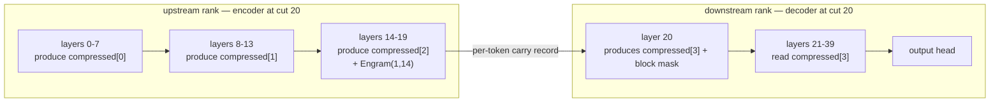

# Design & Implementation Plan — V4.1 Flash Q2 split across a DGX Spark and a Mac Studio M4 Max

**Document type:** implementation design for review.
**Status:** proposal, not implemented. **Superseded for the intended workload — see §11.15.** Measured long-context performance on the target Mac removes the split's main advantage (prefill) at the context sizes the owner actually uses (250K-500K), so this port is **not recommended** unless the goal changes (capacity/residency, or a short-context workload). The design itself remains sound; the justification does not.
**Target repository:** `~/dev/ds4` (DwarfStar), tree state 2026-09-19.
**Related analysis:** `docs/custom/ds4-technical-analysis.md` §7 (how the split mechanisms work), §17 (why the split is blocked today), §18 (feasibility summary that this document expands).

**How to use this document:** §1-§3 are the brief; §4 is the design; §5 is a work-package breakdown sized for one implementation session; §6 is the acceptance test plan; §7 lists the open questions that must be answered *before* writing code. Read §2.3 and §3.2 even if you read nothing else — they contain the two facts that decide the whole design.

---

## 1. Problem, goal, non-goals

### 1.1 Problem

DeepSeek V4.1 Flash Q2 is 340.60 GiB on disk: **~151.8 GiB of main weights** plus ~188.8 GiB of Engram tables that are always read from disk. Neither target machine can hold the main weights resident:

| Machine | Memory | Bandwidth | Prefill | Decode |
| --- | --- | --- | --- | --- |
| DGX Spark (GB10, CUDA sm_121) | 128 GB unified | 273 GB/s | very strong | weak |
| Mac Studio M4 Max (Metal) | 128 GB unified | 546 GB/s | weak | strong |

Measured ratios on identical workloads (Flash Q2, `speed-bench/{gb10,m4_max}.csv`): Spark prefill **2.40-4.02×** the Mac; Mac decode **1.48-1.66×** the Spark. A two-rank split puts ~76 GiB on each machine and removes SSD streaming from the critical path — the difference between the measured **9.3 t/s** (one Spark, streaming) and **21.9 t/s** (two Sparks, resident).

### 1.2 Goal

Make `--role coordinator --layers A:B` + `--role worker --layers B+1:output` work for the `DEEPSEEK41` model family, so that a CUDA rank and a Metal rank can serve one V4.1 Flash Q2 model together, with:

- each rank holding only its layer slice resident (no `--ssd-streaming`),
- correct output (full-vocabulary logits matching single-machine execution),
- usable prefill throughput (chunk-pipelined) and decode (as good as a two-rank split can be),
- the ability to save/load a session checkpoint that is topology-neutral.

**Expected outcome (recalibrated, see §11.2, and then measured, see §11.15):** ~13.7 t/s decode and ~410 t/s prefill at the recommended cut. This was derived before the target Mac was measured at long context; the measurements show the Mac alone already reaches **317-404 t/s prefill** on 131K-262K-token ingests and **~10.5 t/s decode at 262K**, which removes the prefill advantage this design was justified by. **For context on whether this is worth building:** two *like* machines in tensor parallel reach 21.9 t/s decode, i.e. ~1.6× what a pipeline of unlike machines can do, because TP parallelises every layer while a pipeline serialises two stages. If a second Spark or a second 128 GB Mac is an option, TP is the better answer for this model and this port is unnecessary (§11.11).

### 1.3 Non-goals

- **Tensor parallelism for mixed backends.** Out of scope permanently; TP requires bit-identical activations on both ranks and Metal/CUDA do not provide that (§3.5).
- **Splitting V4.1 across more than two ranks.** The design generalises, but only the two-rank case is validated.
- **New model families.** No changes to V4 / PRO / GLM / Qwen paths except the shared plumbing listed in §5.
- **Improving single-machine V4.1 speed.** The port must not regress it (see §6.4), but that is the only requirement.

---

## 2. Background: what the V4.1 graph actually does

Everything here is code-verified; line numbers are anchors into `ds4.c` unless stated.

### 2.1 The graph object and its forward passes

`ds41_gpu_graph` (allocated at `ds41_graph_alloc`, `ds4.c:40311`) is the V4.1 session state. Forward passes:

| Function | Line | Role |
| --- | --- | --- |
| `ds41_graph_step` | 41263 | **one token**: engram rows → embed → 40 layers → optional logits → `g->pos++` |
| `ds41_graph_prefill_sweep` | 41655 | layer-major sweep over a token chunk |
| `ds41_graph_short_prefill` | 42158 | small-chunk variant |
| `ds41_graph_logits` | 40824 | output head |
| `ds41_graph_layer` | 41141 | one layer, eager = `before_moe` + `moe` + `after_moe` |
| `ds41_graph_decode_layer` | 41172 | one layer, CUDA path with graph-capture islands |
| `ds41_graph_reset` | 40303 | reset to position 0 |

`ds41_graph_step` is the function a slice port must mirror. Its shape (verbatim structure):

```c
uint32_t ids[2][DS4_ENGRAM_COLS];
ds4_engram_history next_history = g->history;
if (!ds41_hash_tokens(g, &next_history, &token, 1, &ids[0][0])) return false;
for (i in 0..2) if (!image_at(pos)) ds4_engram_read(&g->table[i], ids[i], COLS, g->rows[i]);
const float initial_pre[] = {1, 0, 0, 0};
ds4_gpu_tensor_write(g->pre, 0, initial_pre, sizeof(initial_pre));
ds41_embed(...);
for (uint32_t il = 0; ok && il < DS4_N_LAYER; il++) { ... layer ... }
if (logits) ds41_graph_logits(...);
g->history = next_history;  g->pos++;
```

Three details are load-bearing for this design and are easy to miss:

1. **`g->pre` is initialised to `{1,0,0,0}` at the start of every token** and then overwritten at the end of each layer (`ds41_graph_after_moe`, `ds4.c:41135-41139`). It is *intra-token*, cross-layer state.
2. **The engram rows are per-token and per-layer-1/14 only**, computed by hashing the token; the tables stay on disk.
3. **`g->pos` and `g->history` advance inside this function**, once per token.

### 2.2 The compressed-cache group model — the constraint that fixes the cut points

V4.1 does not have a per-layer KV cache. `ds41_attention` (`ds4.c:40711`) selects a **shared compressed cache by layer group**:

```c
const uint32_t owner = il < 8 ? 0u : il < 14 ? 1u : il < 20 ? 2u : 3u;   /* ds4.c:40623, :40692, :40714 */
... ds4_gpu_dsv41_gather_kv(g->selected_kv, g->compressed[owner], ...);
```

Each layer reads `compressed[owner]` plus its **own** 128-row sliding window `window[il]`. The compressed rows are written only by the group's *source* layer:

| Group | Layers that read it | Producer (`ds41_kv_source`, `ds4.c:1384`) | Index cache producer (`ds41_index_source`, `ds4.c:1388`) |
| --- | --- | --- | --- |
| 0 | 0-7 | layer 2 | layer 2 |
| 1 | 8-13 | layer 8 | layer 8 |
| 2 | 14-19 | layer 14 | layer 14 |
| 3 | 20-39 | layer 20 | layers 20, 24, 28, 32, 36 |

The candidate block mask is likewise confined to group 3: `ds41_attention_candidates` (`ds4.c:40650`) publishes `g->block_mask` **only at `il == 20`** and filters against it only for `il > 20`. Engram tables serve layers 1 and 14 (`ds41_engram_layer`, `ds4.c:1392`).

**Consequence:** the KV state partitions cleanly at group boundaries and *only* there. A layer-range split must cut after layer 7, 13, or 19. A cut inside a group would leave consumers on the downstream rank reading a cache produced on the upstream rank, and the pipeline protocol ships activations, not caches.



### 2.3 The engine already has this boundary — and a name for the state that crosses it

This is the most important fact in the document: **prefill already stops at layer 20 and rebuilds the decoder from the encoder's output**, and it already defines a named per-token record for the state that crosses that boundary.

- The breakpoint: `ds41_graph_prefill_sweep` contains

  ```c
  if (encoder_only && il == 20u) {
      /* Publish every encoder key, but leave the decoder invalid until
       * the last sweep rebuilds its exact 2541-token dependency suffix. */
      ok = ds41_decoder_prepare(g, m, &w->layer[il], il, initial_start, 0, total_count, true, ...);
      break;
  }
  ```
  (`ds4.c:41696-41703`), with `ds41_decoder_prepare` at `ds4.c:41520`.

- The record (`DS41_CARRY_ROWS`, `ds4.c:40087-40090`):

  | Field | Width | Format |
  | --- | ---: | --- |
  | `residual` | `N_HC × N_EMBD` = 20 480 | BF16 (compacted) |
  | `pre` | `N_HC` = 4 | F32 |
  | `ffn_split` | 24 | F32 |
  | `selected_comp` | `N_INDEXER_TOP_K` | F32 |
  | `block_mask` | `(ctx+7)/8` | bitmask |

- The mover: `ds41_carry_copy(g, offset, count, store)` (`ds4.c:41501`) transfers these rows between the working set (`g->batch.*`) and the per-position ring (`g->carry.*`, capacity `ds41_carry_cap(ctx)` ≈ 3 GiB capped at 32768 rows, `ds4.c:40137`).

So the inter-rank payload for V4.1 is not a new invention — it is the engine's own carry record. The work is to make the *transport* carry it and to make the graph allocatable and runnable over a layer range.

### 2.4 The distributed protocol today

`ds4_distributed.c` is model-agnostic and needs almost no change:

- The coordinator owns layers `[0..K]` (must start at 0) and the last rank may own `[K+1..39]` with `--layers A:output` for the head.
- Per WORK frame it ships: the token ids, the quantized activation, and a route blob; per RESULT it gets logits or an activation back.
- Activation width comes from `ds4_engine_hidden_f32_values(e)` — for V4.1 `N_HC × N_EMBD` today (`ds4.c:71777-71780`), used at `ds4_distributed.c:2685`, `:3537` (coordinator) and `:7287` (worker validation).
- Consistency: an FNV-1a prefix hash per frame; a mismatch is rejected before any layer work.
- Recovery: transport failure ⇒ forget the offending worker and replay the transcript; application error ⇒ replay only.

---

## 3. Constraints and invariants

### 3.1 Legal cut points

After layer **19** (recommended first target), **13**, or **7**. Cut after 19 is also the model's own encoder/decoder breakpoint (§2.3) and gives a balanced 76 GiB per rank.

| Cut | Upstream | Downstream | Prefill (predicted) | Decode (predicted) | Upstream RAM |
| --- | --- | --- | ---: | ---: | ---: |
| after 7 | Mac 0-7 | Spark 8-39+head | ~1025 t/s | ~11.9 t/s | 120.4 GiB — **reject, does not fit** |
| after 13 | Mac 0-13 | Spark 14-39+head | ~631 t/s | ~12.7 t/s | 98.0 GiB — marginal |
| **after 19** | **Spark 0-19** | **Mac 20-39+head** | **~410 t/s** | **~13.7 t/s** | **76.5 GiB — recommended** |

Weights are **measured from the actual GGUF tensor table**, not estimated (§11.1). Prefill uses `min(40·R_up/L_up, 40·R_down/L_down)` with the resident Flash-calibrated rates R_spark 822.98 / R_mac 204.96 t/s.

Decode uses per-layer constants recalibrated against the one measured V4.1 multi-rank anchor (two Sparks, TP, 21.9 t/s ⇒ 45.7 ms/token ⇒ 1.142 ms/layer per rank at *half* the experts; a pipeline rank carries **all** the selected experts of its layers ⇒ ≈2.283 ms/layer on the Spark, ÷1.66 for the Mac = 1.375 ms). An independent estimate scaled from the Flash Q2 single-machine runs (1.680 ms/layer × 1.25 for V4.1's wider `n_embd`) gives 2.10 ms — the two agree, so these figures are ~30% *lower* than the first draft of this document, which used the Flash per-layer times directly. See §11.2.

### 3.2 The state contract across the cut

Per token, upstream → downstream:

| Field | Needed by the decode path? | Needed by the prefill path? | Notes |
| --- | --- | --- | --- |
| `residual` (HC block) | **yes** | **yes** | what the wire carries today |
| `pre` (4 f32) | **yes** | **yes** | the mixer; `before_attention` feeds it into `ds4_gpu_hc_weighted_sum_tensor` (`ds4.c:40845`) |
| `ffn_split` (24 f32) | no (already used to produce `pre` in `after_moe`) | **yes** | the batch path carries it per row (`ds4.c:41030`) and `ds41_decoder_prepare` consumes it (`ds4.c:41536`) |
| `selected_comp` | no | no (per-group, produced and consumed inside a group) | part of the carry ring for chunk resumption only |
| `block_mask` | no at this cut | no at this cut | produced at layer 20, i.e. downstream |

**Design rule:** ship the carry record the engine already defines, in the smallest form that the receiving path consumes. Start with `residual + pre` for the decode path, add `ffn_split` when wiring the prefill path, and keep `selected_comp`/`block_mask` out of the wire unless a test shows they are needed (they are group-local by construction).

Critically: **the downstream rank must not overwrite the received `pre` with the `initial_pre` constant.** `ds41_graph_step` writes `{1,0,0,0}` unconditionally; a slice entry point must do that only when `layer_start == 0`.

### 3.3 Wire-width change and mismatch detection

`ds4_engine_hidden_f32_values` is the single source of truth for every wire size (3 call sites, all in the distributed path, plus `ds4_session_eval_output_head_from_hc` at `ds4.c:73501`). For V4.1 it must become `N_HC*N_EMBD + N_HC` (+ 24 if `ffn_split` is shipped).

Version skew is already detected: the worker recomputes `expected_hc_values = n_tokens * ds4_engine_hidden_f32_values(engine)` and rejects a frame whose `input_hc_bytes` disagrees (`ds4_distributed.c:7287`). So a patched rank paired with an unpatched one fails loudly at the first WORK frame, not silently. **No protocol version field is needed**; document that both ranks must run the same commit (already the project's rule).

### 3.4 Per-rank memory budget (cut after 19)

| Component | Upstream (Spark) | Downstream (Mac) |
| --- | ---: | ---: |
| 20 layers (measured: 76.46 GiB upstream incl. `token_embd`, 75.29 GiB downstream incl. head) | ~76.5 GiB | ~75.3 GiB |
| KV: 4 groups of compressed/index caches | ~0.7 GiB | ~0.7 GiB |
| Carry ring + working set (`ds41_carry_cap(ctx)`, ≈3 GiB when ctx ≥ 32768) | ~3 GiB | ~3 GiB |
| Engram prefetch buffer (~0.8 GiB at `carry_cap` 32768) | ~0.8 GiB | — (owns no engram layer at this cut) |
| **Total** | **~81 GiB** | **~79 GiB** |

Comfortably inside 128 GB on both. Note that at cuts 7 and 13 the Engram layers (1 and 14) land on *different* ranks, so both machines become engram-reading ranks (each table is ~94.4 GiB on disk; both are read sparsely, ~6.3 KB per layer per token). At cut 19 both tables belong to the upstream rank, which is another argument for it. Only the rank owning an engram layer allocates the prefetch buffer and the engram projection norms.

Also note that the two calibrations above give ~81 GiB upstream at cut 19 — the earlier draft's "~80 GiB" was right by luck, but for the wrong reason (a uniform 3.795 GiB/layer and an undercounted scratch). Note the asymmetry that matters operationally: the Mac needs `sudo sysctl iogpu.wired_limit_mb=120000` style headroom management, the Spark needs the usual CUDA/OS reserve.

### 3.5 Why not tensor parallelism (restated for the implementer)

TP would need `vocab_split` symmetric (`ds4.c:72549-72550`), a reachable transport (RDMA is UC on macOS vs RC on Linux, rejected at `ds4_tp.c:1182-1185`), **and** bit-identical activations on both ranks, which two different backends do not provide. Do not spend time here.

---

## 4. Design

### 4.1 Topology and roles

```
Spark (CUDA)  : coordinator, layers 0..19, owns tokenizer/prompt/sampling, listens
Mac   (Metal) : worker,      layers 20..output, listens on its data port, dials in
transport     : plain TCP (the distributed path's only transport; ~80 KiB down + ~600 KiB up per token)
```

The direction is **performance-neutral** at this cut — both stages carry 20 layers, so decode (a sum) and prefill (a max) are symmetric; the only asymmetry is that the rank owning `--layers X:output` computes the head (~1.5 ms on the Mac vs ~3.0 ms on the Spark). Pick the coordinator by operations: the Mac puts the interactive CLI/agent where the user sits, the Spark keeps the headless box in charge. Whichever you choose, record it as the default in `docs/DISTRIBUTED.md` (§11.10).

Start the worker first (it retries), then the coordinator. Both need the complete GGUF locally (Engram reads come from the same file; at this cut only the Spark owns layers 1 and 14).

### 4.2 Slice-aware graph allocation

`ds41_graph_alloc` (`ds4.c:40311`) must take the slice range and:

- allocate `window[il]` **only** for owned layers (or allocate the array and leave non-owned entries NULL, with every access guarded);
- allocate `compressed[]`, `index_cache[]`, `previous_kv[]`, `previous_score[]` **only for owned groups**: derive groups from the layer range with the same `owner()` rule (`il<8?0:il<14?1:il<20?2:3`). At cut 20 the upstream rank needs groups {0,1,2}, the downstream rank {3};
- open the Engram tables and allocate `engram_q_norm[2]`/`engram_k_norm[2]` **only if** the rank owns layer 1 or 14, and initialise `g->table[0/1].fd = -1` otherwise;
- keep `carry`/`batch`/scratch allocations as they are (they are per-rank working sets, sized by `ctx`);
- make `ds41_graph_bytes` (`ds4.c:40258`) reflect the slice, since `ds41_memory_admit` (`ds4.c:70403`) and the session admission path use it;
- make `ds41_graph_free` (`ds4.c:40218`) and `ds41_graph_reset` (`ds4.c:40303`) tolerate NULL/foreign entries.

**Invariant to preserve:** every read of `g->compressed[owner]`/`index_cache[owner]`/`window[il]` inside the layer tape must be reachable only on a rank that allocated them. Add a debug assertion (behind `DS4_TEST_HOOKS` or an env switch) that fires if a tape function reads a group or layer outside its slice — this is the single most valuable guard against silent corruption.

### 4.3 Slice forward — decode path

There are two existing entry points to mirror: `ds41_graph_step` (single token) and `ds41_graph_step_batch` (`ds4.c:42022`, used by the server's batched decode). Implement the slice form for the single-token path first (M1) and add the batch slice form when the server is in scope (M5); the batched case needs the carry carried per row.

New entry point, modelled on `ds41_graph_step` but bounded and with external state:

```c
/* Evaluate layers [layer_start, layer_end] for one token.
 * stage-local: g->pos must already equal pos0.
 * layer_start == 0  -> performs engram hashing/reads, embedding, and the
 *                      initial g->pre = {1,0,0,0}.
 * layer_start  > 0  -> consumes input_carry (residual + pre [+ ffn_split]).
 * layer_end == 39   -> optionally runs ds41_graph_logits.
 * Always: advances g->history and, exactly once per token per rank, g->pos. */
static bool ds41_graph_step_slice(ds41_gpu_graph *g, const ds4_model *m, const ds4_weights *w,
                                  int token, uint32_t layer_start, uint32_t layer_end,
                                  const float *input_carry, float *output_carry,
                                  bool output_logits, float *logits);
```

Implementation notes:

- Reuse the existing per-layer calls unchanged (`ds41_graph_layer` eager; see §4.6 for capture).
- The command-buffer drain policy in `ds41_graph_step` (`drain = !queue_layers || il == 13 || il + 1u == DS4_N_LAYER`) is written for the full 40-layer tape. For a slice, drain when the *slice* ends, and keep the TP-queue condition (`queue_layers` is a `g->tp_world == 2` path that does not apply to a pipeline split — force it false).
- `g->history` must advance on **both** ranks (deterministic, cheap, keeps the next token's engram hash consistent); only the rank owning layers 1/14 performs the table reads.
- `g->pos++` must happen exactly once per rank per token. Take `pos0` from the frame (the protocol already guarantees the coordinator's timeline via the prefix hash) and set `g->pos = pos0` on entry, rather than trusting the rank to have counted correctly.

### 4.4 Slice forward — prefill path

This is the part that decides whether prefill is fast, and it is where the encoder/decoder machinery must be reproduced on the downstream rank:

1. **Chunking stays where it is.** The coordinator keeps using `--dist-prefill-chunk`/`--dist-prefill-window`; each chunk is a `WORK` frame with `n_tokens > 1`.
2. **Upstream (encoder, 0-19):** run the existing layer-major sweep for layers 0-19 (`ds41_graph_prefill_sweep` already loops `for il in 0..DS4_N_LAYER`, so bounding it is a parameter, and the `encoder_only && il == 20` break becomes "slice end reached"). The upstream rank must **emit the carry rows** for each token of the chunk instead of storing them in `g->carry`.
3. **Downstream (decoder, 20-39):** receive the carry rows for the chunk into `g->batch.*`, then:
   - at layer 20, publish **the chunk's own positions only**: `ds41_decoder_prepare(g, m, l, 20, chunk_start, 0, chunk_len, /*publish=*/true, ...)`, mirroring what the single-machine `encoder_only` break does — except that in a split the prefix arrives in chunks, so the publish runs per chunk with `offset = chunk_start` rather than once over the whole prefix. This is correct because the publish is position-ordered and its cross-position state (`previous_kv[3]`/`previous_score[3]`, the ratio-2 pooling pair) is persistent group state. **Do not re-publish the whole prefix on every chunk** — that is quadratic in chunks and would dominate prefill. The single-machine code can afford the whole-prefix call only because it sweeps the prefix once;
   - run layers 20-39 with the existing batch tape (`ds41_attention_batch`, `ds41_moe_batch`, `ds41_prefill_seed`).
4. **Cross-rank carry volume:** the carry is ≈ 20 484 floats/token (HC block + `pre`) = ~80 KiB at 32-bit; a 2048-token chunk ≈ 160 MiB/hop at `--dist-activation-bits 32` and ≈ 80 MiB at 16. That is the same order as today's HC-only payload, so the extra 4 floats are free. Two corrections to the first draft of this section: the *values* of `residual` are BF16-exact (`ds41_bf16` in `ds41_graph_after_moe`) but the **transport** still follows `--dist-activation-bits`; and **`--dist-activation-bits 8` must not be used for a V4.1 carry** — the payload is not a normalized activation, and E4M3 clamps to ±240, which the HC residual can exceed. Restrict V4.1 to 32 or 16 bits (see §11.4).

**Q1 status — resolved by re-reading, with a test still required.** The comment above `ds41_decoder_prepare` ("Decoder attention reads all encoder compressed keys") refers to *prefix coverage*, not to cross-group reads. Every access to a shared cache in the V4.1 tape is indexed by `owner()`: `ds41_attention` (`:40726`, `:41114`, `:41119`), `ds41_attention_publish` (`:40639`, `:40643`), `ds41_attention_select_published` (`:40685`), `ds41_attention_candidates` (`:40658`), and the batch paths (`:40974`, `:40979`, `:41011`). Nothing reads a group outside its own layer range, so **no encoder-side cache needs to cross the wire**. Keep the cheap experiment in §6.1 item 9 anyway (§11.3) — it is the difference between a contained port and a redesign.

### 4.5 Wire contract

- Extend `ds4_engine_hidden_f32_values` for `DEEPSEEK41` to `N_HC*N_EMBD + N_HC` (and `+ 24` if `ffn_split` is shipped). All four call sites then agree automatically.
- The coordinator composes the payload as `[residual HC block][pre]` and the worker splits it on the same boundary. Keep the arithmetic in one helper on each side so the layout is defined once.
- 32/16/8-bit quantization keeps working unchanged: `dist_write_activation_payload`/`dist_decode_activation_payload` operate on a float array of the declared width.
- Do **not** add a protocol version. The per-frame `input_hc_bytes` check already rejects a mismatched peer.

### 4.6 CUDA graph capture

`ds41_graph_decode_layer` (`ds4.c:41172`) wraps `ds41_decode_island` (capture) around the eager layer. Capture assumes a fixed layer sequence and stable pointers; a slice with an external carry breaks that. Plan: force the eager path whenever a slice is active (a `g->slice_active` flag consulted by the capture predicate, and by `ds4_gpu_decode_graph_*` guards), and treat "re-capture per slice" as a later optimisation with its own A/B validation.

### 4.7 Session lifecycle, checkpoint, recovery

- `ds4_session_layer_slice_reset` (`ds4.c:73454`): add a `ds41` branch calling `ds41_graph_reset` and clearing the carry/windows for the slice.
- `ds4_session_eval_layer_slice` (`ds4.c:74344`): add a `ds41` branch that validates the same preconditions (layer range inside the model, `input_hc` required iff `layer_start > 0`, `output_logits` only if the slice ends at 39 and the head is loaded) and dispatches to §4.3/§4.4. Reuse `ds4_session_slice_check_timeline` / `ds4_session_slice_commit_timeline` unchanged.
- `ds4_session_eval_output_head_from_hc` (`ds4.c:73485`): add a `ds41` branch that writes the HC block into the graph's residual and runs the `ds41_graph_logits` body (`ds4.c:40824`).
- Rewind/invalidate: V4.1's compressors cannot truncate, so a rewind invalidates the checkpoint and forces a full re-sync — the existing distributed replay path handles this; verify it does not assume `s->graph`.

### 4.8 Snapshots and topology-neutral save/load

Two levels:

1. **Session snapshot (DSV4, `ds41_save_payload`/`ds41_load_payload`, `ds4.c:62378`/`62405`) is already backend-portable** (all-f32 spans, family tag `0x413431`, no backend byte). In a split, each rank holds part of the state, so the coordinator must gather: the natural approach is the existing distributed save (`ds4_dist_session_save_payload`) plus a **new ds41 branch in `ds4_session_save_layer_payload`/`load_layer_payload`/`layer_payload_bytes`** (`ds4.c:61346`/`61416`/`61682`). Today's non-GLM branch reads `s->graph.layer_n_comp[il]`, which does not exist for V4.1.
2. **Format decision to make:** the DSVL layer format assumes per-layer compressed-row counts. V4.1's compressed rows belong to four shared groups, so a layer-range shard must either (a) carry whole groups with the rank that owns them and let the loader place them, or (b) gain a group section in the format. Choose (a) for the first implementation — it needs no format version bump because each shard still describes a contiguous layer range, with its group payloads attached — and document the mapping in the shard header's reserved fields only if a test demands it.

### 4.9 Engram

The Engram layers are 1 and 14, so **which rank reads tables depends on the cut**:

| Cut | Rank owning layer 1 | Rank owning layer 14 | Engram-reading ranks |
| --- | --- | --- | --- |
| after 7 | upstream (Mac 0-7) | downstream (Spark 8-39) | **both** |
| after 13 | upstream (Mac 0-13) | downstream (Spark 14-39) | **both** |
| after 19 | upstream (Spark 0-19) | upstream (Spark 0-19) | upstream only |

Requirements for the port:

- Open `g->table[i]` and allocate `engram_q_norm[i]`/`engram_k_norm[i]` **only** for owned engram layers; set `fd = -1` otherwise.
- **Gate the per-token reads, not just the opens.** `ds41_graph_step`'s prologue reads *both* tables unconditionally:

  ```c
  for (uint32_t i = 0; !ds41_image_at(g, g->pos) && i < 2; i++) {
      if (!ds4_engram_read(&g->table[i], ids[i], DS4_ENGRAM_COLS, g->rows[i])) return false;
  }
  ```
  (`ds4.c:~41272-41276`). A downstream rank at cut 19 owns neither layer and must skip this loop entirely; a rank owning only layer 14 must read only `table[1]`. The same applies to the prefetch path (`ds41_engram_prefetch_start`, `ds4.c:41634`) and to the per-layer write in the layer loop (`ds4_gpu_tensor_write(g->engram_rows, ...)`, guarded today by `ds41_engram_layer(il)` with no ownership test).
- Both machines still need the complete 341 GiB GGUF on local disk (each maps its own weight slice from it). Each table is ~94.4 GiB; reads are sparse (~6.3 KB per engram layer per token).
- `ds41_engram_prefetch_*` must be a no-op on a rank without tables, and the layer tape must skip the engram add for non-owned layers.
- **WP1 grows accordingly**: the engram gating is two separate edit sites (open + read), and a mistake here is silent (garbage in, or a read of a NULL table). Add the guard from §4.2 and a test that asserts `table[i].fd == -1` on a rank that owns neither layer.

### 4.10 Options, gate and CLI

- Relax the V4.1 gate (`ds4.c:70585`): allow `distributed.role != NONE` and `load_slice` for `DEEPSEEK41`, keeping `!dspark`, `!glm_mtp`, power 100, ctx ≤ 1M. Add a V4.1-specific restriction to cut points: reject `--layers` whose boundary is not 8/14/20/40 (or accept any range but fail fast with a clear message at graph alloc).
- Keep `--ssd-streaming` incompatible with the split (each rank is resident); reject the combination explicitly rather than silently streaming.
- No new user-facing flags are needed; `--role`, `--layers`, `--listen`, `--coordinator`, `--dist-*` already exist.

### 4.11 Interaction with recovery

The distributed layer already forgets a failed worker, rebuilds the route, and replays the transcript. For V4.1 the replay path must re-establish the carry state from scratch — which it will, since a replay starts a fresh `sync` with `RESET_SESSION`. Verify that a worker restart mid-prefill, mid-decode, and during a snapshot leaves both ranks agreeing (the prefix hash will catch disagreements).

---

## 5. Implementation plan

Ordered work packages. Each is independently reviewable. Sizes are estimates for planning, not commitments.

| WP | Deliverable | Files / functions | Size | Depends on |
| --- | --- | --- | --- | --- |
| **WP1** | Slice-aware allocation + guards | `ds41_graph_alloc` (40311), `ds41_graph_bytes` (40258), `ds41_graph_free` (40218), `ds41_graph_reset` (40303), `ds41_memory_admit` callers | ~120 LOC | — |
| **WP2** | Slice-aware weight binding verification | confirm `weights_validate_layout`'s generic branch (5883) and `weights_model_map_spans` (8494, built on `model_map_span_vec_include_layer` at 8037) tolerate a V4.1 slice; add tests if they do not | ~30 LOC + tests | — |
| **WP3** | Decode slice forward | new `ds41_graph_step_slice` (§4.3); forced-eager capture flag (§4.6) | ~250 LOC | WP1 |
| **WP4** | Wire contract | `ds4_engine_hidden_f32_values` (71777) + compose/split helpers on both sides; worker width validation unchanged | ~60 LOC | WP3 |
| **WP5** | Engine gate + option plumbing | `ds4.c:70585`, cut-point validation, `--ssd-streaming` rejection, CLI help text | ~40 LOC | WP3 |
| **WP6** | Session integration | `ds41` branches in `ds4_session_layer_slice_reset` (73454), `ds4_session_eval_layer_slice` (74344), `ds4_session_eval_output_head_from_hc` (73485) | ~150 LOC | WP1, WP3 |
| **WP7** | Prefill slice sweep | bound `ds41_graph_prefill_sweep` (41655) to a layer range; decoder-side publish path via `ds41_decoder_prepare` (41520); carry emission/consumption per chunk | ~300 LOC | WP3, WP6 |
| **WP8** | Slice payload (save/load) | `ds41` branches in `ds4_session_layer_payload_bytes` (61346), `_save_layer_payload` (61416), `_load_layer_payload` (61682) with the group-attachment rule (§4.8) | ~200 LOC | WP6 |
| **WP9** | Test harness + docs | split-vs-whole oracle (see §6.2), QA §17 update, `docs/DISTRIBUTED.md` section | ~150 LOC + docs | all |

**Milestones**

- **M1 — decode correctness at cut 20** (WP1-WP6): one worker on loopback, `--ssd-streaming` allowed, serial prefill, logits match single-machine. This is the "is the design sound" gate.
- **M2 — real prefill** (WP7): chunked, pipelined prefill; measure throughput.
- **M3 — snapshots** (WP8).
- **M4 — other cuts** (8, 14) and cross-backend bring-up on the real hardware.
- **M5 — performance**: CUDA capture for slices, carry in BF16 on the wire, `--dist-activation-bits` tuning.

**Development loop without the hardware:** two processes on one Mac on loopback (`--role coordinator --listen 127.0.0.1 9911` + `--role worker --coordinator 127.0.0.1 9911`). Because 152 GiB does not fit in 128 GB, run the worker with `--ssd-streaming`; that is slow but exercises the entire protocol, the slice logic, and the carry — everything except cross-backend numerics. Do cross-backend only at M4.

---

## 6. Validation plan

### 6.1 What must be proven

1. **Logit identity, single-machine vs split.** Same prompt, same sampling settings, greedy; compare full-vocabulary logits for the first N tokens. This is the primary oracle.
2. **Prefix-hash discipline.** A deliberately wrong `--layers` range or a stale worker must be rejected rather than produce garbage.
3. **Cut-point legality.** Cuts at 8, 14, 20 work; a cut inside a group (e.g. `--layers 0:9`) is rejected with a clear error.
4. **Engram ownership.** The rank owning layers 1/14 reads the tables; the other does not open them (assert on `table[i].fd`).
5. **Carry integrity.** Zero the received `pre` on the downstream rank and confirm the logits *change* — if they do not, the carry is not wired.
6. **Recovery.** Kill the worker mid-prefill, mid-decode, during a snapshot save and during a snapshot load; each must recover by replay with matching results.
7. **Snapshots.** Save on a split run, load on a single-machine run and vice versa (the DSV4 payload is backend-portable, so this should work once WP8 lands).
8. **No single-machine regression.** Re-run `QA_BEFORE_RELEASES.md` §17 Metal and CUDA V4.1 gates.

### 6.2 Harness to add

A `--split-vs-whole` mode (in `tests/` or as a `ds4_test` group) that:
- runs prompt P on one process, records logits for T greedy tokens;
- runs P across a coordinator+worker pair (configurable cut) with the same seeds;
- diffs the logits with a tolerance of zero and reports the first divergent position.

Existing pieces to reuse: `--dist-replay-check` (coordinator-side replay verification), `ds4_test --logprob-vectors`, `tests/test_deepseek41_graph --prefill-parity --encoder-parity --partitions --wide-prefill`, `tests/test_deepseek41_prefill`, `speed-bench/ds4-bench` for throughput.

### 6.3 Acceptance criteria for M1

- Logits identical (bit-exact) for ≥64 greedy tokens at ctx 4096 and 32768, cut at 20, on loopback.
- No assertion/guard fires in a full run (the §4.2 guard).
- Coordinator and worker memory each stay within their documented budget (§3.4).

### 6.4 Acceptance criteria for M4 (the real hardware)

- Same logit identity across Spark(CUDA)+Mac(Metal) — this is the first time two backends exchange activations, so if the two implementations disagree at ULP level anywhere in the dense path, this test finds it. Decide the tolerance *before* running: the honest options are (a) require bit-exact and fix divergences, or (b) accept a documented small tolerance and validate quality with the official NLL manifests rather than logits.
- Measured prefill and decode within ±20% of the §3.1 predictions (**~13.7 t/s decode and ~410 t/s prefill at cut 19**, with the caveat that the prefill comparison depends on the baseline's cache state); report both, plus the same numbers for a single Spark streaming and, if available, for a two-Spark TP pair, so the cost of heterogeneity is explicit.

---

## 7. Risks and open questions

| # | Risk / question | Severity | Mitigation / how to settle |
| --- | --- | --- | --- |
| Q1 | Does the decoder at cut 20 need encoder-side caches (groups 0-2)? The `owner()` partition says no; one comment suggests otherwise | **high** — changes the design | Experiment before WP7: run a cut at 20 with groups 0-2 deliberately unallocated downstream and compare logits. If it fails, the design needs a one-time KV shard transfer at the boundary (reuse the DSVL payload path, WP8) |
| Q2 | `ffn_split` may be needed on the wire for the prefill path | medium | Start with `residual + pre`; add `ffn_split` if prefill parity fails. The field exists in the carry record already |
| Q3 | Cross-backend numerical disagreement in the dense path | **high** | Decide bit-exact vs tolerance before M4; use the NLL manifests as the quality oracle if a tolerance is accepted |
| Q4 | CUDA capture cannot be reused for a slice until re-captured | low (perf) | Force eager for slices at M1-M4; optimise at M5 |
| Q5 | Memory admission is computed from `ds41_graph_bytes` and will be wrong for a slice | medium | WP1; assert against actual device allocation in a test |
| Q6 | The 2541-token decoder dependency suffix means the first chunk after a boundary may be slow or require the whole prefix | medium | Measure; if it dominates, consider forcing the coordinator to send the prefix in chunks at least that long (the `--dist-prefill-chunk` default is 4096 today) |
| Q7 | Engram on a rank that owns neither layer 1 nor 14 but is asked for an image (`ds41_image_at`) | low | Check `ds41_image_at` paths; vision at a split is out of scope — document that V4.1 vision stays single-machine |
| Q8 | A future model revision changes the group boundaries | low | Put the `owner()` mapping in one named helper and assert the cut-point rule against it |

---

## 8. Performance expectations and measurement

| Configuration | Prefill | Decode | Source |
| --- | ---: | ---: | --- |
| **Mac Studio M4 Max, SSD streaming, auto cache (this machine)** | **45-48 t/s @2K chunks, 168-182 t/s @8K chunks** | **14.0-15.0 t/s** | **measured 2026-09-19, §11.14** |
| 1 Spark, SSD streaming, 64 GiB cache | 84.9 t/s @2K, 384 t/s @32K | 9.3 t/s | measured (QA §17) |
| 2 Sparks, network TP, resident | ~400 t/s @32K | 21.9 t/s | measured |
| **Spark+Mac split, cut after 19** | **~410 t/s (predicted)** | **~13.7 t/s (predicted)** | this design |
| Spark+Mac split, cut after 13 | ~570 t/s (predicted, §11.14) | ~12.7 t/s (predicted) | if ~98 GiB + buffers fits |
| Spark+Mac split, cut after 7 | ~480 t/s (predicted, §11.14) | ~11.9 t/s (predicted) | upstream 120 GiB — not viable |

Two things this table makes clear, both developed in §11: the split's **decode** gain over one Spark streaming is ~1.5× (13.7 vs 9.3 t/s), not the ~2× the first draft implied; and its **prefill** gain is context-dependent — ~4.8× at a 2K prompt/uncached (410 vs 84.9 t/s) but only ~1.07× against a well-cached 32K frontier (410 vs 384 t/s). The split's reliable selling point is *residency* (no SSD streaming on the critical path), not raw prefill.

Measure with `ds4-bench` on both sides plus the split configuration, same prompt file, same context, greedy decode; report prefill t/s per frontier, steady decode t/s, and the per-hop timing (`DS4_DIST_DECODE_PROFILE=1`) so the network share is visible.

---

## 9. Rollout and definition of done

- **Feature flag:** none needed at the CLI level (the combination is only reachable via `--role` + `--layers`), but keep the V4.1 gate rejection until M4 passes so nobody ships a half-working configuration. Consider an env override (e.g. `DS4_ALLOW_V41_PIPELINE=1`) for development only.
- **Docs to update:** `docs/DISTRIBUTED.md` (a V4.1 section with the cut points and commands), `QA_BEFORE_RELEASES.md` §17 (the line that currently requires pipeline to fail explicitly for V4.1 must become a test list), `docs/MODELS.md` (the "two 128 GB Macs or Sparks" paragraph gains the mixed-pair case), and this document's status header.
- **Code comments:** per `AGENT.md`, the invariants belong next to the implementation — the `owner()` group rule, the carry contract, and the "no `initial_pre` on a downstream slice" rule.
- **Done means:** M1-M4 acceptance criteria met, the validation harness committed, docs updated, and a clean single-machine V4.1 regression pass on both backends.

---

## 10. Appendix — reference map

**Key functions (ds4.c)** `ds41_graph_alloc` 40311 · `ds41_graph_bytes` 40258 · `ds41_graph_reset` 40303 · `ds41_graph_free` 40218 · `ds41_graph_step` ~41265 · `ds41_graph_layer` 41141 · `ds41_graph_decode_layer` 41172 · `ds41_graph_prefill_sweep` 41655 · `ds41_graph_short_prefill` 42158 · `ds41_graph_step_batch` 42022 · `ds41_graph_logits` 40824 · `ds41_attention` 40711 · `ds41_attention_publish` 40620 · `ds41_attention_candidates` 40650 · `ds41_attention_select_published` 40673 · `ds41_decoder_prepare` 41520 · `ds41_carry_copy` 41501 · `ds41_carry_cap` 40137 · `ds41_engram_prefetch_*` 41613-41643 · `ds41_save_payload` 62378 · `ds41_load_payload` 62405 · `ds41_state_spans` 62352 · `ds41_memory_admit` 70403 · `ds4_session_layer_slice_reset` 73454 · `ds4_session_eval_output_head_from_hc` 73485 · `ds4_session_eval_layer_slice` 74344.

**Constants and macros (ds4.c)** `DS41_CARRY_ROWS` 40087 · `DS41_PREFILL_ROWS` 40118 · `DS41_PREFILL_CAP` 40084 · `DS41_SCRATCH` 40147+ · `ds41_kv_source` 1384 · `ds41_index_source` 1388 · `ds41_engram_layer` 1392 · `DS4_N_HC` 4, `DS4_N_EMBD` 5120 (shape table 641-671).

**Other files** `ds4.h:588-638` (slice + payload API) · `ds4_distributed.h/.c` (protocol; `ds4_distributed.c:2685/3537/7287` activation sizing) · `ds4_kvstore.h/.c` (disk cache header/gates) · `ds4_engram.c` (table reads) · `QA_BEFORE_RELEASES.md` §17 · `docs/DISTRIBUTED.md`.

**Glossary of the carry record:** `residual` = the HC-expanded residual block (`N_HC × N_EMBD`); `pre` = the pre-attention HC mixer weights produced by the previous layer's `after_moe`; `ffn_split` = the per-layer HC split vector (24 = 2·N_HC + N_HC²); `selected_comp` = the indexer's selected compressed rows; `block_mask` = the candidate block bitmask produced at layer 20.

---

## 11. Design review — what a second pass found (added after the first draft)

The first draft was written from code reading plus the repository's own measurements. This section records a deliberate re-examination of every quantitative claim and every "this will just work" assumption, with the methods used and the resulting corrections. **The implementer should read this section as part of the design, not as commentary on it** — three of the findings change acceptance targets, one changes a work package, and one removes a risk that the first draft over-weighted.

### 11.0 Method

Four things found everything worth finding:

1. **Measure the artifact, not the documentation.** The per-layer memory model was an average ("152 GiB ÷ 40"); the actual GGUF tensor table was parsed and summed (1046 tensors, block sizes per quant type). §11.1.
2. **Recalibrate against the only V4.1 measurement that exists.** The first draft reused Flash Q2 per-layer decode times directly. There is exactly one V4.1 multi-rank measurement (two Sparks, TP, 21.9 t/s) and it disagrees. §11.2.
3. **Re-derive each claim that had a "convenient" outcome** — the ones that flattered the design. Two survived, two did not. §11.3, §11.5.
4. **Look for silent-failure modes and quadratic behaviour**, the two things that turn a port into a project. §11.6, §11.7.

### 11.1 Verified correct — memory model (now measured, not estimated)

Parsed from `DeepSeek-V4.1-Flash-Q2.gguf` directly: 1046 tensors, 40 blocks (`blk.0`-`blk.39`), main weights **151.75 GiB** (matches the documented 152 GiB), Engram tables **188.83 GiB**, `token_embd` 1.233 GiB, `output.weight` 0.655 GiB.

Per-layer sizes are near-uniform (3.729 GiB), with these exceptions: `blk.1` and `blk.14` carry ~+0.29 GiB of Engram projections; the compressor layers (2, 8, 20) and index-source layers (24, 28, 32, 36) carry ~+0.01-0.02 GiB. Exact per-cut totals:

| Cut | Upstream weights | Downstream weights |
| --- | ---: | ---: |
| after 7 (Mac 0-7 / Spark 8-39) | 31.38 GiB (incl. `token_embd`) | 120.37 GiB (incl. head) |
| after 13 (Mac 0-13 / Spark 14-39) | 53.77 GiB | 97.98 GiB |
| after 19 (Spark 0-19 / Mac 20-39) | 76.46 GiB | 75.29 GiB |

Conclusion unchanged: cut 19 is the only comfortable split. Cut 7 is confirmed **infeasible** (120 GiB on one 128 GB machine before KV/scratch), cut 13 is marginal at 98 GiB.

### 11.2 Corrected — decode throughput was ~35% optimistic

The first draft's decode column (18.6 t/s at cut 19) came from applying Flash Q2 per-layer decode times to V4.1. Recalibrating against the V4.1 TP anchor:

- Two Sparks, TP, 64K ctx: 21.9 t/s ⇒ 45.7 ms/token, and in TP each rank runs all 40 layers with *half* the experts ⇒ 1.142 ms/layer.
- A pipeline rank carries **all** selected experts for its layers ⇒ ≈2.283 ms/layer on the Spark; ÷1.66 (the measured Mac/Spark decode ratio) ⇒ 1.375 ms/layer on the Mac.
- Independent cross-check: the Flash Q2 single-machine figure (1.680 ms/layer) scaled by 1.25 for V4.1's wider `n_embd` gives 2.10 ms — consistent.

Corrected decode: **cut 7 → 11.9 t/s, cut 13 → 12.7 t/s, cut 19 → 13.7 t/s** (was 16.2/17.6/18.6). All tables in §3.1 and §8 are updated.

**Why it matters:** the split's decode gain over one Spark streaming is **~1.5×** (13.7 vs 9.3 t/s), not the ~2× the first draft implied. The recommendation (cut 19) does not change — the ordering is unchanged and cut 19 remains both the decode-best and the natural encoder/decoder boundary — but the *justification* shifts from "roughly doubles decode" to "1.5× decode plus residency".

### 11.3 Rejected fallacy — "the decoder needs the encoder's KV"

The first draft flagged this as Q1, high risk, potentially requiring a design change. Re-reading every shared-cache access settles it: all of them index by `owner()` (`ds41_attention` `:40726`, `:41114`, `:41119`; `ds41_attention_publish` `:40639`, `:40643`; `ds41_attention_select_published` `:40685`; `ds41_attention_candidates` `:40658`; batch paths `:40974`, `:40979`, `:41011`). Nothing reads a group outside its own layer range, so the `ds41_decoder_prepare` comment is about *prefix coverage*, not cross-group reads. **No encoder cache crosses the wire.** Keep the assertion test (§6.1 item 9) as a guard, but plan on the contained design.

The group-boundary rule is now supported by three independent mechanisms, not one: the compressed-KV cache, the index cache *plus its reused `index_scores`* (non-source layers reuse the previous layer's scores, so a split inside a group would also orphan that), and the block mask published only at layer 20.

### 11.4 Hazard found — `--dist-activation-bits 8` is unsafe here

The 8-bit codec is E4M3 clamped to ±240 (`ds4_distributed.c`, `dist_f32_to_f8_e4m3`). The V4.1 carry's `residual` is an **unnormalized HC residual**, not a post-norm activation, and can exceed that range. Shipping it at 8 bits would silently clip. Restrict V4.1 to `32` or `16` and say so in `ds4_dist_usage`/docs; better, reject `8` for `DEEPSEEK41` at option validation rather than documenting a footgun.

### 11.5 Corrected — the wire-size framing was wrong (the conclusion survives)

The first draft claimed the carry is *smaller* on the wire than today's payload because `residual` is BF16. Both halves were sloppy: the BF16 property is about the *values* (`ds41_bf16` rounds them in place), while the transport follows `--dist-activation-bits`; and the comparison was against the 32-bit default only. Correct statement: the carry is 20 484 floats/token — **the same payload as today plus four floats** — so the extension is free, at 32 or 16 bits.

### 11.6 Gap — the publish pass must be per chunk (quadratic trap)

§4.4 previously said only "reproduce what `ds41_decoder_prepare(..., publish=true)` does". In the single-machine flow that call publishes the **whole prefix** once, at the end of the encoder sweep. A distributed prefill delivers the prefix in chunks, so a literal copy of that behaviour would re-publish the entire prefix on every chunk — O(chunks²) work, enough to destroy prefill throughput. Now specified: publish **the chunk's own positions** (`offset = chunk_start`, `rows = chunk_len`), which is valid because the publish is position-ordered and its cross-position state (`previous_kv[3]`/`previous_score[3]`) is persistent group state. This is the single most likely way to implement the design and get a mysteriously slow prefill.

### 11.7 Gap — Engram gating is two edit sites, and one fails silently

Making the *table opens* conditional is not enough: `ds41_graph_step`'s prologue reads **both** tables unconditionally on every token (`ds4.c:~41272-41276`), and the layer loop writes `g->engram_rows` guarded only by `ds41_engram_layer(il)` with no ownership test. At cut 19 the downstream rank owns neither engram layer and must skip the loop entirely; at cuts 7 and 13 the two engram layers land on *different* ranks, so **both machines become engram-reading ranks**. §4.9 now carries a per-cut ownership table, and WP1 is enlarged accordingly. A mistake here produces garbage logits rather than an error.

### 11.8 Gap — batching does not survive the split

Tensor parallel mirrors batches across ranks (`ds4_tp_send_eval_batch`, `ds4_tp_send_mixed_batch`); the pipeline path has no equivalent — each `ds4_session` owns its own `ds4_dist_session` and its own route, so `N` concurrent requests mean `N` independent round trips. Consequence: **`--batched-session N` on a pipeline coordinator does not batch across machines**, and the measured CUDA batching gain (11.0 vs 8.4 aggregate t/s) is lost. Serve single-user or accept per-session serialization on a split; cross-session batching across a pipeline would be a separate design (and a large one — the batch would have to be assembled in lockstep on both ranks). Document it; do not attempt it in this port.

### 11.9 Unexplored alternative — head placement

The head must currently live on the last stage, so ~608 KB of logits returns upstream every token (~0.6 ms at 10 GbE, ~5.5 ms at 1 GbE). Allowing the coordinator to load the head (`load_output` on a non-final slice) would replace that with an 80 KiB return plus a 152k×5120 matvec on the coordinator — ~3.0 ms on the Spark (825 MB of head weights at 273 GB/s), ~1.5 ms on the Mac. So: keep it as-is for 10 GbE and above; consider it only on a slow link. Note it in `ds4_dist_usage` as a future option, and do not implement it in this port.

### 11.10 Missing decision — which machine is coordinator is (almost) free

The first draft fixed the Spark as coordinator without justification. At cut 19 the two stages carry the same layer count, so decode is `sum` and prefill is `max`, both symmetric in direction, and **the choice is performance-neutral within ~2%** (the only asymmetry is that whichever rank owns `--layers X:output` computes the head: ~1.5 ms on the Mac vs ~3.0 ms on the Spark). Decide it on operations: the Mac as coordinator puts the interactive CLI/agent/server where the user sits; the Spark as coordinator keeps a headless box in charge. Document whichever is chosen.

### 11.11 The economics of heterogeneity, stated plainly

| Configuration | Decode | Prefill |
| --- | ---: | ---: |
| 1 Spark, SSD streaming (measured) | 9.3 t/s | 84.9-384 t/s |
| 2 Sparks, network TP (measured) | 21.9 t/s | ~400 t/s @32K |
| **Spark+Mac pipeline, cut 19 (predicted)** | **~13.7 t/s** | **~410 t/s** |

A pipeline split of *unlike* machines reaches ~62% of what two *like* machines get with TP, because TP parallelises every layer while a pipeline serialises two stages. That is the price of heterogeneity, and it should be stated before anyone builds this: if a second Spark (or a second 128 GB Mac) is an option, TP is the better answer for this model and this port is not needed.

### 11.12 Fallacies considered and rejected (do not re-litigate)

- **"The two backends must agree bit-for-bit."** They must not. A pipeline ships *state*, not partial sums: the downstream rank consumes the upstream's exact values and produces the final logits. There is no cross-rank agreement requirement — unlike TP, where both ranks compute from their own copy of the activation. So the mixed pair is *numerically legitimate by construction*; the only questions are (a) is the carry format interpreted identically (a format contract, testable) and (b) is the resulting quality acceptable (an NLL/question-bank question, not a logit-equality one). This **removes the first draft's Q3 severity**: plan for bit-exact validation on a *same-backend* split (where it should hold at 32-bit activations), and quality-manifest validation on the cross-backend split.
- **"The worker can be given a different slice size than the coordinator expects."** No: the route blob is validated per frame (`dist_route_validate_blob`), and a non-contiguous route is rejected.
- **"`g->pre` can be recomputed downstream."** No: it is produced by the previous layer's `after_moe` from that layer's MoE output. It must be carried (§3.2).
- **"Cut positions are free."** No: three mechanisms tie them to group boundaries (§11.3).

### 11.13 What changes in the plan

| Item | Change |
| --- | --- |
| WP1 | **Grows**: conditional Engram *reads* as well as opens (§11.7); scratch accounting per §3.4 |
| WP7 | **Specified**: per-chunk publish with `offset = chunk_start`, never whole-prefix (§11.6) |
| §3.1 / §8 tables | Decode corrected to 11.9 / 12.7 / 13.7 t/s; memory to measured 31.4 / 53.8 / 76.5 GiB upstream |
| §6.3 / §6.4 | Acceptance targets updated; the cross-backend test is a *quality* gate plus a format contract, not logit equality (§11.12) |
| §4.4 / §4.10 | `--dist-activation-bits 8` must be rejected for V4.1, not merely discouraged |
| New | §11.8 (batching limitation), §11.9 (head placement), §11.10 (coordinator choice) recorded as documentation items |
| §7 Q1, Q3 | Downgraded: Q1 resolved by code reading (keep the test), Q3 re-scoped to same-backend vs cross-backend validation |


### 11.14 Measured on the target Mac (2026-09-19) — and what it changes

`ds4-bench` was run on the actual Mac Studio M4 Max (128 GB, Metal, SSD streaming, automatically sized expert cache, `speed-bench/promessi_sposi.txt`, 32 greedy tokens per frontier). Two sweeps, one process each:

**Sweep A — 2048-token prefills** (ctx-alloc 8225, cache 90.63 GiB = 9009 of 15 360 experts, prefill_chunk 4096):

| ctx | prefill t/s | decode t/s (steady) | first token ms |
| ---: | ---: | ---: | ---: |
| 2 048 | 48.53 | 14.53 | 1218 |
| 4 096 | 47.70 | 14.86 | 735 |
| 6 144 | 46.59 | 14.72 | 299 |
| 8 192 | 45.54 | 14.95 | 175 |

**Sweep B — 8192-token prefills** (ctx-alloc 32 801, cache 86.63 GiB = 8577 experts, prefill_chunk 8192):

| ctx | prefill t/s | decode t/s (steady) | first token ms |
| ---: | ---: | ---: | ---: |
| 8 192 | 181.82 | 14.30 | 994 |
| 16 384 | 180.50 | 14.04 | 816 |
| 24 576 | 176.89 | 14.21 | 548 |
| 32 768 | 168.06 | 14.23 | 303 |

Memory plan reported by the engine at ctx 32 801: non-routed static 9.37 GiB + expert cache 79.51 GiB + prefill reserve 7.12 GiB + **context buffers 8.07 GiB** + KV 0.21 GiB = **103.88 GiB planned** of 128 GB. Startup to the first measured frontier took ~40-50 s; each complete 4-frontier sweep took ~3m15s.

**Findings, in order of importance for this design:**

1. **Prefill throughput is governed by chunk size, not by context.** 45-48 t/s at 2048-token chunks versus 168-182 t/s at 8192-token chunks, and only a gentle decline with context (182 → 168 from 8K to 32K). Expert-load amortization dominates: the cache covers 9009 of 15 360 experts (384 per layer × 40), so ~41% of selections miss and hit the NVMe. This means the design's per-chunk carry volume and the `--dist-prefill-chunk` choice matter more than any context-related effect.
2. **Decode is flat at ~14.0-15.0 t/s from 2K to 32K.** That is **1.53×** the Spark's documented 9.3 t/s — almost exactly the 1.48-1.66× ratio measured on Flash Q2, and consistent with §11.2's recalibration (which assumed 1.66).
3. **This inverts the value proposition as stated in §11.11.** A Mac alone, streaming, already decodes at 14.2 t/s; the split is predicted at ~13.7 t/s. So the hybrid split buys **essentially nothing on decode** — the streaming overhead it removes is roughly cancelled by serializing two stages. Its real wins are (a) **prefill**: predicted ~570 t/s (cut 13) or ~410 t/s (cut 19) versus the measured 168-182 t/s for the Mac alone, and (b) **residency** (no SSD dependence on the critical path, no 41% expert-miss tail).
4. **Bias the cut toward the Spark.** With decode nearly flat across cuts (11.9-13.7 t/s, a 15% spread) and prefill varying ~2.5×, the prefill-optimal legal cut is better than the balanced one. Recomputing with the measured Mac rate and the Spark's documented rates: cut 13 → ~570 t/s prefill / ~12.7 t/s decode; cut 19 → ~410 / ~13.7; cut 7 → ~480 / ~11.9 (and 120 GiB upstream, infeasible). **Cut after 13 replaces cut after 19 as the recommended target if ~98 GiB plus ~5-8 GiB of buffers fits comfortably on the Spark**; cut 19 remains the safe default. Note cut 13 puts the Mac upstream and the Spark downstream, so the *interactive* frontend would run on the Spark.
5. **Buffer memory was under-counted and is now measured.** "Context buffers" reach **8.07 GiB at ctx 32 801 with prefill_chunk 8192** (3.4 GiB at ctx 8 225 / chunk 4096). These scale with context *and* chunk size, and are per rank. §3.4's budget should read **~5-8 GiB of buffers per rank** at a 32K context, on top of the measured weights.
6. **First-token latency after a prefill is 175-1000 ms** (cold expert and Engram reads), improving as the cache warms. Anyone building the prefill/decode handoff of §18.2 in the analysis should expect the same cost on the first token after loading a checkpoint.

These are single-process, single-run figures on one machine, not a controlled A/B; treat them as the right order of magnitude and re-measure per configuration. They do, however, replace every Mac-side *estimate* in §3.1 and §8 with a measurement for the decode column and for the Mac-alone column.


### 11.15 Long-context measurements (2026-09-19, later) — and why this port is not recommended for the intended workload

The owner's actual workload is coding with contexts of **250K-500K tokens** (maximum setting 1M). Four further `ds4-bench` runs on the target Mac Studio M4 Max (Metal, SSD streaming, auto cache, `speed-bench/promessi_sposi.txt`) produce a picture that invalidates §11.14's central claim.

**Results**

| Configuration | Prefill | Decode (steady) |
| --- | ---: | ---: |
| 2048-token rows, ctx 2K-8K | 45.5-48.5 t/s | 14.5-15.0 t/s |
| 8192-token rows, ctx 8K-32K | 168-182 t/s | 14.0-14.3 t/s |
| 131 072-token row at ctx 131 072 | **404.2 t/s** | 8.1 t/s |
| 131 072-token row at ctx 262 144 | **317.1 t/s** | 11.8 t/s |
| **single cold 262 144-token ingest + 64 decode tokens** | **374.7 t/s (11.7 min)** | **10.5 t/s** |

Memory plans reported by the engine (all fit in 128 GB, planned total held at ~103-104 GiB by trading cache against context):

| ctx | KV | buffers | expert cache | experts cached | planned |
| ---: | ---: | ---: | ---: | ---: | ---: |
| 8 225 | 0.06 GiB | 3.26 GiB | 90.63 GiB | 9009 / 15 360 (59%) | 103.32 GiB |
| 32 801 | 0.21 | 7.68 | 86.63 | 8577 (56%) | 103.88 |
| 262 144 | 1.57 | 8.80 | 83.62 | 8253 (54%) | 103.36 |
| 1 048 576 | 6.26 | 12.65 | 75.62 | 7390 (48%) | 103.90 |

**What this changes**

1. **Prefill is not the bottleneck I claimed.** §11.14 concluded "prefill is where the split wins: Mac alone 168-182 t/s versus ~410 t/s for the split". That 168-182 t/s figure came from *short rows* (8192 tokens per frontier with a partially cold expert cache). At realistic ingest lengths the same machine reaches **317-404 t/s**, i.e. at or above the split's predicted 410 t/s and comparable to the Spark's best documented figure (384 t/s @32K with a 64 GiB cache). The split's prefill advantage at the owner's working scale is therefore ~nil.
2. **Decode was already a wash** (§11.14): Mac alone 14-15 t/s at short context versus a predicted ~13.7 t/s for the split. At 250K context the Mac alone decodes at 10.5 t/s, and a split would put two slower long-context stages in series. No advantage.
3. **1M context is available on the Mac alone** (103.90 GiB planned), so the capacity argument for the split does not apply either — the model fits the workflow on one machine, with the cache trimmed from 59% to 48% of experts rather than paging.
4. **The measured costs the owner should plan around** are not solved by this port: a 250K ingest is ~11.7 min, a 500K ingest extrapolates to ~25-30 min, and decode sits at ~8-11 t/s beyond 128K context. Those are properties of the M4 Max + Q2 + streaming configuration.

**What to do instead (ranked, all evidence-backed)**

1. **Run the Mac alone at the target context.** `--ctx 262144` (or 1048576 when needed) with `--ssd-streaming`; measured 11.7 min for a cold 250K ingest and 10.5 t/s decode afterwards.
2. **Raise the disk KV budget.** `--kv-disk-space-mb` defaults to 4096 MiB but a 250K-1M checkpoint is ~1.6-6 GiB (§11.15 table), so the default cannot even hold two. Use e.g. `--kv-disk-space-mb 65536` so the 11.7-minute ingest is amortised across turns instead of repeated.
3. **Consider an M5-class Mac before any port.** The repository's own matched baseline (Flash Q2, 2048-token rows) gives M5 Max **790.18 t/s prefill / 40.00 t/s decode** versus this M4 Max's **343.76 / 26.76** — 2.3× and 1.5× — and the engine logs confirm why: *"Metal 4 tensor API disabled for pre-M5/pre-A19 devices"*. An M5-class machine matches the Spark's prefill while roughly doubling its decode, which dominates every split configuration in this document.
4. **If more aggregate throughput is wanted, add a second Mac as an independent instance**, not as a split: the Spark's decode is poor on this model (18.20 t/s at 2K, 13.91 at 64K on Flash Q2) and a pipeline split serialises two stages.

**Does the port still make sense anywhere?** Yes, in two narrower cases: (a) a workload dominated by *short-context* prefills and batch work, where the split's balanced cut does beat a well-cached single machine; (b) a future model/quant that genuinely exceeds one machine's memory. Neither describes the owner's stated use. The design is retained as a validated blueprint for those cases, and §18.2 of the analysis (checkpoint handoff) remains the cheaper way to borrow the Spark's prefill if it is ever needed.
